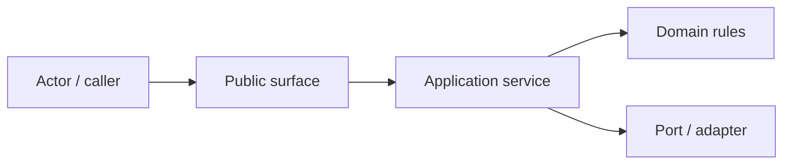
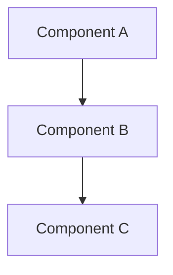
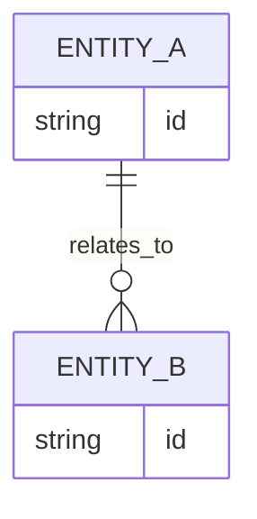
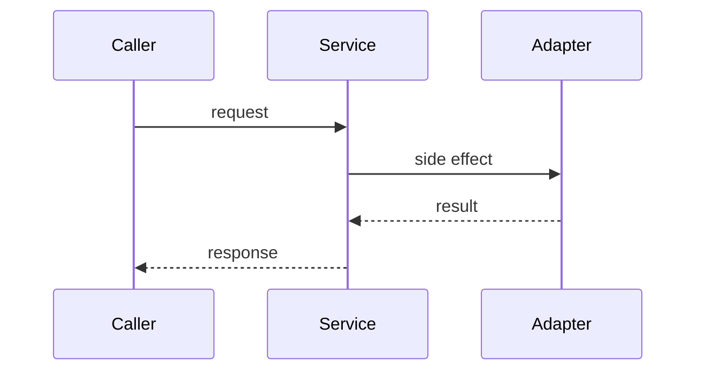

# Design: <change>

## Context

Resume el sistema existente, dependencias relevantes, ownership de módulos y límites que condicionan el diseño.

## Goals And Non-Goals

### Goals

-

### Non-Goals

-

## Architecture Overview

Describe la arquitectura objetivo y cómo se integra con la estructura actual.

## Component Model

| Component | Responsibility | Inputs | Outputs | Owner/Boundary |
| --- | --- | --- | --- | --- |
| `<component>` | `<responsibility>` | `<inputs>` | `<outputs>` | `<boundary>` |

## Data And Persistence

Completar si el cambio toca persistencia, archivos, cache, eventos o estructuras durables. Si no aplica, indicar `not_applicable` y justificar.

## Workflow

## Design Patterns

- Pattern(s) selected:
- Why these patterns fit:
- Alternatives rejected:
- Existing local patterns reused:

## Security, Privacy And Safety

- Auth/authz impact:
- Secret handling:
- User data impact:
- File/system boundary impact:
- Abuse or failure mode:

## Operational Concerns

- Performance:
- Observability:
- Migration/backfill:
- Rollback:
- Compatibility:

## Decisions

### Decision: <title>

- Context:
- Decision:
- Consequences:

## Validation Strategy

- Unit/integration tests:
- Static checks:
- Manual/static review:
- Cross-platform concerns:

## Risks

-
