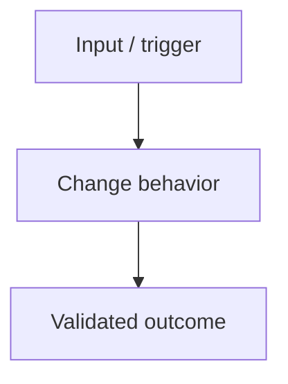

# Proposal: <change>

## LLM Objective

Describe el resultado observable que debe alcanzar el LLM. Incluye:

- outcome principal;
- usuario, sistema o rol beneficiado;
- señal objetiva de éxito;
- tradeoff que no debe optimizarse accidentalmente.

## Problem

Describe el problema actual, su impacto y por qué debe resolverse ahora.

## Current Behavior

- Comportamiento actual:
- Archivos, módulos o flujos afectados:
- Evidencia disponible:

## Target Behavior

- Comportamiento esperado:
- Contratos públicos o internos que cambian:
- Estados, errores o bordes esperados:

## Scope

### In Scope

-

### Out of Scope

-

## Constraints

- No cambiar contratos públicos, seguridad, esquema de datos, puertos o defaults salvo que este proposal lo autorice explícitamente.
- Preservar trabajo local no relacionado y assets user-owned.
- Mantener cambios mínimos y alineados con patrones existentes.
- Registrar cualquier desviación como riesgo antes de implementar.

## Environment

- Runtime/toolchain esperado:
- Comandos reales de validación:
- Dependencias o servicios externos:
- Variables/configuración necesarias:

## Acceptance Criteria

- **WHEN** ocurre una condición observable
- **THEN** el sistema produce un resultado verificable

## Diagrams

Usa esta sección solo si reduce ambigüedad. En `full`, los diagramas completos viven en `design.md`.

## Risks

-

## Open Questions

-
