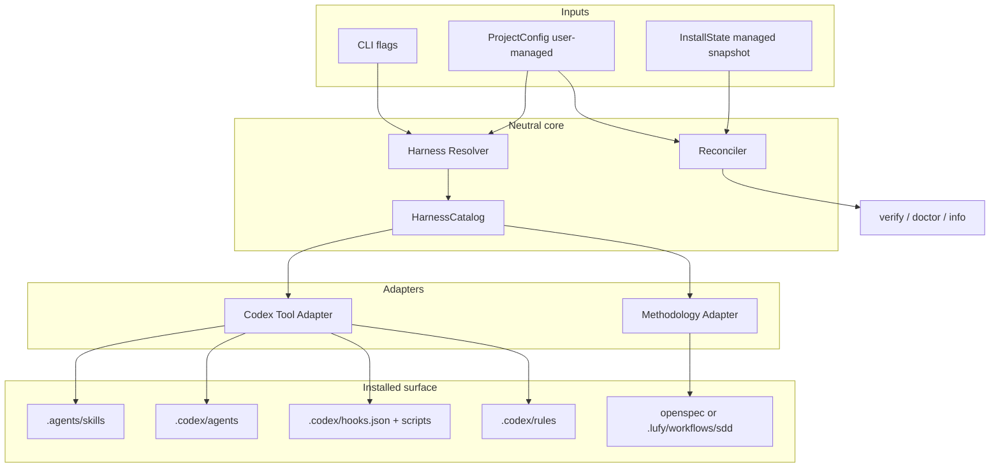
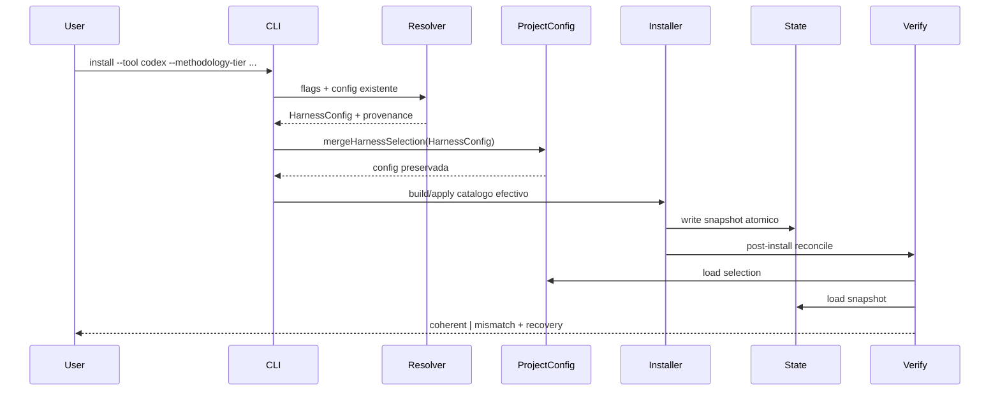
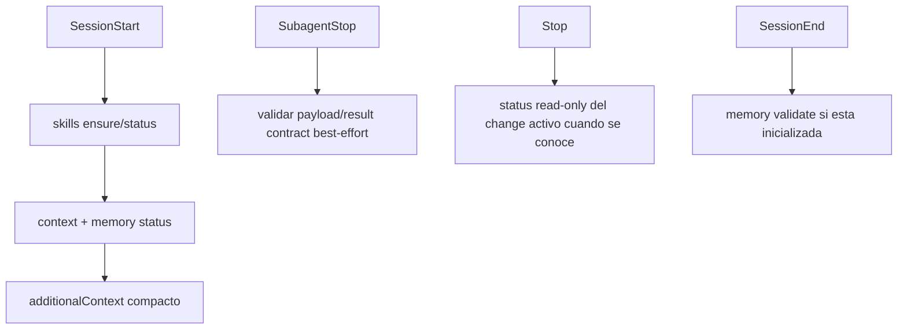

# Design: complete-codex-parity-and-native-integration

## Context

Lufy ya separa tool adapters (`opencode`, `codex`, `claude-code`) de methodology adapters (`openspec`, `lufy-sdd`, `none`). El adapter Codex instala `.agents/skills`, `.codex/agents`, config, hooks, rules y un bloque en `AGENTS.md`. La CLI administra assets mediante catalogo efectivo, SHA-256, ancestors, backup y `install-state.json`.

El defecto sistemico esta en los bordes entre subsistemas: el `HarnessConfig` usado para renderizar el catalogo no se persiste en el project config creado durante install; verify valida existencia y hashes sin reconciliar configuraciones; las superficies Codex hooks/rules existen en el catalogo pero no ejecutan comportamiento; los contracts detallados siguen teniendo ownership OpenCode.

El runtime Codex actual soporta skills repo-locales en `.agents/skills`, custom agents en `.codex/agents`, hooks project-locales, rules Starlark, MCP y multi-agent. La integracion debe usar estas primitivas nativas sin convertir Codex en una copia de OpenCode.

## Goals And Non-Goals

### Goals

- Una resolucion unica y observable del harness efectivo.
- Persistencia consistente con ownership claro y merge no destructivo.
- Lifecycle Codex nativo para orientacion y validacion best-effort.
- Policies y skills autocontenidos para Codex-only.
- Verificacion funcional del adapter, no solo presencia de archivos.
- Review slices independientes con gates agrupados al final del join.

### Non-Goals

- Igualar UIs, command palettes o plugins de OpenCode.
- Hacer obligatorios hooks, memoria, contexto o Codex CLI para usar el core.
- Crear telemetria con contenido de usuario.
- Cambiar la semantica de tiers o autorizar delivery por policy tecnica.

## Architecture Overview

## Component Model

| Component | Responsibility | Inputs | Outputs | Owner/Boundary |
| --- | --- | --- | --- | --- |
| `HarnessResolver` | Resolver tool/metodologias con precedencia explicita | flags, project config, install state, defaults | `HarnessConfig` efectivo y provenance | dominio/core |
| `ProjectConfigMerger` | Persistir seleccion efectiva preservando campos user-managed | config existente, `HarnessConfig` | YAML actualizado atomicamente | projectconfig |
| `HarnessReconciler` | Comparar preferencias y snapshot instalado | project config, install state | diagnostics y recovery | verify/doctor |
| `CodexAdapter` | Declarar y renderizar capacidades Codex reales | harness model | assets `.agents`/`.codex` | adapter tool |
| `CodexLifecycle` | Ejecutar ensure/orient/validate acotados | eventos hooks, cwd | salida hook estructurada | assets Codex |
| `CodexPolicy` | Evaluar prefijos de comandos sensibles | argv | allow/prompt/forbidden | rules Codex |
| `ContractRenderer` | Producir skills/policies por adapter desde contratos compartidos | fuente neutral + overlays | assets OpenCode/Codex | assets/catalog |
| `CodexE2E` | Probar la experiencia instalada completa | matriz tool/metodologia | evidencia por escenario | tests |

## Data And Persistence

| Data | Ownership | Mutability | Invariant |
| --- | --- | --- | --- |
| `.lufy/config/project.yaml` | user-managed | merge atomico | conserva preferencias y refleja seleccion efectiva solicitada |
| `.lufy/managed-state/install-state.json` | Lufy managed | reemplazo atomico | snapshot exacto del catalogo aplicado |
| `.lufy/skill-registry.json` | derivado/ignorado | regenerable | tool y roots coinciden con el harness efectivo |
| `.codex/config.toml` | merge-managed | merge conservador | solo keys Codex soportadas y ownership Lufy explicito |
| `.codex/hooks.json` y scripts | managed | hash/ancestor | hooks sin red, sin secretos y con trust Codex |
| `.codex/rules/*.rules` | managed | hash/ancestor | reglas testeables; mutaciones sensibles nunca auto-allow |

No se agrega base de datos. La observabilidad avanzada y cualquier JSONL de sesiones quedan fuera de alcance para evitar fijar un contrato de privacidad prematuro.

## Install And Reconciliation Workflow

### Precedence

1. Flags explicitos del comando actual.
2. Project config existente y valido.
3. Install state para operaciones sobre una instalacion existente.
4. Defaults solo en repos sin seleccion persistida.

Los comandos que operan sobre assets ya instalados deben bloquear si project config e install state contradicen el tool y no existe un flag explicito que resuelva la intencion. No deben elegir silenciosamente una fuente.

## Codex Lifecycle Workflow

- Los hooks de orientacion no leen `.env`, secretos ni contenido conversacional.
- La ausencia de `lufy-ai`, memoria o context graph produce warning compacto y recovery, no bloqueo.
- Hooks que refuerzan una policy de seguridad pueden bloquear solo escenarios definidos y testeados.
- El usuario debe confiar hooks Codex nuevos o modificados; Lufy no evade ese gate.

## Design Patterns

- **Ports and adapters**: mantiene Lufy neutral y encapsula diferencias Codex/OpenCode.
- **Single effective configuration with provenance**: evita defaults silenciosos y explica de donde surgio cada decision.
- **Reconciliation pattern**: project config expresa intencion; install state expresa realidad aplicada; el reconciler detecta drift.
- **Policy as code**: rules Codex pequenas, conservadoras y con ejemplos ejecutables.
- **Template method / generated adapters**: contratos compartidos se renderizan con overlays especificos sin wrappers incompletos.
- **Functional core, imperative shell**: merge, compare y policy se prueban como funciones puras; filesystem/hooks quedan en bordes.

Alternativas rechazadas:

- Hacer que install state sea la unica fuente: perderia preferencias user-managed y routing previo al install.
- Hacer que project config sea prueba de assets aplicados: no representa hashes, drift ni rollback.
- Copiar `.opencode` completo en Codex: filtraria comandos/plugins irrelevantes y acoplaria tools.
- Resolver todo como plugin Codex ahora: aumenta distribucion y trust surface antes de cerrar consistencia core.

## Security, Privacy And Safety

- Rules de delivery usan `prompt`; force push, borrados amplios y operaciones destructivas conocidas usan `forbidden` con alternativa segura.
- Rules no reemplazan aprobaciones del host ni autorizacion explicita del usuario.
- Hooks ejecutan paths resueltos desde git root, con argumentos fijos y sin interpolar prompt text.
- `additionalContext` contiene estados y rutas, no contenido de memoria privada ni secretos.
- Custom agents mantienen sandbox read-only/workspace-write segun rol; subagentes heredan permisos mas restrictivos del parent.
- Config y state se escriben atomicamente; errores dejan backup/recovery sin estado parcial aceptado como valido.

## Operational Concerns

- Performance: SessionStart debe completar rapido; operaciones costosas quedan async o solo status.
- Observabilidad: cada hook reporta nombre, resultado y recovery en salida estructurada; no persiste transcript.
- Migration: instalaciones Codex existentes con config divergente reciben diagnostico y comando de reconciliacion, sin overwrite silencioso.
- Rollback: sync/install mantienen ancestors y backup; hooks/rules se pueden pinnear o restaurar.
- Compatibility: usar schema Codex aceptado por el runtime disponible; se eliminan `max_threads` y `max_depth`, y el límite opcional `max_concurrent_threads_per_session` se omite mientras Codex 0.144.5 lo interprete como un rol en lugar de un setting escalar.
- Cross-platform: scripts shell requieren alternativa Go o `commandWindows`; preferir subcomandos CLI Go para logica compartida.

## Decisions

### Decision: project config expresa intencion y install state realidad aplicada

- Context: ambos contienen tool/metodologia por razones distintas.
- Decision: no eliminar duplicacion; reconciliarla explicitamente y fallar ante contradiccion no resuelta.
- Consequences: diagnosticos mas confiables y migracion segura, a costa de una regla de precedencia formal.

### Decision: usar hooks y rules nativos antes que plugin marketplace

- Context: Codex ya soporta ambas superficies project-locales.
- Decision: cerrar primero lifecycle y policy con assets instalables actuales.
- Consequences: menor alcance y feedback mas rapido; packaging plugin queda como evolucion independiente.

### Decision: contratos compartidos con overlays por tool

- Context: wrappers Codex reducidos pueden perder invariantes y referencias OpenCode no existen en installs puras.
- Decision: definir una fuente neutral para roles/policies/workflow y renderizar overlays Codex/OpenCode.
- Consequences: se reduce drift, pero cambios de contracts requieren pruebas de ambos renderers.

### Decision: no replicar slash commands ni Observatory

- Context: Codex usa skills, custom agents y UI propia de subagentes.
- Decision: medir paridad por outcomes y gates, no por identidad de superficie.
- Consequences: menos deuda accidental; UX especifica puede evolucionar despues.

## Validation Strategy

- Unit tests para precedence, merge preservando unknown fields y reconciliacion config/state.
- Tests de installer/CLI que lean `project.yaml`, no solo install state.
- Tests adapter-aware que garanticen ausencia de diagnostics OpenCode en Codex.
- Parse/test de `hooks.json`, scripts y rules; `codex execpolicy check` opt-in cuando el binario existe.
- E2E temporal para Codex + OpenSpec y Codex + Lufy SDD Full/Lite.
- Smoke de skills sin `.opencode`, incluyendo PR review, delivery y lifecycle SDD.
- `scripts/validate.sh` agrupado con coverage >= threshold y builds cross-platform existentes.
- Revision estatica de docs y assets embedded sincronizados.

## Risks

- El merge de project config puede alterar formato YAML aunque preserve semantica; minimizar churn y probar unknown fields.
- Hooks Codex pueden cambiar schema; encapsular templates y validar contra runtime disponible.
- Rules son experimentales; mantenerlas acotadas y no usarlas como unica barrera.
- Generar contracts para dos tools puede ampliar el diff; dividir por review slices y validar despues del join.
- E2E dependiente de Codex CLI debe degradar a `not_available` en CI sin binario, manteniendo pruebas estructurales obligatorias.
