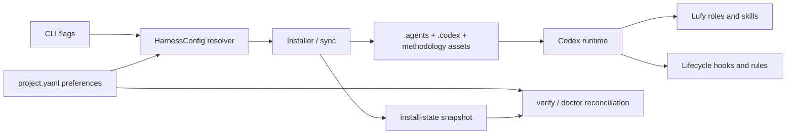

# Proposal: complete-codex-parity-and-native-integration

## LLM Objective

El LLM debe convertir el adapter Codex de una superficie core instalable a una integracion nativa, coherente y verificable de Lufy, sin copiar comportamientos de OpenCode que Codex no necesita.

- Outcome principal: una instalacion Codex mantiene una unica seleccion efectiva de tool y metodologia, carga roles/skills Lufy nativos y ejecuta lifecycle/guardrails Codex sin referencias rotas a OpenCode.
- Usuario, sistema o rol beneficiado: equipos que usan Lufy desde Codex CLI, app o IDE y esperan el mismo contrato de gobernanza T1/T2/T3.
- Senal objetiva de exito: install, sync, doctor, verify, skills y Lufy SDD resuelven la misma configuracion sin repetir `--tool codex`; los smoke tests prueban roles, skills, hooks y rules.
- Tradeoff que no debe optimizarse accidentalmente: no perseguir paridad visual o de comandos slash a costa de duplicar contratos, ampliar permisos o debilitar el modelo nativo de Codex.

## Problem

La paridad actual es principalmente estructural. Codex recibe `.agents/skills`, custom agents y archivos `.codex`, pero varias superficies no forman un sistema operativo consistente:

- `install --tool codex --methodology-tier ...` persiste la seleccion correcta en `install-state.json`, mientras el `project.yaml` nuevo conserva defaults OpenCode/OpenSpec;
- comandos posteriores que resuelven tool desde `project.yaml` pueden degradar a OpenCode o fallar por tool mismatch;
- `verify --deep` y `doctor` no detectan esa divergencia y emiten recovery de hooks OpenCode en instalaciones Codex;
- `hooks.json` y `lufy.rules` se instalan vacios aunque Codex expone hooks y multi-agent como features estables;
- algunos skills Codex dependen de policies, templates o contratos bajo `.opencode` que no se incluyen en una instalacion Codex pura;
- la validacion existente prueba presencia y hashes, pero no la experiencia runtime completa del adapter.

Resolver solo cada sintoma mantendria dos fuentes de verdad y mas drift. El cambio debe cerrar el flujo desde flags de instalacion hasta descubrimiento runtime y diagnostico.

## Current Behavior

- `install-state.json` gobierna el catalogo instalado y puede registrar `tool: codex`.
- `.lufy/config/project.yaml` es la fuente canonica para routing, workflow limits, memoria y contexto, pero `install` lo crea con defaults independientes de los flags efectivos.
- `.codex/agents/*.toml` define los ocho roles Lufy y el runtime actual puede descubrirlos nativamente.
- `.agents/skills` usa la ubicacion nativa documentada por Codex, pero varios skills son wrappers reducidos.
- `.codex/hooks.json` contiene `{ "hooks": {} }` y `.codex/rules/lufy.rules` solo comentarios.
- `verify --deep` ejecuta diagnostico de lifecycle OpenCode para cualquier adapter.

## Target Behavior

- Toda operacion usa un `HarnessConfig` efectivo coherente y persistido.
- `project.yaml` y `install-state.json` tienen ownership distinto, pero no pueden contradecir tool o metodologia sin que `doctor` y `verify` fallen con recovery seguro.
- Codex instala hooks utiles y no destructivos para skill registry, orientacion de contexto/memoria y chequeos de cierre.
- Codex instala rules conservadoras y testeadas para comandos de delivery/destruccion; las rules no conceden autorizacion de negocio.
- Los skills Codex son autocontenidos o reciben dependencias Codex en el mismo catalogo.
- La verificacion distingue capacidades del runtime, assets instalados y features opcionales.
- La documentacion describe capacidades reales de la release y no roadmap obsoleto.

## Scope

### In Scope

- Persistencia y reconciliacion de `tool` y `methodology_by_tier` entre flags, project config y install state.
- Preservacion de campos user-managed de `project.yaml` durante install/sync/setup.
- Diagnosticos adapter-aware en `verify`, `doctor`, `info`, `skills` y `sync`.
- Hooks Codex project-locales para lifecycle Lufy, con trust explicito y degradacion segura.
- Rules Codex conservadoras con ejemplos `match`/`not_match` y pruebas mediante execpolicy cuando este disponible.
- Skills, policies, templates y referencias autocontenidas para una instalacion Codex pura.
- Contrato de roles native/emulated/inline y Result Contract coherente con OpenCode.
- Matriz E2E Codex para OpenSpec, Lufy SDD Full/Lite y `none` donde corresponde.
- Documentacion de arquitectura, instalacion, status, roadmap y troubleshooting.

### Out of Scope

- Reproducir Agent Observatory o la TUI de OpenCode dentro de Codex.
- Agregar comandos slash custom como requisito de paridad.
- Publicar un plugin marketplace en este mismo cambio.
- Incorporar nuevos roles de dominio o aumentar el paralelismo por defecto.
- Implementar el adapter Claude Code.
- Capturar prompts, secretos o contenido conversacional en telemetria.

## Constraints

- Mantener la arquitectura hexagonal: dominio neutral, adapters de tool y metodologia separados.
- No cambiar defaults OpenCode para instalaciones que no seleccionan Codex.
- No sobrescribir campos user-managed de `project.yaml`, `AGENTS.md` o configuracion Codex ajena a Lufy.
- Install/sync deben conservar idempotencia, hashes, backup/restore y merge-managed.
- Hooks deben ser locales, deterministas, acotados, sin red y con fallos best-effort salvo guardrails explicitamente bloqueantes.
- Rules no deben auto-permitir `commit`, `push`, PR, merge, tags, releases ni comandos destructivos.
- Delivery continua requiriendo autorizacion explicita y evidencia remota.
- Windows, macOS y Linux deben recibir comandos de hook compatibles o degradacion documentada.
- No depender del plugin OpenCode, su SQLite, TUI o paths `.opencode` en una instalacion Codex pura.

## Environment

- Runtime/toolchain: Go del modulo `tools/lufy-cli-go`; Codex CLI/app/IDE con project trust.
- Validacion principal: `go test` focalizado, `scripts/validate.sh`, `git diff --check` y smoke tests en targets temporales.
- Runtime probes opcionales: `codex features list` y `codex execpolicy check` cuando `codex` esta disponible.
- Dependencias externas: ninguna obligatoria para hooks o rules; GitHub solo para delivery ya autorizado.
- Configuracion: `.lufy/config/project.yaml`, `.lufy/managed-state/install-state.json`, `.codex/config.toml`, `.codex/hooks.json` y `.codex/rules/*.rules`.

## Acceptance Criteria

- **WHEN** se instala un repo limpio con `--tool codex` y overrides Lufy SDD
- **THEN** `project.yaml`, install state, `info`, `skills status` y `sync --dry-run` resuelven Codex y las mismas metodologias sin flags adicionales.

- **WHEN** project config e install state contradicen tool o metodologia
- **THEN** `verify` y `doctor` reportan fallo con valores esperado/actual y recovery que preserva datos user-managed.

- **WHEN** se ejecuta `verify --deep --tool codex`
- **THEN** no inspecciona hooks/plugins OpenCode ni recomienda migrar el repo a OpenCode.

- **WHEN** Codex carga un proyecto confiable instalado por Lufy
- **THEN** descubre los ocho custom agents y los skills efectivos, y los hooks Lufy aparecen como configurados pendientes de trust o activos.

- **WHEN** inicia o termina una sesion Codex con hooks Lufy confiados
- **THEN** skill registry y diagnosticos de contexto/memoria se actualizan best-effort sin capturar prompts ni bloquear por features opcionales ausentes.

- **WHEN** una instalacion contiene solo assets Codex
- **THEN** cada skill y policy requerida funciona sin leer `.opencode`, o declara una dependencia opcional con fallback completo y verificable.

- **WHEN** una rule Lufy evalua Git/GH mutante o un comando destructivo conocido
- **THEN** devuelve `prompt` o `forbidden` segun policy y nunca `allow` por defecto.

- **WHEN** corre la matriz E2E del adapter
- **THEN** cubre install, idempotencia, sync, doctor, verify, skills y Lufy SDD Full/Lite en targets temporales para Codex.

## Diagrams

## Risks

- Actualizar `project.yaml` durante install puede sobrescribir preferencias si no se realiza un merge de ownership explicito.
- Hooks mal disenados pueden agregar latencia, solicitar trust repetidamente o bloquear sesiones.
- Rules demasiado amplias pueden debilitar seguridad; demasiado restrictivas pueden inutilizar workflows normales.
- Unificar skills puede introducir drift en OpenCode si el renderer no conserva contratos especificos por tool.
- Runtime Codex evoluciona; los probes deben distinguir feature ausente, CLI ausente y configuracion invalida.

## Open Questions

- La distribucion como plugin Codex se evaluara despues de cerrar paridad core y E2E; no bloquea este cambio.
- La observabilidad avanzada necesita un proposal separado cuando exista un contrato claro de datos, retencion y privacidad.
