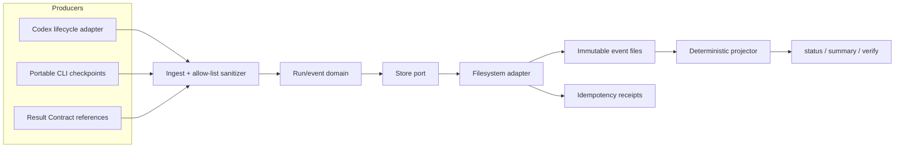
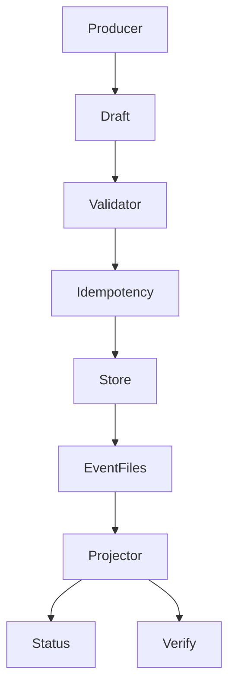
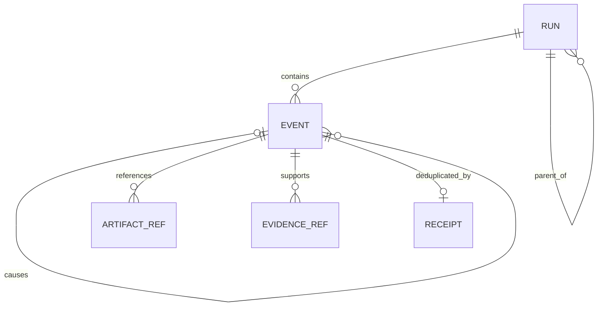
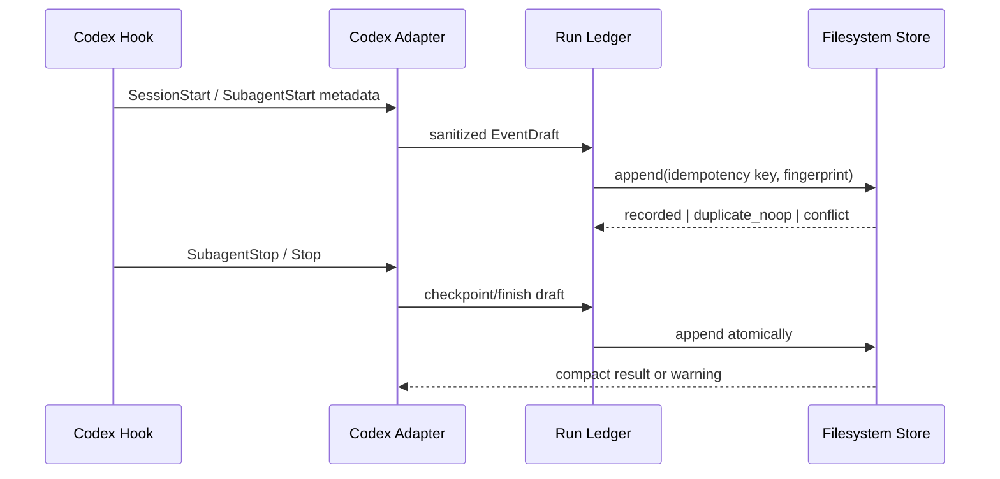
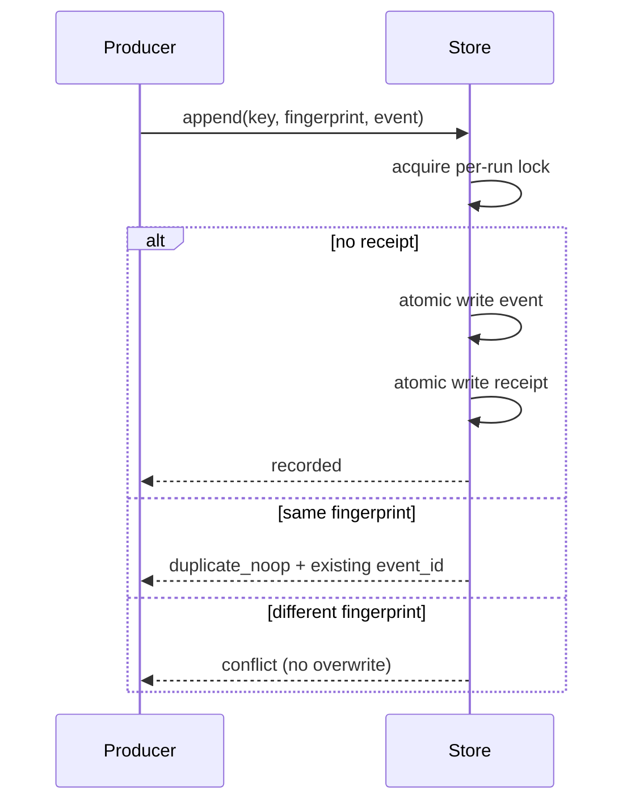

# Design: add-agentic-run-ledger

## Context

La CLI Go es la superficie actual del producto. `internal/codexlifecycle` recibe eventos best-effort y emite orientación compacta, mientras Result Contract v1 transporta estado y evidencia entre roles. Ninguno persiste una historia causal portable. Agent Observatory ofrece observabilidad efímera específica de OpenCode y `lufy-ai status` se limita al estado de instalación.

El diseño agrega un núcleo Go adapter-neutral y un storage local bajo `.lufy/runtime/`. Codex será el primer productor automático usando metadata documentada (`session_id`, `turn_id`, `agent_id`, tipo y nombre del evento); otros adapters podrán emitir checkpoints por CLI o por la misma interfaz interna. El ledger no consume transcripts ni mensajes.

## Goals And Non-Goals

### Goals

- Persistir eventos causales mínimos, versionados, inmutables y verificables.
- Hacer idempotentes los reintentos y seguros los escritores concurrentes.
- Trazar root/subagent/task/artifact/evidence/checkpoint sin contenido privado.
- Ofrecer status, summary, verify y retention por CLI.
- Integrar hooks sin convertir observabilidad en bloqueo del workflow.
- Mantener storage, dominio y adapters desacoplados para futuras integraciones.

### Non-Goals

- Replay de conversaciones, event streaming remoto o tracing distribuido general.
- Autoridad de gates, auto-orquestación o Loop Engine.
- Telemetría de producto enviada fuera del repositorio.
- UI durable en esta fase.

## Architecture Overview



El ingreso produce un `EventDraft` tipado. El dominio valida causalidad, límites y transición observable; calcula fingerprint e identidad si no fueron provistos. El store adquiere un lock acotado por run, verifica el receipt, escribe un evento completo mediante rename atómico y finalmente publica el receipt. Las consultas reconstruyen o leen proyecciones derivadas, nunca sustituyen a los eventos fuente.

## Component Model

| Component | Responsibility | Inputs | Outputs | Owner/Boundary |
| --- | --- | --- | --- | --- |
| `runledger` domain | IDs, schema, causalidad, fingerprint, validación y estados | `EventDraft` tipado | evento validado o error sanitizado | core adapter-neutral |
| `RunStore` port | append idempotente, lectura, verify y prune | evento/queries | receipt, events, diagnostics | interfaz de aplicación |
| filesystem store | atomicidad, locks, layout, recovery | paths seguros y eventos | archivos inmutables/proyecciones | infraestructura local |
| projector | derivar status, árbol causal, métricas y blockers | stream ordenado | summary/status determinista | lectura reconstruible |
| run CLI | record/checkpoint/status/summary/verify/prune | flags/stdin estructurado | texto/JSON y exit code | superficie pública Lufy |
| Codex adapter | mapear hooks estables a drafts | metadata de hook | eventos sanitizados/warnings | adapter Codex |
| Result Contract bridge | transportar referencias opcionales | run/event refs | handoff trazable | contrato neutral |



## Data And Persistence

### Layout

```text
.lufy/runtime/
  runs/<run_id>/
    meta.json
    events/<lamport_clock>-<local_sequence>-<event_id>.json
    receipts/<idempotency_key_hash>.json
    projections/summary.json
    lock/
  bindings/<adapter>/<source_ref_hash>.json
  indexes/runs.json
```

- `events/` es la fuente de verdad append-only.
- `receipts/`, `bindings/`, `projections/` e `indexes/` son reconstruibles y pueden repararse con `run verify --repair` solo cuando la acción sea explícita.
- `.lufy/runtime/` se agrega a `.gitignore`; no forma parte del catálogo de assets gestionados.
- Los nombres pasan por `SafeJoin`; cada archivo se escribe en el mismo filesystem con `WriteFileAtomic`/rename.
- Se prefiere un archivo por evento sobre JSONL: evita append intercalado y permite publicación atómica portable.

### Event envelope `lufy-run-event/v1`

| Field | Semantics |
| --- | --- |
| `schema_version` | versión cerrada del envelope |
| `event_id`, `run_id` | ULID/UUID o ID validado, sin datos del usuario |
| `parent_run_id` | relación root/subagent opcional |
| `caused_by_event_id` | causalidad directa opcional |
| `lamport_clock`, `local_sequence` | orden parcial/lógico y desempate local |
| `occurred_at`, `observed_at` | tiempo de origen si existe y tiempo local de ingreso |
| `kind` | enum: start, link, checkpoint, evidence, validation, blocked, finish, warning |
| `source` | adapter, event name y refs externas pseudonimizadas |
| `task_ref` | ID seguro o hash; sin título/cuerpo libre |
| `artifact_refs` | tipo, `path_sha256`, `content_sha256`; nunca contenido |
| `evidence_refs` | comando/categoría/result/path hash acotados |
| `checkpoint` | status/gate/next owner tipados |
| `metrics` | duración/tokens/costo opcionales con `availability` explícita |

No existe `body`, `message`, `prompt`, `response`, `transcript`, `arguments`, `diff` ni mapa arbitrario de metadata. El decoder rechaza campos desconocidos para las escrituras públicas y aplica límites por evento, lista y string.



## Workflow

### Root y subagente



Codex documenta que subagentes comparten el `session_id` del padre, mientras `agent_id`, `agent_type` y eventos de start/stop permiten distinguirlos. El adapter mantiene bindings pseudonimizados entre esas refs y IDs Lufy; `turn_id` delimita la unidad causal cuando está disponible. No se abre ni parsea `transcript_path`.

### Idempotencia y conflicto



La clave de idempotencia es explícita para CLI y derivada de metadata estable para hooks. El fingerprint es SHA-256 del envelope canónico excluyendo tiempos de observación y campos generados. El lock usa creación atómica de directorio, owner metadata, deadline corto y recuperación conservadora de locks vencidos. Nunca se borra un lock activo solo por antigüedad sin comprobar owner/lease.

## Design Patterns

- **Event log append-only**: preserva evidencia original y facilita verify/rebuild.
- **Ports and adapters**: separa core, filesystem, Codex y futuras superficies.
- **Idempotent consumer + receipts**: tolera at-least-once delivery de hooks/retries.
- **Materialized projections**: acelera consultas sin volver autoritativos los índices.
- **Best-effort sidecar**: observabilidad no altera el resultado del workflow principal.
- **Privacy allow-list**: persiste solo campos modelados; ausencia de mapa libre.

Alternativas rechazadas:

- JSONL único por run: append concurrente y recuperación cross-platform más frágiles.
- SQLite en esta fase: agrega dependencia, migraciones y locking sin necesidad para el volumen local esperado.
- Timestamps como orden total: relojes de pared no expresan causalidad ni son confiables entre procesos.
- OpenTelemetry como store obligatorio: útil para interoperabilidad futura, pero excesivo para la fuente local y no resuelve por sí solo privacidad/retención Lufy.
- Persistir payload de hook completo: viola minimización y acopla el schema a formatos inestables.

## Security, Privacy And Safety

- No hay impacto de auth/authz remoto; el boundary es el filesystem local y sus permisos heredados.
- Inputs públicos usan decoder estricto, enums, límites y validación de hashes/IDs.
- IDs de sesión, turno y agente se pseudonimizan antes de persistir; paths se representan por hashes y tipo lógico.
- Se rechazan claves reservadas sensibles y valores que excedan límites; diagnósticos nunca reflejan el valor rechazado.
- Los fixtures usan datos sintéticos y se prueba ausencia de prompts, secrets, transcripts, diffs, arguments y file contents.
- No existe export automático ni networking desde el ledger.
- `verify` detecta permisos inseguros cuando el OS permite inspeccionarlos y reporta recovery.

## Operational Concerns

- **Performance:** O(1) append bajo lock por run; summary puede usar proyección y reconstruir cuando esté stale. No se bloquean runs distintos entre sí.
- **Observability:** el propio ledger informa warnings estructurados, pero evita recursión; fallos internos no intentan auto-registrarse indefinidamente.
- **Migration/backfill:** no se backfillea historia pasada. El primer evento crea `meta.json`; upgrades de schema preservan lectores de v1 o fallan explícitamente.
- **Retention:** defaults propuestos de 30 días, 500 runs terminales y 64 MiB; prune explícito, ordenado y nunca sobre activos.
- **Rollback:** deshabilitar productores automáticos conserva datos; remover `.lufy/runtime/` es opcional y fuera del uninstall administrado salvo acción explícita.
- **Compatibility:** paths y locks deben probarse en Linux, macOS y Windows; no asumir flock POSIX.

## Decisions

### Decision: Reloj lógico de Lamport y no orden por wall clock

- Context: hooks y subagentes son procesos concurrentes; timestamps pueden empatar o retroceder.
- Decision: cada append calcula `max(observed parent/run clock, proposed clock)+1` bajo lock y conserva timestamps solo como metadata.
- Consequences: se reconstruye un orden causal consistente por run, sin afirmar un orden global inexistente.

### Decision: Eventos inmutables por archivo y proyecciones reconstruibles

- Context: necesitamos atomicidad y recovery portable.
- Decision: un archivo JSON canónico por evento; receipts y summaries son derivados.
- Consequences: más archivos pequeños, a cambio de append seguro, auditabilidad y reparación localizada.

### Decision: Ledger asesor, no autoridad de workflow

- Context: una capa de observabilidad puede estar ausente o dañada.
- Decision: hooks degradan con warning y continúan; solo comandos explícitos `run verify` usan exit no-cero por integridad.
- Consequences: no se bloquean tareas por telemetría, pero la validación puede exigir evidencia cuando el change lo declare.

### Decision: Allow-list tipada sin contenido libre

- Context: redaction posterior es insuficiente para secretos y conversaciones.
- Decision: el schema no admite cuerpo genérico; refs externas y paths se pseudonimizan y contenidos solo se representan por digest.
- Consequences: menor riqueza narrativa, mayor privacidad y estabilidad contractual.

### Decision: Codex primero, contrato portable desde el inicio

- Context: Codex ya ofrece lifecycle metadata estable y Lufy mantiene otros adapters.
- Decision: implementar el productor automático Codex sobre interfaces neutrales; otros adapters usan CLI/checkpoints hasta integración propia.
- Consequences: alcance acotado sin crear un core específico de Codex.

## Validation Strategy

- Unit tests table-driven para schema, canonicalization, fingerprint, causalidad, state projection y privacy allow-list.
- Tests de idempotencia: same key/same fingerprint, same key/different fingerprint y recovery entre event/receipt.
- Tests concurrentes multiproceso o equivalentes, incluyendo carrera por clock y lock vencido; ejecutar race detector donde el CI lo soporte.
- Integration tests de cada comando con texto/JSON, exit codes, prune y repair explícito.
- Lifecycle fixtures para `SessionStart`, `SubagentStart`, `SubagentStop`, `Stop`, `SessionEnd`, metadata ausente y filesystem fallido.
- Golden fixtures sanitizados y tests negativos que busquen contenido prohibido en `.lufy/runtime/`.
- `go test ./...`, `go build ./cmd/lufy-ai`, `scripts/validate.sh`, `git diff --check` y matriz existente de OS.
- Revisión estática de `.gitignore`, catálogo administrado, Result Contract y documentación.

## Risks

- Lock recovery incorrecto puede perder disponibilidad o duplicar eventos; debe testearse por crash windows.
- Una proyección stale puede confundir al operador; cada salida muestra integridad/freshness y puede reconstruir desde fuente.
- Evolución del payload de hooks; el decoder del adapter toma solo campos documentados y trata el resto como desconocido no persistible.
- Retención demasiado agresiva; defaults conservadores, runs activos protegidos y dry-run/report obligatorio antes de eliminación material.

## References

- [Lamport](https://www.microsoft.com/en-us/research/publication/time-clocks-ordering-events-distributed-system/) para orden causal y relojes lógicos.
- [Dapper](https://research.google/pubs/dapper-a-large-scale-distributed-systems-tracing-infrastructure/), [W3C Trace Context](https://www.w3.org/TR/trace-context/) y [OpenTelemetry](https://opentelemetry.io/docs/specs/otel/logs/data-model/) para separación trace/span/event y correlación.
- [IETF Idempotency-Key draft](https://datatracker.ietf.org/doc/html/draft-ietf-httpapi-idempotency-key-header) para semántica de reintentos y conflictos; el documento sigue siendo work in progress.
- [NIST SP 800-92](https://www.nist.gov/publications/guide-computer-security-log-management) y [SP 1800-29](https://www.nccoe.nist.gov/publication/1800-29/VolB/index.html) para gestión de logs y minimización de datos.
- [OpenAI Codex Hooks](https://developers.openai.com/es-419/docs/hooks) para metadata estable y lifecycle disponible.
