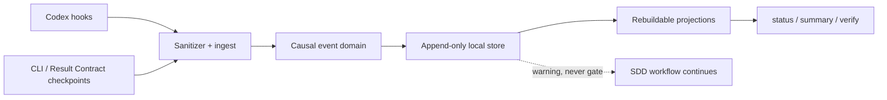

# Proposal: add-agentic-run-ledger

## LLM Objective

- Outcome principal: incorporar un Run Ledger local, causal, append-only y privacy-first que permita reconstruir qué intentó hacer cada agente, qué produjo, qué evidencia dejó, cuánto demoró y por qué se bloqueó, sin almacenar conversaciones ni contenido sensible.
- Usuario, sistema o rol beneficiado: mantenedores, reviewers, orchestrator, validator y futuros loops de mejora de Lufy.
- Señal objetiva de éxito: una ejecución raíz y sus subagentes pueden consultarse y verificarse por CLI desde `run_id` hasta tareas, artefactos y evidencias; los reintentos son idempotentes; un fallo del ledger no bloquea el trabajo principal.
- Tradeoff que no debe optimizarse accidentalmente: no maximizar detalle a costa de privacidad, portabilidad o acoplamiento a un adapter; el ledger registra metadatos causales mínimos, no un replay completo de la conversación.

## Problem

Lufy define roles, gates y un Result Contract, pero hoy la historia operacional queda fragmentada entre salida de hooks, artefactos SDD, Git/GitHub y reportes manuales. No existe una fuente local y portable que relacione una ejecución raíz con sus subagentes, tareas, artefactos, validaciones, tiempos, bloqueos y métricas opcionales.

Esta ausencia dificulta diagnosticar loops, reintentos, trabajo duplicado, handoffs incompletos y costo cognitivo del reviewer. También impide medir de forma confiable futuras mejoras del harness sin recurrir a prompts, transcripciones o payloads privados.

## Current Behavior

- `codexlifecycle` procesa eventos de Codex de forma best-effort, pero no persiste una traza causal ni reconoce `SubagentStart`.
- `.codex/hooks.json` registra `SessionStart`, `SubagentStop`, `Stop` y `SessionEnd`; no hay binding durable entre `session_id`, `turn_id`, `agent_id` y un run Lufy.
- Result Contract v1 describe estado, evidencia, riesgos y siguiente acción, pero no referencia un run ni un evento causal.
- Agent Observatory mantiene una proyección efímera para OpenCode; no es una fuente portable ni durable.
- `lufy-ai status` describe instalación/assets y no el estado de una ejecución agente.

## Target Behavior

Lufy SHALL ofrecer un Run Ledger adapter-neutral con estas propiedades:

1. Eventos versionados, de campos permitidos y append-only bajo `.lufy/runtime/runs/`, ignorados por Git.
2. Identidad causal explícita mediante `run_id`, `parent_run_id`, `event_id`, `caused_by_event_id`, reloj lógico de Lamport y secuencia local.
3. Idempotencia por clave y fingerprint: el mismo evento repetido es no-op; una colisión con payload distinto produce conflicto seguro sin sobrescribir evidencia.
4. Escrituras atómicas y serialización por run compatibles con concurrencia y recuperación después de interrupciones.
5. CLI para registrar checkpoints, consultar estado/resumen, verificar integridad y aplicar retención.
6. Integración automática inicial con hooks Codex y superficie portable para otros adapters y Result Contract.
7. Privacidad por diseño: sin prompts, respuestas, transcripciones, argumentos de tools, diffs, contenidos de archivos, secretos ni identificadores externos en claro.
8. Degradación segura: un fallo de observabilidad emite warning accionable y no bloquea el workflow; `run verify` sí puede fallar en modo estricto.

## Scope

### In Scope

- Modelo de dominio y schema `lufy-run-event/v1`.
- Store filesystem local con atomicidad, locking acotado, receipts de idempotencia e índices reconstruibles.
- Relaciones causales entre ejecución raíz, subagentes, checkpoints, tareas, artefactos y evidencias.
- Comandos `lufy-ai run record`, `checkpoint`, `status`, `summary`, `verify` y `prune`, con salida humana y JSON donde corresponda.
- Productor automático Codex basado solo en metadata estable de hooks; alta de `SubagentStart`.
- Extensión compatible de Result Contract con referencias opcionales al ledger.
- Configuración, límites, retención, documentación, fixtures sanitizados y pruebas cross-platform.
- Métricas opcionales de duración, tokens y costo cuando el adapter las provea; ausencia explícita cuando no estén disponibles.

### Out of Scope

- Almacenar o reconstruir prompts, respuestas, transcripciones o payloads completos.
- Exportación remota, backend central, dashboard web o reemplazo de OpenTelemetry.
- Loop Engine autónomo, scheduling adaptativo, aprendizaje automático o decisiones automáticas basadas en métricas.
- Convertir el ledger en autoridad de gates SDD, delivery o seguridad.
- Instrumentación completa de todos los adapters en esta fase; se entrega una frontera portable y Codex como integración inicial.
- Cambiar contratos públicos, puertos, defaults de auth o schema de negocio externos a Lufy.

## Constraints

- La fuente debe funcionar offline, ser local-first y no requerir servicios externos.
- El formato debe ser evolutivo, legible y verificable; campos desconocidos no deben habilitar persistencia arbitraria.
- Las escrituras no deben corromperse por concurrencia de procesos ni por terminación abrupta.
- Los hooks siguen siendo best-effort y no pueden avanzar gates silenciosamente.
- El ledger no persiste rutas absolutas ni IDs externos en claro; usa hashes estables con salt/provenance local cuando corresponda.
- Los defaults de retención deben ser conservadores y nunca eliminar runs activos.
- La implementación debe reutilizar `platform.WriteFileAtomic`, `SafeJoin`, configuración y patrones CLI existentes.
- La falta actual de `.lufy/config/project.yaml` impide leer `workflow_limits`; durante proposal se registra como `not_available` y no se inventan límites.

## Environment

- Runtime/toolchain: Go en `tools/lufy-cli-go`; assets y contratos bajo `.lufy`, `.codex` y catálogo administrado.
- Validación de artefactos: `go run ./cmd/lufy-ai sdd validate --target <repo> --change add-agentic-run-ledger --strict` desde `tools/lufy-cli-go`.
- Validación futura de implementación: `go test ./...`, `go build ./cmd/lufy-ai`, `scripts/validate.sh`, fixtures cross-platform y revisión privacy-first.
- Dependencias externas: ninguna en runtime; los estándares consultados informan el contrato, pero no agregan SDK obligatorio.

## Acceptance Criteria

- **WHEN** un run raíz inicia subagentes y produce checkpoints
- **THEN** la CLI reconstruye la relación padre-hijo, el orden causal y la relación con task, artefacto y evidencia sin leer una transcripción.

- **WHEN** el mismo evento llega dos o más veces con igual clave de idempotencia y fingerprint
- **THEN** solo existe un efecto durable y el resultado informa `duplicate_noop`.

- **WHEN** una clave de idempotencia existente llega con fingerprint diferente
- **THEN** el sistema no sobrescribe el evento previo, registra o devuelve conflicto sanitizado y permite diagnóstico.

- **WHEN** dos procesos escriben en el mismo run o uno se interrumpe durante la escritura
- **THEN** no aparecen eventos parciales, se preserva un orden lógico válido y `run verify` detecta cualquier residuo recuperable.

- **WHEN** Codex emite `SubagentStart`, `SubagentStop`, `Stop` o `SessionEnd`
- **THEN** Lufy usa únicamente metadata estable permitida para crear o cerrar relaciones causales, sin consumir el transcript.

- **WHEN** un productor intenta incluir prompts, mensajes, secretos, diffs, contenidos o payloads no permitidos
- **THEN** el ingreso rechaza o elimina el campo antes de persistir y produce un diagnóstico sin reproducir el valor.

- **WHEN** el filesystem, lock o ledger no está disponible durante un hook
- **THEN** el hook continúa el workflow principal y emite un warning compacto con recuperación; no declara gates completados.

- **WHEN** un operador ejecuta `run status`, `run summary` o `run verify`
- **THEN** obtiene salida determinista humana o JSON, métricas disponibles/ausentes explícitas e integridad causal verificable.

- **WHEN** la política de retención excede sus límites configurados
- **THEN** `run prune` elimina únicamente runs terminales elegibles, conserva activos y reporta qué eliminó sin revelar contenido privado.

## Diagrams

## Review Slices

| Slice | Objetivo | Archivos esperados | Validación | Riesgo principal |
| --- | --- | --- | --- | --- |
| A | Schema, dominio, store, causalidad e idempotencia | `internal/runledger/` | unit tests, race/concurrency, corruption fixtures | corrupción o duplicación |
| B | CLI, config, proyecciones y retención | `cmd/`, `internal/projectconfig/`, `internal/runledger/` | CLI integration + JSON golden tests | contrato operativo ambiguo |
| C | Hooks Codex, Result Contract y frontera adapter-neutral | `internal/codexlifecycle/`, `.codex/`, `.lufy/contracts/`, assets | lifecycle fixtures + contract tests | fuga de metadata o acoplamiento |
| D | Privacidad, degradación, docs y E2E cross-platform | tests, docs, workflows pertinentes | `scripts/validate.sh`, OS matrix, privacy review | regresión silenciosa |

## Risks

- La concurrencia cross-platform puede introducir locks huérfanos; se mitiga con lock directory atómico, timeout corto, owner metadata y recuperación conservadora.
- Un schema demasiado amplio puede transformarse en logging de contenido; se mitiga con allow-list tipada, límites de tamaño y ausencia deliberada de un campo `body`.
- Los hashes de IDs o paths pueden permitir correlación local; se mitiga con pseudonimización local y documentación de su alcance, sin exportación automática.
- La integración automática puede fallar antes de conocer el parent; se mitiga con bindings reconstruibles y eventos explícitos de enlace, nunca reescritura del pasado.
- El ledger puede percibirse como autoridad de gates; documentación y API lo mantienen como evidencia/observabilidad, mientras SDD y delivery conservan autoridad.
- La fase tiene varios ejes de riesgo, pero no requiere artifact branching: los estándares, los criterios del issue y los límites locales convergen en una arquitectura canónica; comparar dos proposals agregaría carga sin resolver una decisión de producto pendiente.

## Open Questions

- Confirmar durante implementación si los límites de retención serán configurables en `project.yaml` o en un archivo runtime user-owned; el default propuesto es 30 días, 500 runs terminales y 64 MiB.
- Evaluar después de estabilizar la CLI si Agent Observatory debe consumir el ledger como proyección opcional; no es criterio de aceptación de esta fase.
- Tokens/costo dependen del adapter: la ausencia debe ser `unavailable`, nunca inferida como cero.

## References

- Leslie Lamport, [*Time, Clocks, and the Ordering of Events in a Distributed System*](https://www.microsoft.com/en-us/research/publication/time-clocks-ordering-events-distributed-system/).
- Google Research, [*Dapper, a Large-Scale Distributed Systems Tracing Infrastructure*](https://research.google/pubs/dapper-a-large-scale-distributed-systems-tracing-infrastructure/).
- W3C, [*Trace Context*](https://www.w3.org/TR/trace-context/).
- OpenTelemetry, [*Logs Data Model*](https://opentelemetry.io/docs/specs/otel/logs/data-model/) y [*Events semantic conventions*](https://opentelemetry.io/docs/specs/semconv/general/events/).
- IETF HTTPAPI, borrador [*Idempotency-Key HTTP Header Field*](https://datatracker.ietf.org/doc/html/draft-ietf-httpapi-idempotency-key-header) (work in progress; se usa como referencia conceptual, no como estándar final).
- NIST SP 800-92, [*Guide to Computer Security Log Management*](https://www.nist.gov/publications/guide-computer-security-log-management) y [NIST SP 1800-29](https://www.nccoe.nist.gov/publication/1800-29/VolB/index.html) sobre privacidad de datos.
- OpenAI Codex, [documentación oficial de Hooks](https://developers.openai.com/es-419/docs/hooks).
