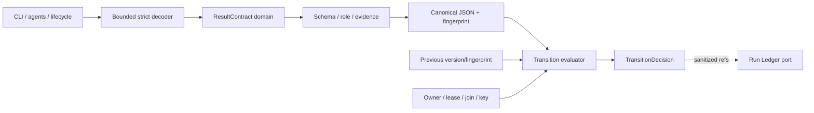
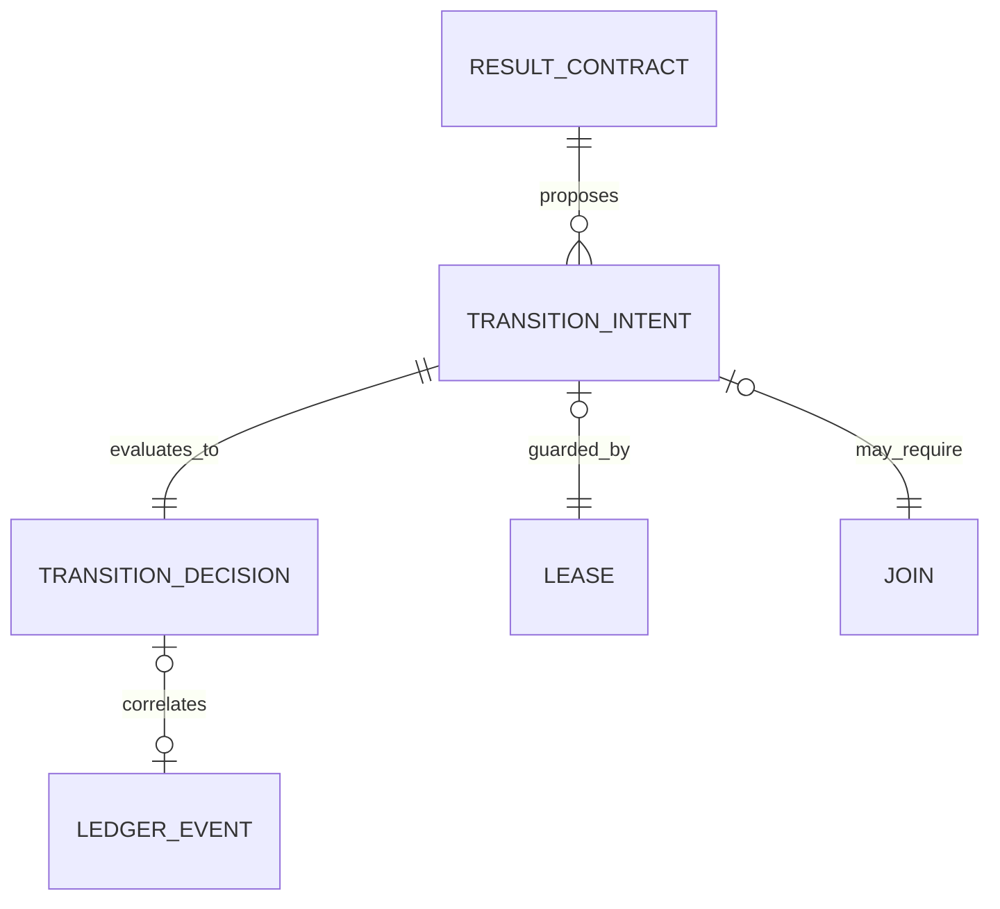
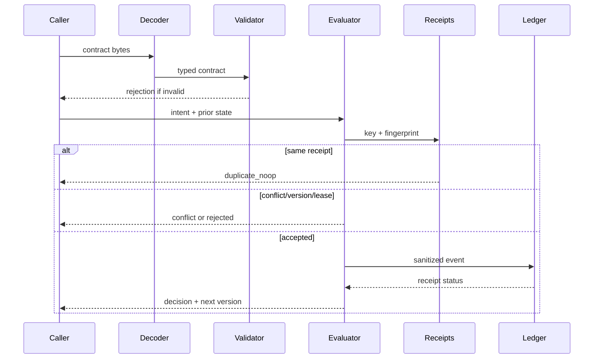

# Design: make-result-contract-executable

## Context

El Result Contract es una especificación humana replicada en contratos, AGENTS/templates, embedded assets y roles. `internal/core/domain` expone schema/status permitidos; `codexlifecycle` inspecciona texto. Run Ledger ya aporta canonicalización, fingerprints, receipts, causalidad y locks portables. Este diseño reutiliza esos patrones sin convertir observabilidad en autoridad.

Se separan cuatro responsabilidades: `result-contract/v1` describe un resultado; `result-transition/v1` intenta cambiar estado; Run Ledger registra historia causal content-free; el futuro Loop Engine decide cuándo pedir otra transición.

## Goals And Non-Goals

### Goals

- Decoder YAML/JSON estricto, bounded y compatible con v1.
- Canonicalización/fingerprint cross-platform.
- Validación estructural, por rol y por evidencia mínima.
- Transiciones con optimistic version, fingerprint, owner/lease, join e idempotencia.
- CLI y puertos reutilizables por lifecycle y Loop Engine.
- Correlación content-free con Run Ledger.

### Non-Goals

- Ejecutar tools/subagentes o decidir la siguiente acción.
- Reintentar automáticamente o administrar presupuestos.
- Tratar evidencia declarada como prueba material.
- Persistir el envelope completo o crear un backend remoto.

## Architecture Overview



Dependencias apuntan al dominio. CLI y Codex son adapters; `resultcontract` no importa adapters ni Git/GitHub.

## Component Model

| Component | Responsibility | Inputs | Outputs | Boundary |
| --- | --- | --- | --- | --- |
| domain | tipos, enums, límites, canonicalización | typed/bytes | contract/diagnostic | adapter-neutral |
| strict decoder | YAML/JSON seguro | bounded reader | typed document | ingress |
| validators | schema, rol, coherencia, evidencia | contract + policy | diagnostics | pure domain |
| transition evaluator | state table, CAS, lease, join | intent + prior | decision | application |
| receipt port | idempotencia key/fingerprint | receipt request | recorded/duplicate/conflict | port |
| ledger bridge | evento causal content-free | decision refs | ledger status | infrastructure |
| result CLI | validate/normalize/transition | flags/stdin | human/JSON | public CLI |
| lifecycle adapter | validación best-effort | hook result | warning/context | Codex |

## Data And Persistence

### Contract

El modelo refleja el documento neutral actual; bloques opcionales siguen opcionales. Se prohíben mapas arbitrarios en el núcleo. Canonical JSON se genera desde structs y produce SHA-256 estable; YAML/JSON equivalentes comparten digest.

### Transition

```yaml
schema_version: result-transition/v1
transition_id: <safe id>
idempotency_key: <safe key>
expected_version: 3
previous_fingerprint: <sha256>
actor:
  role: validator
  owner_ref: <pseudonymous ref>
lease:
  token_digest: <sha256>
  expires_at: <RFC3339>
join:
  required_run_ids: [<local run ids>]
  terminal_contract_fingerprints: [<sha256>]
  grouped_evidence_fingerprint: <sha256>
next_contract: <result-contract/v1>
```

La decisión usa `accepted | duplicate_noop | rejected | conflict`, reason/recovery, next version/fingerprint y ledger status opcional. Receipts guardan solo key hash, intent fingerprint y decisión mínima.



## Workflow



Capas: syntax → schema → coherence → role policy → claim evidence → transition. Un contract puede ser estructuralmente válido pero insuficiente para avanzar gate.

## State Model

| Status v1 | Work | Delivery | Sync | Attention |
| --- | --- | --- | --- | --- |
| ready | ready | not_required | not_required | none |
| implemented | implemented | not_required | not_required | none |
| validated | validated | not_required | not_required/pending | none |
| delivery_pending | validated | pending | synced/not_required | none |
| sync_pending | validated | pending/not_required | pending | none |
| blocked | blocked | unchanged | unchanged | recovery_required |
| escalated | blocked | unchanged | unchanged | escalated |
| delivered | validated | delivered | synced/not_required | none |
| closed | terminal | delivered/not_required | synced/not_required | none |

`unchanged` se resuelve desde estado anterior. Edges son explícitos; `closed` es terminal. Salir de blocked/escalated requiere recovery evidence y nueva versión.

## Ownership, Lease And Join

- Owner refs son locales/pseudonimizadas; role es semántico.
- Lease contiene token digest y expiración, pero version/fingerprint actúa como fencing.
- Owner antiguo no escribe sobre versión nueva aunque su reloj considere el lease activo.
- Join exige children declarados, contracts terminales, causalidad y grouped evidence.
- Children opcionales se declaran antes; no se infieren al finalizar.

## Design Patterns

- Anti-Corruption Layer para adapters/legacy.
- State Machine + Transition Table.
- Optimistic Concurrency / Fencing Token.
- Lease combinado con fencing.
- Idempotent Receiver.
- Ports and Adapters.
- Event-carried reference, not content.

Se rechazan regex/substrings, persistir YAML completo en Ledger, estado mutable sin versión, wall clock como único guard y mezclar Loop Engine en este change.

## Security, Privacy And Safety

- Decoder bounded; rechaza aliases/anchors/tags, duplicados y unknown fields.
- Diagnósticos usan field path/reason sin valores sensibles.
- Normalización no ejecuta Markdown, shell, tools ni referencias.
- Owner, lease token e IDs externos se pseudonimizan/digieren.
- Ledger excluye summary, paths absolutos, comandos/output y nombres libres.
- Lifecycle conserva `continue=true`; transición mutante inválida/conflict falla cerrada.

## Operational Concerns

- Performance lineal y bounded, sin red.
- Reason codes/recovery y ledger status como observabilidad.
- Sin backfill; envelopes válidos siguen funcionando.
- Bridge se puede desactivar sin reescribir eventos.
- Fixtures root/embedded, OpenCode/Codex, CRLF y orden YAML cubren compatibilidad.

## Decisions

### Decision: resultado y transición son schemas separados

- Context: output describe hechos; ownership/idempotencia decide aceptación.
- Decision: mantener v1 y crear `result-transition/v1`.
- Consequences: mayor compatibilidad y Loop Engine desacoplado.

### Decision: status plano es proyección compatible

- Context: roles/templates ya lo consumen.
- Decision: derivar vector interno, no volverlo campo obligatorio.
- Consequences: payloads existentes sobreviven; ambigüedad se rechaza en transición.

### Decision: versión/fingerprint es fencing

- Context: lease solo es ambiguo ante skew/crash.
- Decision: CAS por versión/fingerprint; lease añade exclusión temporal.
- Consequences: stale writers fallan y retry idéntico es idempotente.

### Decision: evidencia estructural no es prueba material

- Context: texto puede declarar un comando no ejecutado.
- Decision: contrato valida categorías; validator/delivery conservan autoridad.
- Consequences: no se automatiza confianza falsa.

### Decision: ledger content-free y policy-aware

- Context: envelope contiene texto humano sensible.
- Decision: solo digests/enums/refs; fail-open hook, fail-closed transición mutante.
- Consequences: privacidad y recuperación causal.

## Validation Strategy

- Decoder: YAML/JSON equivalentes, unknown/duplicate, anchors/tags, oversize, invalid UTF-8.
- Golden/property fingerprint con LF/CRLF y OS.
- Tabla de transiciones por rol y evidencia.
- Version stale, lease/owner mismatch, duplicate/conflict.
- Joins completos/incompletos/causal mismatch.
- Bridge recorded/duplicate/conflict/unavailable + privacy canaries.
- CLI/lifecycle human/JSON, exit codes y legacy.
- Race focalizado y suite agrupada.

## Risks

- Corpus actual es documental; fixtures reales son imprescindibles.
- Evidence policy puede duplicar delivery/SDD; mantener core mínimo y policy inyectable.
- Expected version requiere fuente de estado para consumidores mutantes.
- `normalize` es superficie de seguridad.
- Dos schemas aumentan carga cognitiva; CLI/docs deben diferenciarlos.
