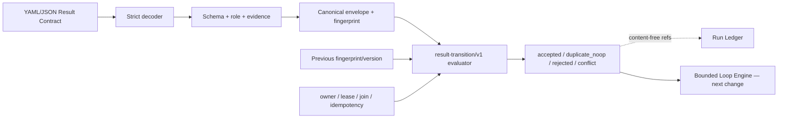

# Proposal: make-result-contract-executable

## LLM Objective

- Outcome principal: convertir `result-contract/v1` de una convención Markdown/YAML en un protocolo tipado, parseable, validable y transicionable, manteniendo compatibilidad con los envelopes actuales y sin ejecutar todavía un loop autónomo.
- Usuario, sistema o rol beneficiado: orchestrator, agentes Lufy, reviewers, adapters Codex/OpenCode y el futuro Loop Engine.
- Señal objetiva de éxito: la CLI acepta un envelope válido, produce una representación canónica determinista, rechaza campos/estados/transiciones inválidas con recovery estructurado y puede correlacionar el resultado con Run Ledger sin volverlo autoridad del gate.
- Tradeoff que no debe optimizarse accidentalmente: no aumentar automatización sacrificando seguridad, auditabilidad o compatibilidad; validar una declaración no equivale a probar que el trabajo ocurrió.

## Problem

Lufy usa `result-contract/v1` como idioma común entre roles, pero hoy el contrato existe como documentación y detección textual. `codexlifecycle` busca un substring, los roles declaran solo schema y status permitidos, y ningún componente valida integralmente tipos, enums, evidencia, ownership o la legalidad de una transición.

Esto permite envelopes incompletos o contradictorios, avances de gate basados en texto, normalizaciones legacy sin procedencia suficiente y handoffs que parecen válidos aunque carezcan de evidencia observable. La fase 2 agregó Run Ledger e idempotencia causal; ahora existe la base para volver ejecutable el contrato antes de construir un Loop Engine que dependa de él.

## Current Behavior

- `.lufy/contracts/result-contract.md` define el envelope canónico, pero no existe un modelo Go equivalente ni decoder estricto.
- `internal/core/domain/role.go` declara schema y statuses permitidos por rol, sin validar payloads concretos.
- `internal/codexlifecycle/service.go` detecta el schema por substring en `last_assistant_message`; no parsea ni valida el envelope.
- `legacy_fallback`, evidencia, ledger, workflow decision, ownership y stop rules son informativos; no existe una transición tipada con compare-and-set.
- Run Ledger puede registrar checkpoints, pero no conoce una decisión de transición del Result Contract ni debe inferir gates por sí solo.

## Target Behavior

1. Un dominio Go adapter-neutral modela `result-contract/v1` con campos permitidos, límites, enums y canonicalización estable.
2. `result-contract/v1` conserva su forma y compatibilidad: los bloques documentados como opcionales siguen siendo opcionales.
3. Un protocolo separado `result-transition/v1` expresa intento de transición, versión esperada, owner, lease, join, idempotency key y fingerprints previos/siguientes sin contaminar el envelope de resultado.
4. La validación distingue validez estructural, suficiencia de evidencia para el claim y legalidad de la transición.
5. CLI `lufy-ai result validate`, `normalize` y `transition` ofrece salida humana/JSON versionada y exit codes estables.
6. Normalización legacy es explícita, conservadora y marcada con `legacy_fallback: true`; nunca inventa comandos, gates o éxito.
7. Una transición validada puede registrar una referencia causal content-free en Run Ledger cuando el caller provee run/idempotency; ledger unavailable produce un estado visible según policy, no un avance silencioso.
8. El futuro Loop Engine consumirá este protocolo, pero planificación iterativa, ejecución de tools y retries autónomos quedan fuera de este change.

## Scope

### In Scope

- Modelo tipado y decoder estricto para `result-contract/v1` en Go.
- Canonicalización y fingerprint determinista de envelopes.
- Validadores estructurales, por rol y de evidencia mínima observable.
- Protocolo `result-transition/v1` con optimistic version, ownership, lease, joins e idempotencia.
- Tabla explícita de transiciones permitidas y razones/recovery estables para rechazo.
- CLI `result validate`, `result normalize` y `result transition` con JSON versionado.
- Integración gradual de `codexlifecycle` para parsear/validar resultados sustantivos sin hacer fail-closed al workflow primario.
- Puente opcional con Run Ledger usando referencias/digests, no contenido del handoff.
- Contrato neutral, assets embebidos, command palette, documentación y pruebas cross-platform/privacy-first.

### Out of Scope

- Ejecutar `Plan → Act → Observe → Evaluate → Decide`.
- Scheduling, selección de tools/modelos, retries automáticos o presupuestos de iteración.
- Persistir prompts, respuestas, mensajes completos o el cuerpo del Result Contract en Run Ledger.
- Inferir que un comando realmente se ejecutó solo porque aparece declarado como evidencia.
- Reemplazar delivery policy, SDD, validadores especializados o revisión humana.
- Cambiar contratos HTTP, auth, puertos, bases de datos o publicar servicios remotos.
- Implementar `add-bounded-loop-engine`; ese change depende de este contrato ya validado e integrado.

## Constraints

- Preservar payloads `result-contract/v1` actuales que cumplan el documento canónico; extensiones opcionales ausentes no invalidan el envelope.
- Campos desconocidos, enums inválidos, duplicados YAML, aliases peligrosos y payloads sobredimensionados se rechazan antes de producir una decisión.
- Canonicalización independiente de OS, CRLF, orden textual de mapas y decoración terminal.
- Evidencia declarada se valida estructuralmente; su veracidad sigue bajo validator/delivery.
- Una transición requiere `expected_version` y fingerprint previo cuando exista estado previo; mismatch devuelve conflicto sin mutación.
- Leases usan identidad opaca/pseudonimizada, expiración acotada y token digest.
- Un join solo valida si todos los children requeridos son terminales y existe evidencia agrupada; no se infiere por ausencia de actividad.
- Run Ledger sigue siendo observabilidad/evidencia. `unavailable` o `conflict` nunca avanza un gate.
- `workflow_limits` permanece `not_available` mientras no exista `.lufy/config/project.yaml`; no se inventan defaults.
- No implementar runtime durante propose; implementation se ejecutará por review slices con TDD y validación agrupada.

## Environment

- Runtime/toolchain: Go en `tools/lufy-cli-go`; YAML mediante `gopkg.in/yaml.v3`; Run Ledger en `internal/runledger`.
- Superficies: CLI Go, contratos `.lufy`, lifecycle Codex, assets embedded y command palette.
- Validación de artifacts: `go run ./cmd/lufy-ai sdd validate --target <repo> --change make-result-contract-executable --strict`.
- Validación futura: tests unitarios/integración, fuzz/property del decoder, race del bridge/leases, `go test ./...`, build, `scripts/validate.sh` y CI Linux/macOS/Windows.
- Dependencias externas: ninguna en runtime; fuentes académicas/estándares son referencias de diseño.
- Contexto local: memoria Obsidian no inicializada y Context Graph/project config no disponibles; archivos/tests actuales son evidencia primaria.

## Acceptance Criteria

- **WHEN** un caller entrega un envelope v1 válido con bloques opcionales presentes o ausentes
- **THEN** la CLI produce representación canónica y fingerprint estable sin cambiar significado.

- **WHEN** el payload contiene schema desconocido, campo no permitido, enum inválido, clave duplicada o excede límites
- **THEN** se rechaza con diagnóstico estructurado y recovery, sin reproducir valores sensibles.

- **WHEN** un rol declara un status fuera de su `allowed_status`
- **THEN** la validación por rol falla y ningún gate avanza.

- **WHEN** un envelope reclama `validated`, `delivered` o `closed` sin evidencia mínima
- **THEN** el evaluador rechaza el claim e identifica categoría faltante y siguiente owner.

- **WHEN** una transición cumple tabla, owner, lease, evidencia, fingerprint y versión esperados
- **THEN** retorna `accepted` determinista con siguiente versión/fingerprint.

- **WHEN** dos workers reutilizan una idempotency key
- **THEN** mismo fingerprint produce `duplicate_noop`; fingerprint distinto o estado stale produce conflicto sin efectos duplicados.

- **WHEN** un join declara children requeridos
- **THEN** solo se acepta si cada child es terminal, causalmente correlacionado y hay evidencia agrupada.

- **WHEN** se normaliza una salida legacy compatible
- **THEN** marca `legacy_fallback: true`, conserva procedencia y representa evidencia ausente como `not_available`, nunca passed.

- **WHEN** se solicita correlación con Run Ledger
- **THEN** se registran solo schema, status, fingerprints, decisión y refs content-free.

- **WHEN** Run Ledger no está disponible durante lifecycle best-effort
- **THEN** el resultado principal continúa con warning y gate sin avanzar; una transición mutante explícita falla según policy.

## Diagrams

## Review Slices

| Slice | Objetivo | Archivos esperados | Criterio de salida | Validación agrupada |
| --- | --- | --- | --- | --- |
| A | Contrato, decoder y canonicalización | `internal/resultcontract/` | schema/límites/fingerprint deterministas | unit + fuzz/property + golden |
| B | Evidencia, roles y transiciones | `internal/resultcontract/`, role registry | claims y estados aceptados/rechazados | state table + role/evidence matrix |
| C | Ownership, lease, joins e idempotencia | transition service + ledger bridge | CAS/lease/join sin doble efecto | concurrency/race + restart fixtures |
| D | CLI, lifecycle, assets y docs | CLI, `codexlifecycle`, contracts/assets | compatibilidad humana/JSON | CLI/lifecycle E2E + full validation |

## Risks

- Deriva entre documento neutral, structs Go, roles YAML y assets embebidos.
- Validador demasiado estricto puede romper outputs existentes; se mitiga con corpus real.
- Normalizador permisivo puede fabricar confianza; legacy siempre queda marcado.
- Leases basados solo en wall clock tienen skew; se combinan versión/fingerprint y causalidad.
- Reintentos pueden duplicar efectos si transición y ledger no comparten idempotencia.
- El cuerpo contiene texto sensible; bridge persiste solo digests/categorías allow-listed.

## Open Questions

- Fijar límites exactos de bytes/listas/strings reutilizando patrones de Run Ledger, sin inventar `workflow_limits`.
- Decidir si `normalize` acepta solo documento completo o extracción acotada; default seguro: documento completo.
- Política exacta cuando ledger está disabled para transición mutante; recomendación inicial: rejected salvo policy read-only.

## References

- Leslie Lamport, *Time, Clocks, and the Ordering of Events in a Distributed System*.
- W. van der Aalst et al., *Workflow Patterns*.
- M. Burrows, *The Chubby Lock Service for Loosely-Coupled Distributed Systems*.
- IETF HTTPAPI, *Idempotency-Key HTTP Header Field* (Internet-Draft; referencia conceptual).
- Contratos locales de Result Contract, Run Ledger producer y specs activas de Run Ledger.
