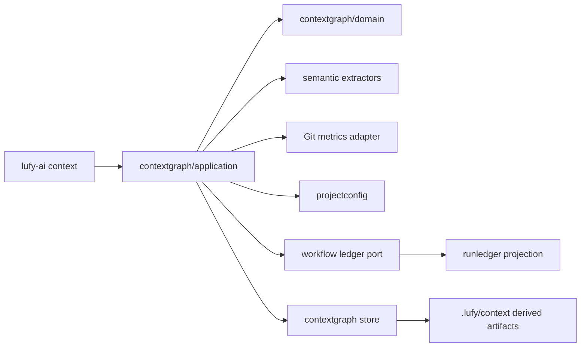
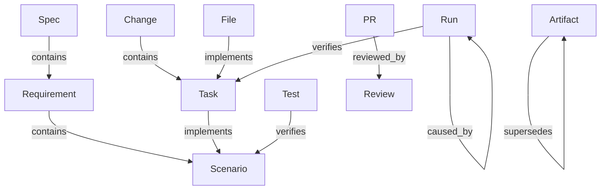
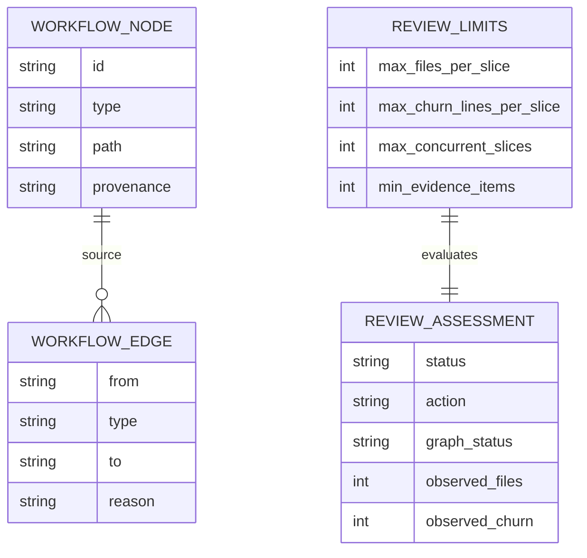
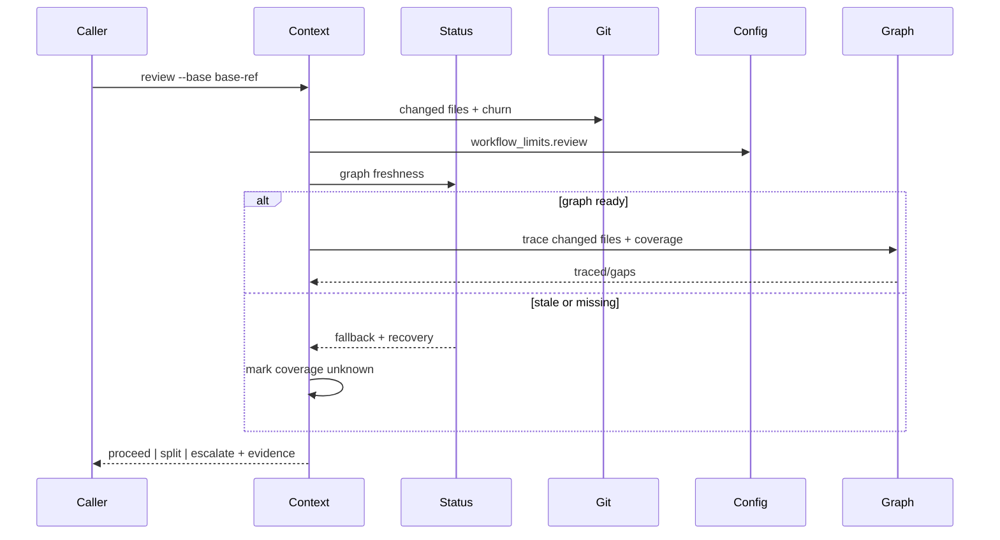

# Design: extend-context-graph-workflow-traceability

## Context

`internal/contextgraph` ya separa dominio, extractores, aplicación y store. El build recorre fuentes soportadas, mantiene cache por hash, calcula health/communities y persiste artifacts derivados. `internal/projectconfig` es autoridad de configuración; `internal/runledger` conserva eventos append-only y proyecciones content-free. La CLI expone context operations desde `internal/cli`.

La extensión debe conservar esas fronteras: extractores producen hechos estáticos; un projector traduce metadata de workflow; application compone, valida freshness y responde queries; adapters aíslan Git, config y ledger. El grafo orienta, pero archivos, comandos y roles siguen siendo evidencia primaria.

## Goals And Non-Goals

### Goals

- Modelar entidades y relaciones de workflow con IDs deterministas y provenance.
- Detectar gaps de scenario/task/test y diff/traceability.
- Evaluar carga de revisión contra límites tipados y observaciones reales.
- Degradar de forma segura ante grafo/config/ledger ausente o stale.
- Medir review/rework/reopened defects solo desde metadata disponible.
- Mantener privacidad, compatibilidad, determinismo y paridad root/embedded.

### Non-Goals

- Knowledge graph probabilístico, embeddings o dependencia de red.
- Scraping de GitHub, contenido completo de PRs/issues o telemetría remota.
- Gates autónomos basados únicamente en el grafo.
- Automatización de asignación/yield o promoción experimental.

## Architecture Overview

## Component Model

| Component | Responsibility | Inputs | Outputs | Owner/Boundary |
| --- | --- | --- | --- | --- |
| `contextgraph/domain` | Tipos de workflow, coverage, review budgets/assessment y métricas | hechos normalizados | contratos JSON bounded | dominio puro |
| `contextgraph/extractors` | Extraer specs, requirements, scenarios, tasks, decisions, tests y refs explícitas | Go/Markdown/YAML/JSON | nodes/edges con provenance | sin filesystem global |
| workflow projector | Convertir Run Ledger content-free y referencias PR/issue locales | summary/event metadata | run/pr/evidence nodes y causal edges | port inyectable |
| `contextgraph/application` | Componer grafo, freshness, coverage, trace y review decisions | graph/config/diff/ledger | resultados `ready/fallback/unknown` | reglas de aplicación |
| Git adapter | Changed files y churn sin mutación | base ref | file stats ordenadas | subprocess bounded |
| `projectconfig` | Tipar/cargar/preservar `workflow_limits.review` | YAML | review limits + availability | fuente canónica |
| CLI | Parsear flags, mapear errores/exit codes y emitir human/JSON | user input | stable output | thin adapter |
| roles/contracts/assets | Consumir assessment sin elevarlo a autoridad primaria | resultados context | routing/review/delivery guidance | managed assets |

## Data And Persistence

El schema base continúa siendo `lufy-context-graph`; nuevos node/edge types son aditivos. `extractor_version` avanza para invalidar cache y forzar rebuild. Los artifacts persisten bajo el root configurado y siguen siendo derivados/reconstruibles.

IDs semánticos usan path normalizado más slug/posición estable cuando no existe un ID explícito. Marcadores explícitos admiten referencias acotadas como `lufy:implements`, `lufy:verifies`, `lufy:depends_on`, `lufy:reviewed_by` y `lufy:supersedes`. Una referencia inválida no crea edge; produce diagnostic/gap.

Run Ledger no entra al discovery genérico. Un port recibe solamente IDs, causalidad, task refs, evidence refs, status, timestamps y métricas ya sanitizadas. La implementación prohíbe serializar cuerpos de eventos, summaries humanos, outputs o paths runtime.

## Workflow

`context coverage` requiere grafo ready y nunca reconstruye implícitamente. `context review` puede degradar: computa file/churn/config directamente, marca traceability `unknown` y recomienda rebuild. `context metrics` retorna `available`, `partial` o `unavailable` según eventos content-free observados.

## Design Patterns

- **Ports and adapters** para Git, config y ledger: evita que dominio dependa de filesystem/subprocesses.
- **Materialized projection** para graph y Run Ledger summary: artefactos reconstruibles, no fuentes primarias.
- **Explicit reference graph**: edges probatorios nacen de estructura o markers, no de fuzzy matching.
- **Policy object** para review limits: evaluación determinista y testeable separada de CLI.
- **Graceful degradation**: observaciones directas se conservan, inferencias dependientes del grafo pasan a `unknown`.
- **Existing local patterns reused**: `BuildResult/StatusResult`, cache por source hash, JSON/human dual output, config extras y adapters inyectables.

Alternativas rechazadas:

- Embeddings o ranking semántico como evidencia: no determinista y propenso a falsos positivos.
- Indexar `.lufy/runtime/**`: viola privacidad y duplica una fuente append-only.
- Rebuild automático en cada query: introduce mutación/coste inesperado en comandos read-only.
- Integrar budgets solo en prompts: no ofrece contrato ejecutable ni testable.

## Security, Privacy And Safety

- Sin impacto auth/authz ni red.
- Sensitive patterns y runtime exclusion permanecen activos.
- Markers y referencias tienen límites de tamaño/cantidad y paths normalizados; no permiten traversal fuera del repo.
- Diagnósticos muestran IDs/path de workspace permitidos, nunca valores secretos ni contenido Run Ledger.
- Canaries prueban ausencia de prompts, outputs, summaries, tokens y secrets en graph/report/query.
- Graph/assessment no avanzan status del Result Contract ni autorizan Git/GH.

## Operational Concerns

- Performance: cache por hash para static extraction; ledger projection y Git stats bounded; resultados limitados por config.
- Observability: status, freshness, availability, violations, gaps, reason, recovery y source paths explícitos.
- Migration/backfill: rescan completa `workflow_limits.review` preservando overrides/extras; graphs previos quedan stale por extractor version.
- Rollback: revertir código/config schema; borrar `.lufy/context` derivado es seguro y rebuildable.
- Compatibility: subcommands y fields nuevos son aditivos; JSON existente se preserva; config parcial se completa solo en init/rescan.
- Cross-platform: paths slash-normalized, Git output parseado sin asumir LF, tests en Windows CI.

## Decisions

### Decision: relaciones probatorias explícitas

- Context: el nombre de un test o una task puede parecerse a un scenario sin verificarlo realmente.
- Decision: crear `implements/verifies/reviewed_by/supersedes` solo desde estructura conocida o marker/ref explícita.
- Consequences: menos falsos positivos; repos existentes mostrarán gaps hasta añadir trazabilidad.

### Decision: fallback parcial, no optimista

- Context: un diff puede evaluarse cuando el grafo está stale.
- Decision: conservar métricas directas y marcar cobertura/traceability como `unknown` con recovery.
- Consequences: el reviewer obtiene señal útil sin usar evidencia obsoleta.

### Decision: budgets tipados bajo `workflow_limits.review`

- Context: límites textuales dispersos no pueden evaluarse ni preservarse correctamente.
- Decision: añadir cuatro enteros positivos con defaults 8/800/3/2 y extras forward-compatible.
- Consequences: configuración clara y migración compatible; ausencia del archivo se reporta `not_available`.

### Decision: Run Ledger mediante proyección mínima

- Context: los runs aportan causalidad y métricas, pero runtime está excluido por privacidad.
- Decision: depender de un port que expone solo metadata content-free ya validada.
- Consequences: trazabilidad causal sin indexar contenido; ledger ausente degrada métricas, no rompe build.

### Decision: una entrega con cuatro review slices

- Context: los cambios se conectan por contratos compartidos, pero tienen riesgos distintos.
- Decision: implementar y revisar slices A–D, con validación agrupada tras cada boundary y PR único salvo crecimiento de scope.
- Consequences: reviewer puede recorrer dominio, queries, policy y harness en orden; delivery sigue requiriendo autorización.

## Validation Strategy

- Slice A: RED/GREEN de extracción semántica, IDs, refs rotas, edge allowlist, deterministic ordering y canaries.
- Slice B: coverage/trace/freshness/fallback con fixtures ready/stale/missing y CLI human/JSON.
- Slice C: config defaults/rescan/extras, Git churn y tabla de decisiones de budgets/boundaries.
- Slice D: Run Ledger projection, metrics availability, role/contract/assets parity y end-to-end CLI.
- Final: `go test ./...`, `go build ./...`, race focalizado, `scripts/validate.sh`, `git diff --check` y strict SDD validate.
- Cross-platform: CRLF, separators, Git numstat y Windows runner.

## Risks

- Scope transversal superior al LOC budget default: `workload_decision_needed=true`; cuatro slices obligatorios.
- Marcadores nuevos requieren documentación y adopción progresiva; los gaps iniciales son esperados.
- Git binary o config pueden faltar: resultados deben expresar `not_available` sin panic ni falsa aprobación.
- Eventos históricos no contienen métricas de review: reportar `unavailable`, no backfill inventado.
