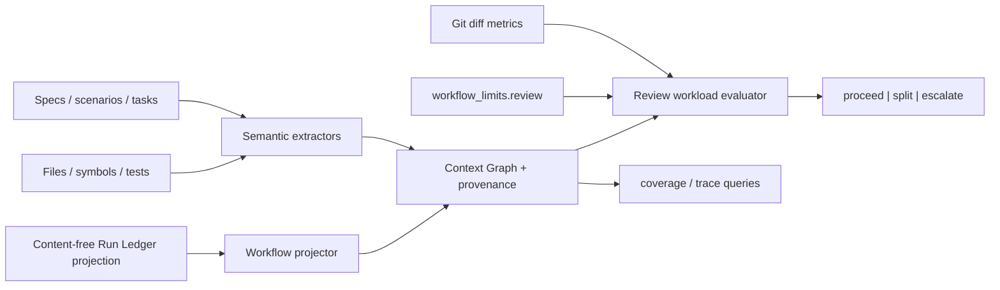

# Proposal: extend-context-graph-workflow-traceability

## LLM Objective

- Outcome principal: convertir el Context Graph en una red de trazabilidad ejecutable entre intención, implementación, evidencia, runs y revisión, y usarla para decidir si un slice es revisable antes de delivery.
- Usuario, sistema o rol beneficiado: autores, `sdd-router`, `orchestrator`, `reviewer`, `validator` y `delivery`.
- Señal objetiva de éxito: queries deterministas detectan scenarios sin task/test, archivos cambiados sin trazabilidad y budgets de review excedidos; el resultado declara freshness, evidencia y fallback.
- Tradeoff que no debe optimizarse accidentalmente: no aumentar cobertura aparente mediante inferencias débiles, indexación de contenido sensible o métricas fabricadas.

## Problem

El Context Graph actual modela archivos, símbolos y referencias léxicas, pero no conecta de forma tipada specs, requirements, scenarios, tasks, runs, tests, fallos, decisiones y PRs. El Review Workload Harness existe como guía textual, mientras que sus límites no son configurables ni evaluables bajo `workflow_limits.review`. Esto obliga al reviewer a reconstruir trazabilidad manualmente y permite que slices grandes o con evidencia insuficiente lleguen a delivery sin una señal estructurada.

La Fase 3 dejó disponibles Run Ledger y Result Contract ejecutables. La Fase 4 debe consumir sus proyecciones content-free y cerrar el circuito entre planificación, ejecución, evidencia y revisión sin convertir el grafo en autoridad primaria.

## Current Behavior

- `internal/contextgraph` descubre Go/Markdown/YAML/JSON, extrae nodos básicos y referencias, persiste un grafo derivado y ofrece `scan/status/build/query/path/explain/diff`.
- `context status` distingue `ready`, `stale` y `not_available`, pero las queries no expresan cobertura del workflow ni budgets de revisión.
- `projectconfig.WorkflowLimits` tipa sizing, routing, slicing, delivery, stop rules y preflight; no existe `workflow_limits.review`.
- `.lufy/runtime/**` se excluye correctamente del descubrimiento genérico. Run Ledger ya ofrece eventos y proyecciones content-free con causalidad, tasks, evidencias y métricas.
- Roles, contratos y specs describen review slices, pero no consumen una evaluación numérica común.
- En este checkout faltan `.lufy/config/project.yaml`, memoria inicializada y grafo construido. Esos estados son evidencia de fallback, no autorización para generar configuración o derivados.

## Target Behavior

- El extractor semántico reconoce entidades de workflow y referencias explícitas estables en artifacts Lufy SDD, verification, código/test y enlaces GitHub.
- El grafo admite edges `implements`, `verifies`, `depends_on`, `caused_by`, `reviewed_by` y `supersedes`, conservando reason/source y rechazando relaciones ambiguas.
- Una query de cobertura identifica scenarios sin task o test, y una evaluación de diff identifica archivos cambiados sin camino de trazabilidad.
- `workflow_limits.review` tipa límites de archivos, churn, slices concurrentes y evidencia mínima. Su ausencia se reporta como `not_available`; no se leen campos legacy.
- Una evaluación read-only devuelve `proceed`, `split` o `escalate`, con budgets, observaciones, gaps y recovery. No autoriza delivery.
- Freshness se evalúa antes de usar el grafo. Un grafo stale/ausente activa fallback seguro: métricas directas de diff/config siguen disponibles, mientras la cobertura se marca `unknown`, nunca `passed`.
- Runs y métricas de review se proyectan desde metadata content-free del Run Ledger; no se indexan prompts, outputs, summaries ni paths crudos del runtime.
- CLI, roles, contratos, documentación, specs y assets embedded permanecen sincronizados.

## Scope

### In Scope

- Dominio y extracción semántica de nodos de workflow, marcadores explícitos y GitHub refs locales.
- Proyección content-free de Run Ledger hacia nodos/edges causales.
- Queries CLI de cobertura/trazabilidad y evaluación de review workload.
- Freshness preflight, resultados degradados y recovery explícito.
- `workflow_limits.review` con defaults, carga, rescan y preservación de overrides/extras.
- Métricas derivadas disponibles: review duration, rework y reopened defects; `unavailable/partial` cuando faltan eventos.
- Integración con `sdd-router`, `orchestrator`, `reviewer`, `validator`, `delivery`, Result Contract y documentación.
- Pruebas unitarias, integración CLI, privacidad, determinismo y compatibilidad cross-platform.

### Out of Scope

- Consultar GitHub durante `context build` o requerir red para evaluar un repo.
- Almacenar cuerpo de issues/PRs, prompts, outputs o contenido privado del Run Ledger.
- Inferir que un test verifica un scenario solo por similitud de nombres.
- Reemplazar validator/reviewer/delivery o hacer que el grafo avance gates.
- Auto-merge, auto-split de PRs o creación automática de branches.
- Asignación adaptativa/yield de la Fase 5 y laboratorio/promoción de la Fase 6.

## Constraints

- Mantener `context build` determinista, idempotente, local-first y bounded.
- Preservar compatibilidad aditiva del schema `lufy-context-graph`; el cambio de extractor fuerza rebuild mediante versionado.
- Toda relación probatoria requiere estructura o referencia explícita; las inferencias débiles se presentan como hint, nunca como edge de evidencia.
- `.lufy/runtime/**` continúa excluido del escaneo genérico.
- `workflow_limits` es la única fuente canónica de budgets; campos top-level legacy no son válidos.
- Un resultado `stale`, `not_available`, `partial` o `unknown` no puede convertirse en evidencia positiva.
- No cambiar defaults de seguridad, auth, puertos ni red.
- Preservar trabajo local no relacionado y assets user-owned.

## Environment

- Runtime/toolchain esperado: Go toolchain de `tools/lufy-cli-go`; filesystem y Git local; GitHub solo para delivery autorizado.
- Comandos reales de validación: tests focalizados de `contextgraph`, `projectconfig`, `runledger` y `cli`; `go test ./...`; `go build ./...`; `scripts/validate.sh`; strict Lufy SDD validate.
- Dependencias o servicios externos: ninguno en runtime; CI remoto solo durante delivery autorizado.
- Variables/configuración necesarias: `.lufy/config/project.yaml` cuando exista; sin él los límites se reportan `not_available`.

## Acceptance Criteria

- **WHEN** un scenario no tiene edge explícito hacia task o test
- **THEN** `context coverage` lo reporta como gap con node id, razón y recovery.
- **WHEN** un archivo del diff no tiene camino `implements` o `verifies`
- **THEN** `context review` lo lista como `untraced_file` y no afirma cobertura completa.
- **WHEN** archivos, churn, slices concurrentes o evidencia exceden/fallan `workflow_limits.review`
- **THEN** la evaluación devuelve `split` o `escalate` con la regla exacta y sin autorizar delivery.
- **WHEN** el grafo está stale o ausente
- **THEN** las métricas directas de diff siguen disponibles, la cobertura queda `unknown` y el resultado recomienda rebuild explícito.
- **WHEN** existen eventos content-free de review/rework/reopened defect
- **THEN** `context metrics` deriva tiempos y contadores; si faltan, declara disponibilidad `partial` o `unavailable`.
- **WHEN** un artifact declara refs explícitas válidas
- **THEN** build produce edges tipados deterministas con provenance; refs rotas quedan como gaps diagnosticables.
- **WHEN** se procesa Run Ledger
- **THEN** el grafo no contiene prompts, summaries, outputs, secretos ni paths crudos de runtime.

## Diagrams

## Risks

- Parsing Markdown semántico puede producir falsos enlaces: se mitiga exigiendo marcadores o estructuras explícitas.
- Leer Run Ledger desde contextgraph puede crear acoplamiento y fuga de contenido: se usa un port/projection mínima content-free y tests con canaries.
- Defaults de review demasiado agresivos pueden bloquear trabajo válido: la evaluación recomienda y escala, pero no autoriza ni ejecuta delivery.
- El grafo puede quedar stale durante un diff: el resultado degradado separa observaciones directas de cobertura desconocida.
- La superficie cruza dominio, CLI, configuración y assets; se divide en cuatro review slices y se valida de forma agrupada.

## Open Questions

- Ninguna decisión de producto bloqueante. Los defaults iniciales se fijan como `max_files_per_slice: 8`, `max_churn_lines_per_slice: 800`, `max_concurrent_slices: 3` y `min_evidence_items: 2`, preservando overrides user-owned.
