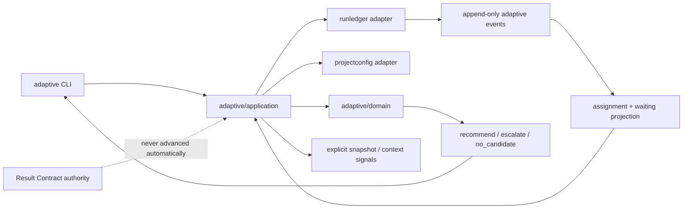
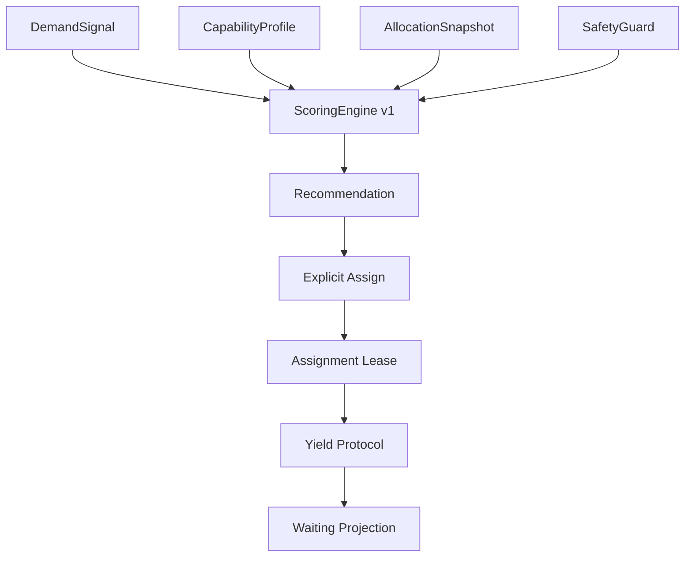
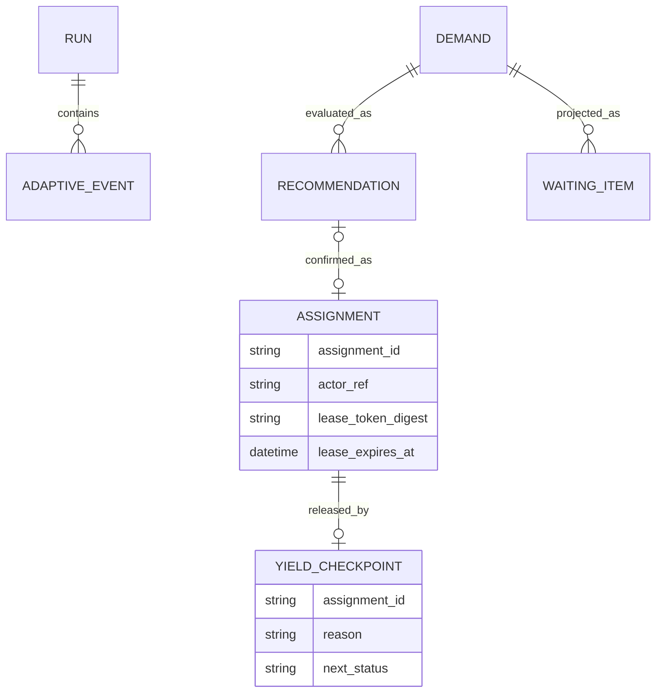
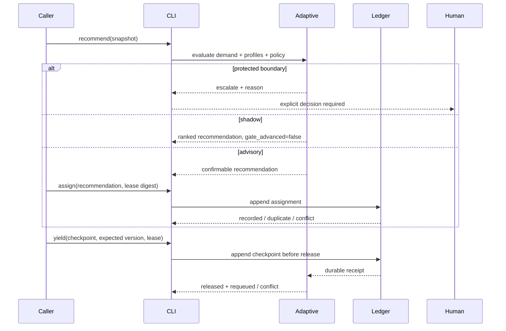

# Design: experiment-adaptive-role-allocation

## Context

La arquitectura disponible ya contiene los bloques necesarios para una evolución incremental:

- `internal/core/domain` registra roles y permisos como contratos estables.
- `internal/projectconfig` es la autoridad para feature flags, límites y preservación de config user-owned.
- `internal/resultcontract` aporta ownership, lease fencing, CAS, joins e idempotencia para gates autoritativos.
- `internal/runledger` aporta eventos append-only, locks portables, receipts, causalidad y proyecciones reconstruibles.
- `internal/contextgraph/application` aporta señales secundarias de trazabilidad, carga y métricas.
- `internal/cli` concentra superficies human/JSON y exit semantics.

El cambio agrega un scheduler adaptativo acotado sin mezclarlo con Result Contract. El scheduler decide recomendaciones y administra leases propios; Result Contract continúa siendo la autoridad de workflow. La integración ocurre por referencias y señales, no mediante imports circulares ni avance automático de gates.

## Goals And Non-Goals

### Goals

- Separar identidad del agente, capacidades actuales y `role_hint` temporal.
- Obtener decisiones reproducibles con score entero y breakdown completo.
- Modelar demanda, waiting pool, assignment, lease y yield como contratos bounded.
- Soportar shadow/advisory con feature flag disabled-by-default.
- Reutilizar Run Ledger como fuente append-only content-free y reconstruir estado adaptativo.
- Hacer visible starvation, falta de capacidad, riesgo protegido y costos de coordinación.
- Liberar lease/presupuesto solo después de un checkpoint durable válido.

### Non-Goals

- No ejecutar ML, aprendizaje online, autonomous spawn ni work stealing automático.
- No reemplazar permisos de roles, ownership de Result Contract ni gates SDD/delivery.
- No almacenar contenido libre o razonamiento del agente.
- No resolver asignación multi-task/multi-agent óptima globalmente.
- No leer GitHub/red ni mutar Git durante scoring.

## Architecture Overview



La dependencia apunta desde `adaptive` a ports mínimos. `resultcontract` no importa `adaptive`; los adapters traducen snapshots de ownership a señales cuando el caller los provee. `contextgraph` tampoco se convierte en dependencia fuerte: su salida puede entrar como disponibilidad/riesgo/evidencia, y `unknown` nunca puntúa como éxito.

## Component Model

| Component | Responsibility | Inputs | Outputs | Owner/Boundary |
| --- | --- | --- | --- | --- |
| `adaptive/domain` | contratos, validación, scoring, ranking y reglas protegidas | demanda, perfiles, snapshot, policy v1 | decisión explicada | puro, sin I/O |
| `adaptive/application` | recommend/assign/yield/status, idempotencia de caso de uso | requests tipados | response versionada | no avanza gates |
| `adaptive/adapters/projectconfig` | resolver enabled/mode y límites | target repo | policy efectiva | config user-owned |
| `adaptive/adapters/runledger` | append y replay de metadata adaptativa | events allow-listed | receipt/projection | durable, content-free |
| `projectconfig` | schema y defaults disabled-by-default | YAML/rescan | `AdaptiveRoutingConfig` | fuente canónica |
| `runledger` | tipos y persistencia causal | adaptive metadata | eventos/receipts | append-only |
| `cli` | stdin/file, target, record, JSON/human y exit codes | comando explícito | decisión/diagnóstico | superficie pública aditiva |



## Domain Contracts

Todos los inputs son strict JSON/YAML, sin claves desconocidas, con tamaño máximo y listas bounded.

### `DemandSignal`

- `schema_version: lufy-demand-signal/v1`
- `demand_id`, `task_ref`, `snapshot_version`
- `priority` y `required_budget`: enteros `0..100`
- `required_capabilities[]`: token + nivel `0..100` + peso `1..10`
- `risk` y `coordination_cost`: enteros `0..100`
- `protected_boundaries[]`: enum allow-listed
- `caused_by_event_id` opcional

### `CapabilityProfile`

- `schema_version: lufy-capability-profile/v1`
- `actor_ref`: SHA-256, nunca identidad cruda
- `capabilities[]`: token + nivel `0..100`
- `available_budget`: entero `0..100`
- `risk_tolerance`: entero `0..100`
- `coordination_cost`: entero `0..100`
- `active_assignments`: bounded list de IDs
- `role_hints[]`: enum de roles registrados; descriptivo, no identidad ni autorización

### `Assignment`

- `schema_version: lufy-adaptive-assignment/v1`
- IDs/fingerprints deterministas de demanda, profile, policy y snapshot
- `actor_ref`, `task_ref`, `role_hint`, score/breakdown y policy version
- `lease.token_digest`, `lease.expires_at`, `expected_projection_version`
- `mode: advisory`; shadow nunca crea assignment

### `YieldCheckpoint`

- `schema_version: lufy-yield-checkpoint/v1`
- `assignment_id`, `actor_ref`, lease digest/expiry y expected version
- reason enum: `blocked`, `capacity_change`, `higher_value_successor`, `lease_expiring`, `manual`
- `artifact_refs[]`/`evidence_refs[]` existentes del ledger
- `hypothesis_refs[]` y `failed_attempt_refs[]` como SHA-256 solamente
- `successor_capabilities[]` como tokens allow-listed
- `next_status: waiting|blocked|escalated|completed`

## Deterministic Scoring V1

El motor utiliza solo enteros y una policy fija versionada:

```text
capability_match = weighted_average(min(profile_level, required_level) * 100 / required_level)
risk_gap         = max(0, demand.risk - profile.risk_tolerance)
capacity_fit     = 100 si available_budget >= required_budget; de otro modo proporción entera

total = 5 * capability_match
      + 4 * demand.priority
      + 2 * capacity_fit
      - 6 * risk_gap
      - 3 * (demand.coordination_cost + profile.coordination_cost)
```

Reglas anteriores al score:

1. Cualquier protected boundary produce `escalate` y termina la evaluación.
2. Un perfil que carece de una capability requerida queda `ineligible`.
3. Budget cero/insuficiente puede permanecer visible, pero no ganar una assignment.
4. Empate: mayor capability match, luego mayor capacity fit y finalmente `actor_ref` lexicográfico.
5. Todo término, exclusión y tie-break aparece en el breakdown; no hay floats ni reloj implícito.

El score recomienda; nunca autoriza. Cambiar pesos o fórmula requiere nueva policy version y tests de compatibilidad.

## Configuration

```yaml
adaptive_routing:
  enabled: false
  mode: shadow
  policy_version: deterministic-v1
  lease_ttl_seconds: 900
  max_candidates: 32
  max_waiting_items: 128
  starvation_after_cycles: 5
```

- Config ausente: feature disabled.
- `mode` solo admite `shadow|advisory`.
- Rescan completa defaults sin activar el feature ni sobrescribir extras.
- Valores negativos, límites fuera de rango o mode/policy desconocidos fallan con path canónico.
- `parallel_execution.max_parallel_agents` limita assignments activas; `workflow_limits.review` y Context Graph pueden añadir señales de riesgo, pero no se copian ni redefinen.

## Data And Persistence

El Run Ledger mantiene el source of truth append-only. Se añade metadata opcional `adaptive` allow-listed a eventos versionados y kinds explícitos `demand`, `recommendation`, `assignment` y `yield`.



La proyección `lufy-adaptive-status/v1` se reconstruye por causalidad y secuencia local. Incluye assignments activas, presupuesto observado y waiting items ordenados por prioridad descendente, ciclo de espera descendente (mayor edad lógica primero) y `demand_id` lexicográfico. No se reescriben eventos; repair solo reemplaza proyección derivada.

Una confirmación `assign` es válida solo si la recommendation sigue siendo el último evento de la proyección y el mismo CAS vuelve a verificar capacidad global y presupuesto acumulado del actor. Presentar una `expected_projection_version` actual no revive una recomendación desplazada por eventos intermedios.

Un `yield` válido se considera liberado únicamente si el append durable devuelve `recorded` o `duplicate_noop` para el mismo fingerprint. Conflicto, lease stale, owner mismatch o storage unavailable dejan la assignment activa. El reloj por sí solo nunca libera recursos: una lease vencida requiere un checkpoint explícito, exactamente fenced, con `reason: lease_expiring` y `next_status: waiting`; ese evento durable representa la recuperación y permite reconstruir la liberación sin estado implícito.

## Workflow



## Design Patterns

- Functional Core / Imperative Shell: scoring, eligibility y tie-break son funciones puras; CLI/ledger quedan en adapters.
- Strategy: policy `deterministic-v1` es seleccionable por versión, sin loading dinámico ni ML.
- Event Sourcing + Projection: assignments/yields se reconstruyen desde Run Ledger append-only.
- Lease + Fencing Token: expected version, owner ref y token digest impiden writers stale; la confirmación revalida recommendation, capacidad y budget en el mismo CAS.
- State Machine: `waiting -> recommended -> assigned -> yielded|completed|escalated`; no existen saltos implícitos.
- Circuit Breaker de autoridad: protected boundaries cortan antes del scoring y requieren humano.

Alternativas rechazadas:

- Mutar `resultcontract.TransitionState` desde el allocator: mezclaría recomendación con autoridad y aumentaría blast radius.
- Persistir `state.json` mutable separado: duplicaría fuente de verdad y complicaría crash recovery.
- Score flotante/configurable desde el inicio: reduce reproducibilidad y abre tuning no validado.
- Autonomous work stealing: no tiene aún evidencia del laboratorio ni autorización operativa.

## Security, Privacy And Safety

- No cambia auth/authz; roles y delivery conservan permisos vigentes.
- `actor_ref`, lease token, paths, hipótesis e intentos se persisten como SHA-256 o enums/tokens.
- Decoders rechazan unknown fields, aliases/tags, duplicados, oversized, invalid UTF-8 y valores fuera de rango.
- Diagnósticos nombran field/reason sin reflejar valores sensibles.
- Protected boundaries se evalúan antes de cualquier ranking.
- `assign`/`yield` requieren ledger durable en advisory; no existe success optimista.
- Shadow nunca consume presupuesto ni altera owner.
- Deshabilitar el feature impide nuevas assignments; un yield explícito de una lease preexistente sigue permitido para recuperación segura.

## Operational Concerns

- Performance: máximo 32 candidatos y 128 waiting items; scoring `O(candidates * capabilities)` con listas bounded.
- Observabilidad: cada decisión expone policy version, breakdown, exclusions, mode, source availability y `gate_advanced: false`.
- Migration/backfill: no se backfillean eventos históricos; métricas y estado previo son `unavailable`.
- Rollback: apagar `adaptive_routing.enabled`; las leases existentes pueden liberarse explícitamente, incluso después de expirar mediante el checkpoint durable de recuperación, sin tocar Result Contract.
- Compatibility: config y ledger metadata son aditivos; readers viejos deben seguir rechazando/ignorando solo según su contrato, por lo que el schema de evento se versiona conscientemente.
- Cross-platform: canonical JSON, UTC, LF/CRLF, locks y rename se prueban en Windows/macOS/Linux.

## Decisions

### Decision: roles como hints temporales

- Context: la issue exige que un agente entienda el objetivo y pueda cambiar de función.
- Decision: identidad (`actor_ref`) y capacidad son independientes; `role_hint` se deriva para la assignment, pero permisos siguen en el Role Contract.
- Consequences: un agente puede recomendarse para otra función sin adquirir privilegios ni borrar su historial.

### Decision: shadow y advisory, sin autonomous

- Context: no hay baseline experimental suficiente para reasignación automática.
- Decision: shadow solo observa; advisory requiere invocación explícita para registrar assignment/yield.
- Consequences: la fase 6 puede medir calidad antes de promover un modo más fuerte.

### Decision: Run Ledger como fuente content-free

- Context: assignments, retries y yield necesitan idempotencia, causalidad y crash safety.
- Decision: extender metadata allow-listed del ledger y derivar proyecciones; no crear store mutable paralelo.
- Consequences: mayor cohesión y trazabilidad, a cambio de versionar evento/projection y ampliar privacy tests.

### Decision: yield es liberación segura, no sacrificio

- Context: la inspiración de colonia describe priorizar el objetivo colectivo, pero no debe traducirse en pérdida opaca de trabajo o identidad.
- Decision: yield conserva artifacts/evidence/hypotheses/attempts como refs, libera solo recursos adaptativos y declara capacidades sucesoras.
- Consequences: la reasignación es reversible/auditable y el sucesor recibe contexto mínimo útil.

## Validation Strategy

- Slice A: RED/GREEN de strict decode, bounds, scoring, exclusions, tie-break y config disabled-by-default/rescan.
- Slice B: RED/GREEN de append, duplicate/conflict, concurrent assign/yield, lease stale/expired, waiting order, repair y crash fixtures.
- Slice C: matriz de modes/comandos/exit codes, snapshot stale, protected boundaries, ledger unavailable y no gate advancement.
- Slice D: lifecycle/roles/contracts/docs/assets, canaries de privacidad, coupling/parity y E2E recommend -> assign -> yield -> requeue.
- Final: `go test ./...`, `go build ./...`, race focalizado, `scripts/validate.sh`, `git diff --check origin/develop`, strict SDD validate y CI multi-OS durante delivery.

## Risks

- El scope puede exceder review budget: cuatro slices obligatorios y stop rule ante crecimiento de schema/CLI no previsto.
- Extender Run Ledger puede romper fixtures o readers: cambios aditivos versionados, goldens y compatibilidad explícita.
- Starvation o thrashing: espera lógica observable, lease TTL y ninguna reasignación automática.
- Score aparentemente objetivo pero sesgado: breakdown íntegro, policy fija y fase 6 antes de cualquier aprendizaje/promoción.
- Config inexistente en este repo checkout: proposal no inventa estado local; implementación cubre generación, carga parcial y ausencia mediante fixtures.
