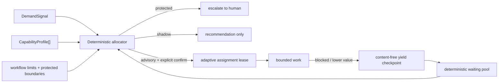

# Proposal: experiment-adaptive-role-allocation

## LLM Objective

- Outcome principal: recomendar y ejecutar, solo bajo invocación explícita, asignaciones y cesiones de trabajo explicables según demanda, capacidad, riesgo y costo de coordinación.
- Usuario, sistema o rol beneficiado: orchestrator, implementer, reviewer y mantenedores que coordinan varios agentes o slices concurrentes.
- Señal objetiva de éxito: la misma entrada produce el mismo ranking y decisión; una cesión válida libera el lease adaptativo y deja un checkpoint content-free reutilizable; los límites protegidos siempre escalan.
- Tradeoff que no debe optimizarse accidentalmente: no maximizar ocupación, paralelismo o velocidad a costa de seguridad, autoridad humana, trazabilidad, privacidad o carga de coordinación.

## Problem

Lufy ya dispone de roles, Result Contract ejecutable, leases de ownership, Run Ledger causal y Context Graph para carga de revisión, pero la asignación de trabajo continúa siendo estática y externa al producto. Un rol se elige por convención al iniciar el trabajo y no existe un contrato tipado que compare demanda con capacidades disponibles, mantenga una waiting pool o permita ceder una asignación sin perder contexto reutilizable.

Esto provoca tres fallos sistémicos: agentes o slices pueden quedar ocupados aunque otra capacidad tenga mayor valor esperado; un bloqueo puede retener presupuesto y trabajo; y una reasignación manual puede perder artifacts, hipótesis, intentos fallidos o requisitos del sucesor. La fase 4 (#221) ya aporta trazabilidad y límites de review; la fase 5 puede usarlos como señales secundarias sin convertirlos en autoridad.

## Current Behavior

- `internal/core/domain` define roles fijos y sus permisos, pero no perfiles de capacidad temporales.
- `internal/resultcontract` valida owner, lease, evidencia y transiciones, pero no selecciona owner ni reasigna trabajo.
- `internal/runledger` persiste eventos causales content-free, checkpoints y métricas, pero no modela demanda, asignación o yield.
- `internal/contextgraph` produce cobertura, carga de revisión y métricas; esos resultados no participan en un ranking de asignación.
- `parallel_execution` limita concurrencia por configuración, sin waiting pool ni utilización de presupuesto por assignment.
- No existe una superficie CLI para explicar por qué una capacidad fue recomendada o por qué una frontera requiere escalamiento humano.

## Target Behavior

1. Incorporar contratos versionados y bounded para `DemandSignal`, `CapabilityProfile`, `Assignment`, `AssignmentLease`, `WaitingItem` y `YieldCheckpoint`.
2. Tratar el rol como `role_hint` temporal derivado de capacidades y no como identidad del agente; la identidad queda pseudonimizada mediante `actor_ref` SHA-256.
3. Evaluar candidatos mediante scoring entero, determinista y completamente explicable. Los empates se resuelven por claves estables, no por timing.
4. Mantener dos modos iniciales:
   - `shadow`: calcula y opcionalmente observa recomendaciones, sin adquirir leases ni cambiar ownership;
   - `advisory`: permite que un caller explícito confirme una assignment y ejecute `yield`, sin avanzar gates ni mutar ownership de Result Contract automáticamente.
5. Mantener `adaptive_routing.enabled: false` por default. Deshabilitado, no se crean assignments adaptativas y el routing vigente permanece intacto.
6. Hacer fail-closed ante `delivery`, `security`, `public_contract`, `database_schema` o `destructive_migration`: la salida es `escalate`, sin score ganador ni lease.
7. Persistir únicamente metadata allow-listed y content-free mediante Run Ledger. No guardar prompts, respuestas, razonamientos, diffs, secretos, hipótesis en texto ni resultados de comandos.
8. Ejecutar `yield` con idempotencia y fencing: validar assignment/lease vigente, registrar primero el checkpoint durable y solo entonces proyectar lease/presupuesto como liberados.

## Scope

### In Scope

- Nuevo dominio `internal/adaptive` separado en reglas puras, aplicación y adapter de Run Ledger.
- Config `adaptive_routing` tipada, preservación de overrides/extras y feature flag disabled-by-default.
- Scoring v1 fijo con breakdown observable de demanda, match de capacidades, capacidad disponible, riesgo y coordinación.
- Waiting pool bounded y ordenada de forma determinista.
- Metadata adaptativa allow-listed en eventos Run Ledger y proyección reconstruible.
- Superficies CLI human/JSON para `adaptive recommend`, `adaptive assign`, `adaptive yield` y `adaptive status`.
- Integración progresiva con Result Contract, Context Graph y contratos de roles sin delegarles autoridad nueva.
- Tests unitarios, tabla de decisiones, concurrencia, idempotencia, privacidad, cross-platform, docs y assets embedded.

### Out of Scope

- Aprendizaje automático, actualización automática de pesos o reinforcement learning.
- Modo autónomo que cree subagentes, cambie owners, ejecute delivery o avance gates sin invocación explícita.
- Reasignación automática de seguridad, contratos públicos, schema/database, migraciones destructivas o Git/GitHub.
- Optimización global/NP-hard, subastas económicas reales, prioridades basadas en identidad personal o evaluación de desempeño individual.
- Persistir contenido libre de hipótesis, prompts, summaries, outputs, diffs o secretos.
- Sustituir `result-transition/v1`, `workflow_limits`, validación, reviewer, checks remotos o autorización humana.

## Constraints

- `develop` continúa como base; la issue trazable es #222 y depende de #221 ya cerrada.
- Go sigue siendo el runtime del producto; no se agregan servicios externos ni dependencias de red.
- La CLI mantiene diagnósticos sanitizados, JSON versionado, idempotencia y compatibilidad Windows/macOS/Linux.
- `adaptive_routing` es aditivo y disabled-by-default; config ausente equivale a feature deshabilitada.
- Los límites de concurrency y review siguen viniendo de `parallel_execution` y `workflow_limits.review`; el nuevo motor los consume como señales, no crea aliases top-level.
- El Run Ledger conserva eventos append-only como fuente; proyecciones y waiting pool son derivables.
- La cesión libera recursos del scheduler adaptativo, no borra trabajo ni revoca silenciosamente ownership de Result Contract.
- Ningún score puede sobrepasar una frontera protegida ni autorizar delivery.

## Environment

- Runtime/toolchain: Go en `tools/lufy-cli-go`; YAML mediante `gopkg.in/yaml.v3`; persistencia content-free en `internal/runledger`.
- Validación real: tests Go por package/slice, tabla RED/GREEN, race focalizado, `go test ./...`, `go build ./...`, `scripts/validate.sh`, `git diff --check` y strict SDD validate.
- Dependencias externas runtime: ninguna.
- Config requerida: `.lufy/config/project.yaml` cuando el feature se use; ausencia se reporta como disabled/not_available sin inventar defaults activos.

## Research Basis

- El [Contract Net Protocol](https://ieeexplore.ieee.org/document/1675516) aporta negociación y asignación distribuida; Lufy toma el contrato explicable, no una subasta autónoma.
- La taxonomía de [Multi-Robot Task Allocation](https://doi.org/10.1177/0278364904045564) separa demanda, capacidades y utilidad; Lufy limita la primera versión a single-task/single-agent con snapshot explícito.
- [Scheduling Multithreaded Computations by Work Stealing](https://doi.org/10.1145/324133.324234) inspira liberar trabajo retenido y aprovechar capacidad ociosa, preservando dependencias y límites de concurrencia.
- Los [response thresholds en sociedades de insectos](https://doi.org/10.1006/bulm.1998.0041) inspiran responder a señales de necesidad con perfiles heterogéneos; en Lufy esos umbrales son explícitos, auditables y no antropomorfizan ni sacrifican agentes.
- [The Vision of Autonomic Computing](https://doi.org/10.1109/MC.2003.1160055) aporta el loop monitor-analyze-plan-execute; esta fase implementa monitor/analyze/recommend y una ejecución explícita acotada, con conocimiento observable.

## Acceptance Criteria

- **WHEN** dos perfiles reciben el mismo `DemandSignal`
- **THEN** el motor produce ranking, breakdown, decisión y tie-break deterministas.

- **WHEN** cambia prioridad, capacidad disponible, riesgo o costo de coordinación
- **THEN** la recomendación puede cambiar y explica exactamente qué términos variaron.

- **WHEN** una demanda declara una frontera protegida
- **THEN** la decisión es `escalate`, no se elige ganador y no se crea lease.

- **WHEN** adaptive routing está ausente o deshabilitado
- **THEN** no se registra assignment adaptativa y el routing/ownership actual se conserva.

- **WHEN** el modo es `shadow`
- **THEN** se puede observar la recomendación, pero `assign` no adquiere lease ni consume presupuesto.

- **WHEN** el modo es `advisory` y un caller confirma una recomendación vigente
- **THEN** se registra una assignment idempotente con lease digest/expiry y se descuenta presupuesto solo en la proyección adaptativa.

- **WHEN** un agente no progresa o detecta mayor valor esperado en otro perfil
- **THEN** `yield` valida el lease, registra checkpoint/artifacts/hipótesis/intentos fallidos por referencias content-free y publica capacidades sucesoras.

- **WHEN** el checkpoint durable de yield fue aceptado
- **THEN** la proyección libera lease y presupuesto, reencola la demanda de forma determinista y no avanza gates.

- **WHEN** el lease está vencido, pertenece a otro actor o la misma idempotency key cambia de payload
- **THEN** la operación rechaza/conflicta sin release parcial ni sobrescritura.

- **WHEN** Run Ledger no está disponible para `assign` o `yield`
- **THEN** no se informa éxito ni se simula una liberación durable; se devuelve recovery sanitizado.

- **WHEN** los eventos persistidos se inspeccionan recursivamente
- **THEN** no contienen prompts, respuestas, summaries, secretos, paths crudos, diffs ni texto de hipótesis/intentos.

## Diagrams

## Review Workload

`workload_decision_needed=true`. El cambio cruza config, dominio, Run Ledger, CLI y assets, por lo que supera el budget normal y se divide en cuatro review slices con validación agrupada:

1. Dominio, config y scoring determinista.
2. Eventos/proyección, leases, waiting pool y yield.
3. Application service y CLI shadow/advisory.
4. Harness, privacidad, documentación, assets y validación end-to-end.

Los slices comparten schemas e invariantes; la guía inicial es un solo PR con commits/review sections distinguibles. Si el slice de persistencia supera los límites de review o requiere cambiar un contrato público no descrito, se detiene y reevalúa el split.

## Risks

- Confundir recomendación con autoridad: todas las salidas declaran mode, policy, evidencia y `gate_advanced: false`.
- Thrashing por cambios pequeños: ranking usa snapshot/version y leases acotados; no hay reassignment automático en esta fase.
- Starvation de demandas con score bajo: waiting pool conserva prioridad/edad lógica y reporta starvation risk sin autoelevar privilegios.
- Doble asignación o release parcial: append idempotente, lease digest, expected version y proyección reconstruible.
- Scope transversal y drift de assets: slices revisables, coupling/parity tests y validación agrupada final.
- Exposición de razonamiento o contenido: contracts allow-listed con refs/digests y privacy canaries.

## Open Questions

- No queda una decisión de producto bloqueante. La fase inicial se limita a `shadow` y `advisory`; un eventual modo autónomo pertenece a otra proposal y requiere evidencia del laboratorio de fase 6.
- El scoring v1 será fijo y versionado. Cualquier tuning aprendido se difiere a fase 6 y nunca podrá desactivar protected boundaries.
