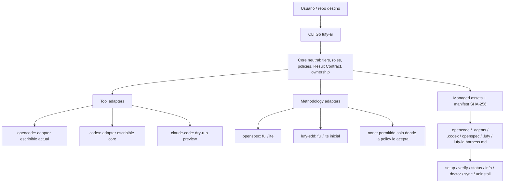
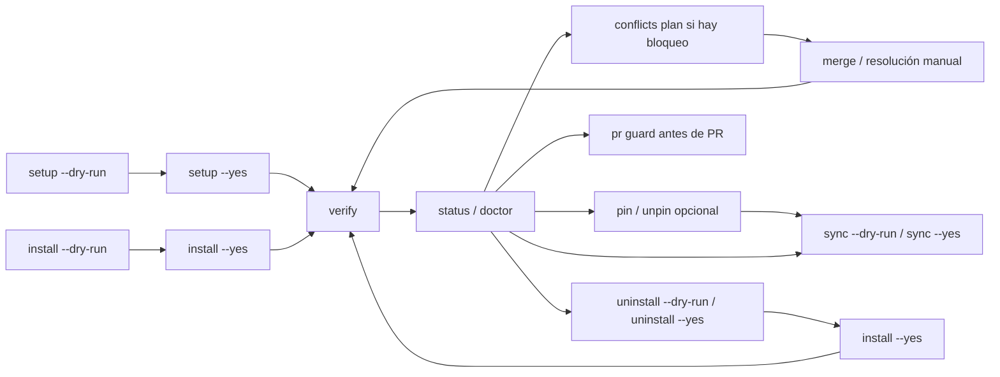

# lufy-ai

<p align="center">
  
</p>

<p align="center">
  Harness operativo para instalar, mantener y gobernar flujos AI-first en repositorios existentes.
</p>

<p align="center">
  <a href="#que-es-lufy-ai">Qué es</a> •
  <a href="#quickstart">Quickstart</a> •
  <a href="#arquitectura">Arquitectura</a> •
  <a href="#cli-y-lifecycle">CLI</a> •
  <a href="#setup-y-command-palette">Setup</a> •
  <a href="#estado-real">Estado</a> •
  <a href="docs/installation.md">Instalación</a> •
  <a href="docs/roadmap.md">Roadmap</a>
</p>

---

## Qué es `lufy-ai`

`lufy-ai` es un harness instalable. No reemplaza tu stack, no genera una app y no fuerza una metodología única. Agrega una capa operativa sobre un repositorio para coordinar agentes, reglas de workflow, specs, validación, delivery, memoria local, grafo de contexto y assets gestionados.

La versión actual instala el preset productivo **OpenCode + OpenSpec**. El core ya está orientado a arquitectura hexagonal: tiers, roles, Result Contract, policies, validación y managed assets viven como dominio neutral; OpenCode, OpenSpec y Lufy SDD son adapters seleccionables o modelados alrededor de ese dominio.

El objetivo de producto es que Lufy sea el harness y que la tool sea reemplazable: hoy OpenCode es el preset productivo principal, Codex ya tiene adapter core escribible project-local y Claude Code sigue como preview dry-run hasta que exista una superficie validada.

## Qué problema resuelve

En proyectos reales, usar agentes sin una capa de harness suele dejar tres problemas:

- cada agente interpreta distinto el alcance, la evidencia y el estado del trabajo;
- las specs, skills y prompts quedan acoplados a una tool concreta;
- actualizar el kit en repositorios brownfield puede pisar configuración local o bloquearse por drift esperado.

`lufy-ai` resuelve eso con:

- routing proporcional T1/T2/T3;
- contratos de salida compactos para handoffs entre agentes;
- skills y agentes con responsabilidades explícitas;
- metodología por tier: `openspec`, `lufy-sdd` o `none` donde la policy lo permite;
- CLI Go con `setup`, hashes SHA-256, manifest, backups, restore, sync, uninstall y guardrails de PR;
- memoria Obsidian portable y grafo de contexto local como índices secundarios para ahorrar exploración repetitiva;
- separación entre core neutral, tool adapters y methodology adapters.

## Quickstart

Versión estable actual: `v0.6.11`. La guía completa por OS/shell está en [`docs/installation.md`](docs/installation.md).

### 1. Instalar el binario

```bash
curl -fsSL https://raw.githubusercontent.com/adrotech/lufy-ai/v0.6.11/scripts/bootstrap.sh -o /tmp/lufy-bootstrap.sh
less /tmp/lufy-bootstrap.sh
bash /tmp/lufy-bootstrap.sh --version v0.6.11 --install-dir "$HOME/.local/bin"
```

### 2. Revisar el plan end-to-end sobre tu repo

```bash
lufy-ai version
lufy-ai setup --target /ruta/a/tu/proyecto --dry-run
```

`setup` verifica versión, detecta qué falta y orquesta layout, install, project config, memoria, context graph y verify. Por seguridad, `--dry-run` no escribe. Sin `--yes`, las mutaciones reales se bloquean o se ofrecen en UI interactiva cuando hay TTY.

Si necesitas controlar tool, scope o metodología por tier, usa el flujo manual de instalación:

```bash
lufy-ai init --target /ruta/a/tu/proyecto
lufy-ai memory init --target /ruta/a/tu/proyecto
lufy-ai install --target /ruta/a/tu/proyecto --tool opencode --scope project --dry-run --yes
```

`init` crea `.lufy/config/project.yaml` con detección de stacks y `project_profile.surfaces`. En una terminal interactiva abre Bubble Tea por default para revisar si el proyecto es `frontend`, `backend`, `fullstack`, `mobile`, `cli`, `infra` o `library`; usa `--interactive=false` para desactivar la UI. En repos ya inicializados, `lufy-ai scan --target /ruta/a/tu/proyecto` reescanea y también abre la UI cuando hay TTY.

`memory init` crea `.lufy/memory` como memoria Obsidian portable e ignorada por Git por defecto. La configuracion canonica de memoria/vault vive en `.lufy/config/project.yaml`; el contenido privado vive en `inbox/` y `knowledge/`; el CLI valida frontmatter/backlinks, busca notas y persiste conocimiento con `lufy-ai memory validate|search|capture|connect|index`.

### 3. Instalar y verificar

```bash
lufy-ai setup --target /ruta/a/tu/proyecto --yes
lufy-ai verify --target /ruta/a/tu/proyecto --tool opencode
lufy-ai status --target /ruta/a/tu/proyecto --verbose
```

Obsidian es la única memoria canónica portable. Lufy no instala ni verifica MCPs externos de memoria.

### 4. Desinstalar o reinstalar si hace falta

```bash
lufy-ai uninstall --target /ruta/a/tu/proyecto --dry-run
lufy-ai uninstall --target /ruta/a/tu/proyecto --yes
lufy-ai install --target /ruta/a/tu/proyecto --tool opencode --yes
```

`uninstall` elimina solo assets gestionados sin drift, crea backup previo, preserva configuración user-owned y remueve solo la integración LUFY gestionada de `AGENTS.md`.

## Walkthrough end-to-end

Este flujo lleva un repo nuevo desde instalación hasta una primera demo T3 sin delivery:

```bash
lufy-ai version
lufy-ai setup --target /ruta/a/tu/proyecto --dry-run
lufy-ai setup --target /ruta/a/tu/proyecto --yes
lufy-ai verify --target /ruta/a/tu/proyecto --tool opencode --deep
```

Luego abre o reinicia OpenCode dentro del repo destino y ejecuta:

```text
/lufy.onboard --demo --dry-run
```

El onboarding lee `.lufy/config/project.yaml`, valida estáticamente la instalación y propone un T3 dummy adaptado al stack detectado sin mutar archivos. Si aceptas aplicar una demo real, el flujo correcto es derivar a `implementer` con alcance T3, ejecutar validación proporcional y mantener commit/push/PR como delivery separado y explícitamente autorizado.

Para cerrar la sesión con trazabilidad local:

```text
/lufy.timereport
```

## Lo que instala hoy

| Área | Ruta | Propósito |
| --- | --- | --- |
| Agentes OpenCode | `.opencode/agents/` | `orchestrator`, `sdd-router`, `explorer`, `implementer`, `test-writer`, `validator`, `reviewer` y `delivery`. |
| Comandos OpenSpec | `.opencode/commands/opsx-*.md` | Ciclo OpenSpec: explore, propose, apply, verify, sync, archive y version. |
| Comandos Lufy | `.opencode/commands/lufy.*.md` | Extras propios del kit: `/lufy.close`, `/lufy.pr-review`, `/lufy.timereport`, `/lufy.onboard`, `/lufy.context` y `/lufy.mem-*`. |
| Memoria Obsidian | `.opencode/commands/lufy.mem-*.md`, `.opencode/skills/lufy.mem-*`, `.opencode/hooks/memory-*.sh`, `.opencode/plugins/lufy-memory-context.ts` | Captura, documenta, conecta y busca memoria portable en `.lufy/memory`; el plugin OpenCode ejecuta orientación/validación best-effort. |
| Skills | `.opencode/skills/` | Skills locales para workflow SDD/OpenSpec, PR, onboarding, memoria y reportes instalables. |
| Templates | `.opencode/templates/` | `sdd-lite.md`, `result-contract.md` y `memory-note.md` para T2, handoffs y notas validables. |
| Policies | `.opencode/policies/` | Delivery, branch safety, validación, gates y permisos. |
| Observatory | `.opencode/plugins/agent-observatory.tsx` | Plugin TUI local de observabilidad de agentes. |
| Codex core | `.agents/skills/`, `.codex/agents/`, `.codex/hooks.json`, `.codex/rules/`, `.codex/config.toml` | Roles, skills, hooks, reglas y config project-locales cuando se instala con `--tool codex`. |
| OpenSpec | `openspec/` | Configuración, specs base, deltas y workflow action-based. |
| Lufy SDD | `.lufy/workflows/sdd/` | Superficie inicial opcional cuando se selecciona `lufy-sdd`. |
| Harness doc | `lufy-ia.harness.md` | Instrucciones compartidas legacy; `AGENTS.md` usa bloque LUFY gestionado compacto. |
| Estado local | `.lufy/managed-state/install-state.json` | Manifest schema v2 con tool, methodology por tier, ownership y hashes. |

`.lufy/memory` no es un asset gestionado por `sync`: lo crea `lufy-ai memory init` o `setup` y su contenido queda user-owned. `sync` actualiza comandos, skills, hooks, plugin y templates de memoria, pero no toca notas privadas. `doctor` y `verify --deep` reportan estado de memoria, contexto y lifecycle hooks con comandos de recuperación.

`AGENTS.md` es user-owned: la CLI solo crea o mantiene un bloque LUFY gestionado compacto y sigue reconociendo la referencia legacy `@lufy-ia.harness.md`. `opencode.json` también es user-owned/merge-managed: se mergea de forma conservadora y no se registra como asset completo por hash.

## Arquitectura



El dominio no debería saber de paths específicos de OpenCode, `CLAUDE.md` o `AGENTS.md`. Ese conocimiento pertenece a adapters. Esta separación evita duplicar tiers, agentes, contracts y policies cuando se agreguen tools nuevas.

Más detalle técnico: [`docs/architecture.md`](docs/architecture.md).

## Routing T1/T2/T3

| Tier | Cuándo aplica | Metodología típica | Resultado |
| --- | --- | --- | --- |
| T1 Full SDD | Arquitectura, contratos públicos, seguridad, cambios transversales o alta incertidumbre. | `openspec/full` o futuro `lufy-sdd/full`. | Proposal, design, specs, tasks, validación agrupada, optional overview/render y archive. |
| T2 SDD Lite | Cambio funcional acotado, bug relevante, agente/skill o refactor controlado. | `openspec/lite`, `lufy-sdd/lite` o mini-spec. | Criterios `WHEN`/`THEN`, handoff recuperable, optional overview/render y review enfocada. |
| T3 Express | Cambio trivial, mecánico, local o documental. | `none` permitido. | Implementación directa y validación proporcional. |

La metodología es elegible por tier, no global. Eso permite que un proyecto use OpenSpec completo para T1, Lufy SDD Lite para T2 y ningún spec para T3. La mentalidad de los agentes se ajusta con `project_profile.surfaces` en `.lufy/config/project.yaml`, separando stack técnico (`go`, `typescript`) de superficie de producto (`frontend`, `backend`, `fullstack`, `mobile`, `cli`, `infra`, `library`).

`init` también escribe `parallel_execution`, que permite paralelismo gobernado solo cuando `sdd-router` detecta `review_slices` independientes, archivos no compartidos, plan de merge claro y validación agrupada tras el join. No se paraleliza delivery, migraciones de schema/db, contratos públicos no cerrados ni cambios sobre los mismos archivos.

Cuando `init` o `scan` detecta o el usuario selecciona `frontend` o `fullstack`, el `agent_lens` generado favorece estructura feature-driven y ahora persiste `structural_expectations`: código de cada funcionalidad colocado en `src/features/<feature>/` con `components/`, `hooks/`, `services`, `types.ts` y un barril público `index.ts`; `src/pages/` queda para routing/layouts, y `src/components`, `src/hooks`, `src/services` y `src/utils` se reservan para piezas globales compartidas. Si un prompt pide carpetas concretas, el harness las trata como criterios de aceptación obligatorios y bloquea validación/aprobación si páginas, hooks o utilidades quedan en la raíz de la feature sin confirmación explícita del usuario.

Para `backend`, `project_profile.surfaces[*].architecture` registra arquitectura detectada/preferida y `architecture.structural_expectations`. El mínimo recomendado es `controller_service_repository`; desde la interfaz Bubble Tea el usuario puede cambiar a `clean_architecture` o `hexagonal` si el proyecto ya usa esa arquitectura o si decide adoptarla. En `fullstack`, el frontend sigue feature-driven y la arquitectura backend se toma de la surface backend conectada. Los agentes deben revisar primero la arquitectura existente antes de introducir capas nuevas y validar contra la arquitectura seleccionada antes de reportar readiness.

Ejemplos:

```bash
lufy-ai install --target <repo> --methodology-tier T3:none --yes
lufy-ai install --target <repo> --methodology-tier T2:lufy-sdd/lite --yes
lufy-ai install --target <repo> --methodology-tier T2:openspec/lite --methodology-tier T3:none --yes
```

Por seguridad, los comandos mutantes bloquean `T1:none`, `T2:none` y `--tool claude-code`. `opencode` sigue siendo el default; `codex` ya instala una superficie project-local core con `.agents/skills`, `.codex/agents`, hooks/rules/config y `AGENTS.md` gestionado.

## CLI y lifecycle

| Comando | Propósito |
| --- | --- |
| `lufy-ai setup` | Orquesta onboarding end-to-end: chequeo de versión, layout, install, project config, memoria, context graph y verify. Usa defaults `opencode`/`project`; para customizar tool/scope/metodología usa comandos individuales. |
| `lufy-ai menu` | Abre un command palette Bubble Tea en TTY; también aparece cuando ejecutas `lufy-ai` sin argumentos en una terminal interactiva. |
| `lufy-ai init` | Genera `.lufy/config/project.yaml` stack-aware/surface-aware y editable; abre selector Bubble Tea por default cuando hay TTY. |
| `lufy-ai scan` | Reescanea stacks y superficies de producto, preserva overrides y abre selector Bubble Tea por default cuando hay TTY. |
| `lufy-ai install` | Instala assets gestionados, mergea configs user-owned y escribe manifest con SHA-256. |
| `lufy-ai uninstall` | Remueve assets gestionados sin drift, con backup, preservando configs user-owned. |
| `lufy-ai verify` | Valida manifest, estructura, JSON, hashes y referencias críticas. |
| `lufy-ai status` | Resume estado instalado, drift, faltantes y detalles por asset. |
| `lufy-ai info` | Muestra catálogo efectivo, manifest, stacks y surfaces sin mutar. |
| `lufy-ai doctor` | Diagnostica `.lufy/config/project.yaml`, manifest y drift de forma read-only. |
| `lufy-ai conflicts plan` | Genera un plan read-only de conflictos de instalación agrupado por categoría, riesgo, recomendación y acciones posibles. |
| `lufy-ai pin` | Congela un asset gestionado para que `sync` lo preserve sin modificar. |
| `lufy-ai unpin` | Remueve el freeze de un asset gestionado y permite `sync` normal. |
| `lufy-ai sync` | Reaplica assets gestionados cuando el source cambió y el target no tiene drift local. |
| `lufy-ai merge` | Reconcilia `.lufy-new` con edits locales cuando existe ancestor seguro. |
| `lufy-ai backup` | Crea backup multiasset bajo `.lufy/managed-state/backups/<timestamp>/`. |
| `lufy-ai restore` | Restaura backups validando target, paths seguros y hashes. |
| `lufy-ai opsx render` | Genera un HTML offline/autocontenido para revisar artifacts OpenSpec. |
| `lufy-ai context` | Genera y consulta un grafo local determinístico configurado desde `.lufy/config/project.yaml`, con reporte derivado y hints rankeados para ahorrar exploración inicial. |
| `lufy-ai memory` | Inicializa, valida, busca, captura, conecta e indexa memoria Obsidian portable bajo `.lufy/memory`. |
| `lufy-ai pr guard` | Detecta paths ignorados por `.gitignore` o metadata interna en `git diff <base>...HEAD` antes de push/PR; también aparece en la command palette. |
| `lufy-ai upgrade` | Actualiza el binario a una versión fija con checksum. |
| `lufy-ai version` | Muestra versión, commit, build date y plataforma. |

## Setup y command palette

`setup` es el flujo recomendado para un repo nuevo o para revisar capacidades nuevas pendientes:

```bash
lufy-ai setup --target <repo> --dry-run
lufy-ai setup --target <repo> --yes
lufy-ai setup --target <repo> --json --dry-run
lufy-ai setup --target <repo> --check-new-features --dry-run
```

Comportamiento real:

- consulta la última release salvo `--skip-version-check`;
- puede bloquear con `--require-latest` si hay una versión estable más nueva o si no puede verificar releases;
- planifica layout `.lufy`, install, project config, stack profile, SDD methodology, memoria, context graph y verify;
- si hay conflictos de assets no gestionados, bloquea y recomienda `lufy-ai conflicts plan --target <dir>`;
- sin `--yes`, no aplica mutaciones reales; en TTY puede abrir una checklist Bubble Tea para seleccionar acciones;
- usa defaults `--tool opencode` y `--scope project` de forma implícita; para `codex`, `global`, `both` o overrides `--methodology-tier`, usa `install`, `sync` y `verify` directamente.

`menu` expone un command palette local para ejecutar comandos comunes sin recordar flags:

```bash
lufy-ai menu
lufy-ai
```

El palette incluye `setup`, `init`, `scan`, `install`, `sync`, `verify`, `doctor`, `status`, `info`, `upgrade`, memoria, contexto, `conflicts plan`, `pr guard`, backup/restore, `merge`, `pin`, `unpin`, `uninstall`, `opsx render` y `version`. Solo se abre cuando `stdin` y `stdout` son TTY; en scripts, `lufy-ai` sin argumentos imprime ayuda.

## Conflictos y PR guard

`conflicts plan` y `pr guard` son guardrails para trabajar con repos brownfield y releases.

```bash
lufy-ai conflicts plan --target <repo> --json
lufy-ai pr guard --target <repo> --base origin/develop
lufy-ai pr guard --target <repo> --base origin/main --include-worktree
```

`conflicts plan` no muta archivos: agrupa conflictos por categoría (`.opencode/agents`, `.opencode/skills`, `openspec/specs`, `.codex`, `.lufy`, `root/config`, etc.), asigna riesgo, recomienda `merge` o `block` y lista acciones disponibles como `keep-local`, `accept-managed`, `merge`, `backup-and-replace` o `block`.

`pr guard` revisa el rango `git diff <base>...HEAD` o `git diff <base>` con `--include-worktree`. Bloquea si entran paths ignorados por `.gitignore` o metadata interna conocida: `openspec/`, `.lufy/`, `.lufy-ai/` y `pr_review/`. Esto cubre el caso que `.gitignore` no evita: archivos ya trackeados o cherry-picks que entran al PR.

### Overview/render de propuestas

El contrato del harness exige que una propuesta o especificación lista preserve el outcome opcional de overview/render como `generated`, `offered_pending`, `skipped_by_user` o `not_available`. Para OpenSpec propose, la respuesta exitosa debe mostrar el comando exacto `lufy-ai opsx render --change <change> --format html --theme notion-dark` y preguntar explícitamente: `¿Quieres que genere ahora el reporte HTML offline de los artifacts con tema Notion dark?`

`offered_pending` significa que el reporte fue ofrecido y el usuario todavía no respondió. `skipped_by_user` solo es válido cuando el usuario lo rechazó explícitamente. Esto aplica a Full SDD y SDD Lite; si la metodología o el tool adapter seleccionado no tiene una superficie de render, el resultado debe decir `not_available` en vez de omitir el paso.

### Preview HTML de changes OpenSpec

`lufy-ai opsx render` es la superficie concreta actual para OpenSpec: crea una vista HTML local para revisión humana de un change OpenSpec.

```bash
lufy-ai opsx render --target <repo> --change <name> --format html --theme notion-dark --output /tmp/lufy-opsx-overview.html
```

El render incluye solo Markdown directo de `openspec/changes/<name>/`: `proposal.md`, `design.md`, `plan.md`, `tasks.md` y otros `.md` top-level. Excluye `specs/**`. El HTML es autocontenido, usa diseño dark con tabs y no carga recursos remotos.

El parser local soporta headings, listas, checkboxes deshabilitados, fenced code, inline code y links seguros (`http://`, `https://`, `mailto:`). HTML crudo y links inseguros como `javascript:` quedan escapados. Si un artefacto falta o está vacío, la UI muestra `No disponible` y `Este artefacto no existe o está vacío.`

### Reportes HTML instalables

La versión actual instala tres superficies de reporte offline/autocontenido con estética unificada basada en Notion:

| Reporte | Cómo se genera | Uso |
| --- | --- | --- |
| Proposal overview | `lufy-ai opsx render --change <change> --format html --theme notion-dark` | Revisar artifacts OpenSpec generados antes de aplicar. |
| PR review | `/lufy.pr-review` | Generar un review HTML en español para un PR existente. |
| Time report | `/lufy.timereport` | Resumir tiempo, actividad, fases, herramientas, subagentes, skills, ROI y limitaciones desde fuentes locales. |

Los reportes no cargan recursos remotos y deben marcar faltantes o limitaciones en vez de inventar evidencia.

Lifecycle recomendado:



## Desarrollo local

```bash
git clone https://github.com/adrotech/lufy-ai.git /tmp/lufy-ai
cd /tmp/lufy-ai/tools/lufy-cli-go
mkdir -p bin
go build -o bin/lufy-ai ./cmd/lufy-ai
```

Probar contra un target:

```bash
/tmp/lufy-ai/tools/lufy-cli-go/bin/lufy-ai setup --target /ruta/a/tu/proyecto --dry-run --skip-version-check
/tmp/lufy-ai/tools/lufy-cli-go/bin/lufy-ai install --target /ruta/a/tu/proyecto --dry-run --yes
/tmp/lufy-ai/tools/lufy-cli-go/bin/lufy-ai install --target /ruta/a/tu/proyecto --yes
/tmp/lufy-ai/tools/lufy-cli-go/bin/lufy-ai verify --target /ruta/a/tu/proyecto
```

`scripts/install.sh` es solo un wrapper estricto hacia `lufy-ai install`; no tiene fallback legacy.

## Validación

Desde la raíz del repo:

```bash
scripts/validate.sh
git diff --check origin/develop...HEAD
git diff --check
```

`scripts/validate.sh` ejecuta gates reales del producto: whitespace PR-aware, `lufy-ai pr guard`, pinning de Actions, versión de release en docs, YAML con helper Go, harness coupling, shell lint cuando está disponible, smoke del format dispatch hook, tests Go con coverage, `go vet` y build del CLI. No hay suite Node/TypeScript global en la raíz.

Por defecto valida contra `origin/develop`. Para una promoción `develop` → `main`, reproduce el rango real del PR con:

```bash
LUFY_AI_VALIDATE_BASE=main scripts/validate.sh
git diff --check origin/main...HEAD
```

`pr guard` también puede ejecutarse directamente cuando quieras diagnosticar paths bloqueados:

```bash
(cd tools/lufy-cli-go && go run ./cmd/lufy-ai pr guard --target ../.. --base origin/main)
```

## Delivery y release

- `develop` es la rama normal de integración.
- `main` es estable/productiva.
- Las releases públicas se publican desde tags `v*` alcanzables desde `origin/main`.
- Al mergear un PR hacia `main`, el pipeline crea el tag de release, construye y publica artifacts, checksums, SBOM, provenance, firmas y valida el artifact publicado con instalación/verificación real.
- Delivery, commit, push, PR y promoción requieren autorización explícita.
- PRs normales van de ramas `feature/*`, `fix/*`, `chore/*` o equivalentes hacia `develop`.
- Promoción productiva normal: PR `develop` → `main`, con checks remotos exitosos y evidencia del rango contra `main`.
- Antes de reportar un PR como listo, se debe revisar `mergeStateStatus`, checks remotos y guardas de paths internos/ignorados.

Ver [`docs/github-branch-settings.md`](docs/github-branch-settings.md) y [`docs/release-security.md`](docs/release-security.md).

## Estado real

Disponible e instalable:

- OpenCode como tool adapter escribible.
- Codex como tool adapter escribible core project-local.
- OpenSpec como metodología principal.
- Lufy SDD como metodología inicial seleccionable.
- `none` para tiers permitidos por policy, especialmente T3.
- CLI Go con `setup`, `menu`, install, uninstall, verify, status, info, doctor, `conflicts plan`, pin, unpin, sync, merge, backup, restore, memoria, contexto, `opsx render`, `pr guard`, upgrade y version.
- `init` y `scan` con `.lufy/config/project.yaml`, detección stack-aware/surface-aware y selector Bubble Tea para `project_profile.surfaces`.
- Managed assets con manifest schema v2, ownership, SHA-256, backups e idempotencia.
- Memoria Obsidian portable bajo `.lufy/memory`, con capture/connect/index y plugin/hook OpenCode best-effort.
- Context graph local determinístico bajo `.lufy/context`, con scan/build/status/query/path/explain/diff, ranking, vecinos acotados y token savings como hints secundarios.
- Command palette TUI local para comandos frecuentes del CLI.
- Guardrails de release: `pr guard`, `conflicts plan`, validación con `LUFY_AI_VALIDATE_BASE` y reportes PR HTML.
- Reportes HTML offline: overview OpenSpec, PR review y time report.
- `claude-code` solo como adapter dry-run/preview, no como instalación real.

No disponible como feature escribible todavía:

- plugin marketplace, slash commands, Observatory y reporting avanzado para Codex;
- instalación real en Claude Code;
- templates por stack;
- subagentes de dominio adicionales;
- Lufy SDD full como reemplazo completo de OpenSpec;
- instalación automática de skills externas.
- configuración directa de `--tool`/`--scope` desde `lufy-ai setup`; usar comandos individuales para esos casos.

## Documentación

| Documento | Contenido |
| --- | --- |
| [`docs/installation.md`](docs/installation.md) | Instalación del binario, PATH, install/uninstall/reinstall y troubleshooting. |
| [`docs/getting-started.md`](docs/getting-started.md) | Walkthrough de uso diario y flujo de repo destino. |
| [`docs/architecture.md`](docs/architecture.md) | Arquitectura hexagonal, adapters, ownership y lifecycle. |
| [`docs/status.md`](docs/status.md) | Estado implementado vs pendiente. |
| [`docs/backlog.md`](docs/backlog.md) | Backlog estratégico y prioridades. |
| [`docs/roadmap.md`](docs/roadmap.md) | Evolución futura y límites de roadmap. |
| [`docs/lessons/lufy-ai.md`](docs/lessons/lufy-ai.md) | Aprendizajes operativos versionados. |
| [`tools/lufy-cli-go/README.md`](tools/lufy-cli-go/README.md) | Detalle técnico de la CLI Go. |
| [`openspec/README.md`](openspec/README.md) | Workflow OpenSpec instalado. |

## Licencia

MIT
