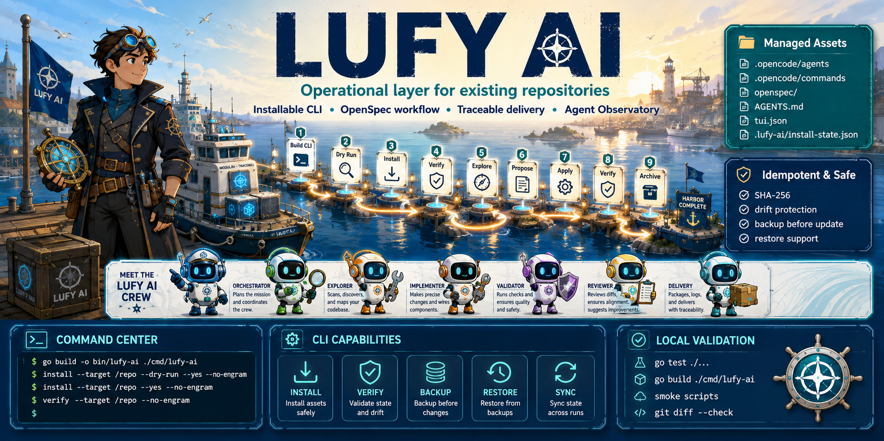
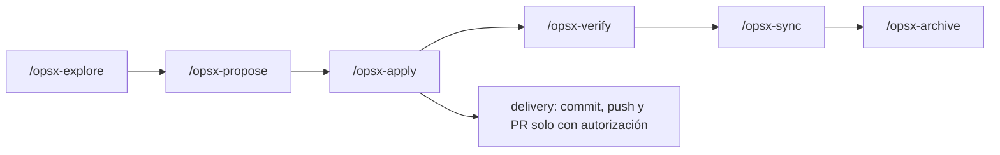

# lufy-ai

<p align="center">
  
</p>

<p align="center">
  Kit instalable para sumar OpenCode, OpenSpec, agentes especializados y delivery trazable a repositorios existentes.
</p>

<p align="center">
  <a href="#que-es-lufy-ai">Qué es</a> •
  <a href="#estado-actual">Estado actual</a> •
  <a href="#instalacion-rapida">Instalación</a> •
  <a href="#cli-go">CLI Go</a> •
  <a href="#workflow-openspecopencode">Workflow</a> •
  <a href="#validacion-local-y-ci">Validación</a> •
  <a href="docs/roadmap.md">Roadmap</a>
</p>

---

## Qué es `lufy-ai`

`lufy-ai` es una capa operativa AI-first que se instala sobre un repositorio destino. Su alcance actual es copiar y mantener assets de OpenCode/OpenSpec, convenciones de agentes, políticas de delivery y tooling auxiliar para trabajar con cambios trazables.

No es un framework de aplicación, no genera proyectos por stack y no instala templates de frontend/backend/mobile. Las capacidades futuras viven en [`docs/roadmap.md`](docs/roadmap.md) hasta que existan como assets reales, instalables y validados.

## Estado actual

El repositorio incluye hoy:

| Área | Estado real |
| --- | --- |
| Agentes OpenCode | `.opencode/agents/` con `orchestrator`, `explorer`, `implementer`, `validator`, `reviewer` y `delivery`. |
| Comandos slash | `.opencode/commands/` con `/opsx-explore`, `/opsx-propose`, `/opsx-apply`, `/opsx-verify`, `/opsx-sync`, `/opsx-archive` y `opsx-version`. |
| Skills OpenSpec | `.opencode/skills/sdd-workflow/` para explorar, proponer, aplicar, sincronizar, verificar y archivar cambios. |
| Delivery | `.opencode/policies/delivery.md` con validación por tiers, branch safety, PRs y trazabilidad. |
| Observatory | `.opencode/plugins/agent-observatory.tsx` y comandos `/observatory*` para la TUI local. |
| CLI Go | `tools/lufy-cli-go/` con `install`, `verify`, `backup`, `restore`, `sync` y `version`. |
| Instalador Bash | `scripts/install.sh` como wrapper estricto de `lufy-ai install`, sin fallback legacy. |
| Releases binarios | Workflow `.github/workflows/release.yml`, scripts de build/checksum y bootstrap seguro. Al mergear un PR hacia `main`, `.github/workflows/auto-release-tag.yml` crea el siguiente tag patch `vMAJOR.MINOR.PATCH` sobre el merge commit e invoca explícitamente la publicación. |
| OpenSpec core v2 | `openspec/` con configuración action-based, `UPSTREAM.json`, documentación y estructura base. |
| CI mínimo | `.github/workflows/go-cli-install.yml` para PRs/pushes a `develop` y `main`: tests/build/smokes de la CLI Go, sanity OpenSpec condicional y `git diff --check`. |

No son capacidades instalables actuales:

- templates por stack como React, Next.js, Astro, Expo o Spring;
- detección automática de stack;
- subagentes de dominio adicionales no presentes en `.opencode/agents/`.

El cambio `route-orchestrator-to-domain-agents` sigue siendo trabajo activo/futuro; no debe tratarse como una capacidad completada hasta que sus assets y validación estén disponibles.

## Instalación rápida

Versión estable actual: `v0.2.0`.

Para instalación completa por OS/shell —incluyendo macOS, Linux, Windows/WSL y configuración de `PATH` para bash, zsh y fish— ver [`docs/installation.md`](docs/installation.md).

Resumen sin clone desde release estable:

```bash
curl -fsSL https://raw.githubusercontent.com/adrotech/lufy-ai/v0.2.0/scripts/bootstrap.sh -o /tmp/lufy-bootstrap.sh
less /tmp/lufy-bootstrap.sh
bash /tmp/lufy-bootstrap.sh --version v0.2.0 --install-dir "$HOME/.local/bin"
```

Si el bootstrap indica que el directorio no está en `PATH`, aplica la instrucción correspondiente a tu shell (bash/zsh o fish) desde la guía dedicada y abre una terminal nueva.

Atajo directo, solo si aceptas ejecutar el script remoto tras revisar la versión fijada:

```bash
curl -fsSL https://raw.githubusercontent.com/adrotech/lufy-ai/v0.2.0/scripts/bootstrap.sh \
  | bash -s -- --version v0.2.0 --install-dir "$HOME/.local/bin"
```

El bootstrap detecta OS/arch, descarga el artifact `lufy-ai_<version>_<os>_<arch>`, verifica su SHA-256 contra el archivo de checksums de la misma release y solo instala el binario. No ejecuta `lufy-ai install` contra tu proyecto.

Después instala los assets en tu repositorio destino y verifica:

```bash
lufy-ai version
lufy-ai install --target /ruta/a/tu/proyecto --dry-run --yes --no-engram
lufy-ai install --target /ruta/a/tu/proyecto --yes --no-engram
lufy-ai verify --target /ruta/a/tu/proyecto --no-engram
```

`latest` existe como conveniencia explícita (`--version latest`), pero no es reproducible; prefiere `vX.Y.Z` en documentación, CI y onboarding automatizado.

### Flujo de desarrollo/contribuidor con clone local

```bash
git clone https://github.com/adrotech/lufy-ai.git /tmp/lufy-ai
cd /tmp/lufy-ai/tools/lufy-cli-go
mkdir -p bin
go build -o bin/lufy-ai ./cmd/lufy-ai
```

`scripts/install.sh` queda como wrapper local estricto: busca primero `tools/lufy-cli-go/bin/lufy-ai` dentro del checkout y después `lufy-ai` en `PATH`. Si no encuentra binario, falla con una instrucción explícita de build local. No descarga releases ni tiene fallback legacy.

Revisar el plan sin escribir:

```bash
/tmp/lufy-ai/scripts/install.sh --target /ruta/a/tu/proyecto --dry-run --yes --no-engram
```

Forma equivalente con la CLI:

```bash
/tmp/lufy-ai/tools/lufy-cli-go/bin/lufy-ai install --target /ruta/a/tu/proyecto --dry-run --yes --no-engram
```

Instalar y verificar:

```bash
/tmp/lufy-ai/scripts/install.sh --target /ruta/a/tu/proyecto --yes --no-engram
/tmp/lufy-ai/tools/lufy-cli-go/bin/lufy-ai verify --target /ruta/a/tu/proyecto --no-engram
```

Flags frecuentes:

| Flag | Uso |
| --- | --- |
| `--target <dir>` | Repositorio destino. |
| `--dry-run` | Construye y muestra el plan sin mutar archivos. |
| `--yes` | Autoriza mutaciones reales cuando no hay conflictos bloqueantes. |
| `--no-engram` | Omite resolución/configuración de Engram. |
| `--backup <path>` | Ruta usada por `restore` para restaurar un backup existente. |

## CLI Go

La CLI actual vive en [`tools/lufy-cli-go/`](tools/lufy-cli-go/) y es la implementación canónica del instalador. El wrapper Bash solo delega en ella.

| Comando | Propósito actual |
| --- | --- |
| `lufy-ai install` | Copia assets gestionados, crea/mergea configuración mínima y registra estado con hashes SHA-256. |
| `lufy-ai verify` | Valida estructura, `.lufy-ai/install-state.json`, assets críticos, hashes registrados y JSON gestionado. |
| `lufy-ai backup` | Crea backup multiasset bajo `.lufy-ai/backups/<timestamp>/manifest.json`. |
| `lufy-ai restore` | Restaura desde backup validando `targetRoot`, paths seguros y hashes. |
| `lufy-ai sync` | Reaplica assets gestionados cuando el source cambió y el target no tiene drift local. |
| `lufy-ai version` | Muestra versión semántica, commit, build date, GOOS y GOARCH; builds locales sin metadata se declaran como development build. |

El estado de instalación se guarda en `.lufy-ai/install-state.json`. Los assets completos gestionados usan SHA-256 para distinguir `skip`, `create`, `update-managed` y `conflict`; `opencode.json` usa una estrategia especial `merge-json` para preservar configuración local.

## Workflow OpenSpec/OpenCode



El workflow OpenSpec core v2 instalado declara acciones explícitas en `openspec/config.yaml`, registra baseline local en `openspec/UPSTREAM.json` y exige specs de cambio con markers `ADDED`, `MODIFIED` o `REMOVED`. Cada requisito añadido o modificado debe tener escenarios con `WHEN` y `THEN`; `GIVEN` es opcional. `/opsx-sync` aplica deltas validados a `openspec/specs/` antes de archivar, sin mover el cambio.

Roles instalados:

| Agente | Responsabilidad |
| --- | --- |
| `orchestrator` | Enruta el trabajo y coordina el mínimo contexto necesario. |
| `explorer` | Investiga en modo read-only y produce handoffs para implementación. |
| `implementer` | Aplica cambios acotados de código, tests, docs o configuración. |
| `validator` | Valida y diagnostica sin editar archivos. |
| `reviewer` | Revisa calidad, riesgos y cobertura sin editar. |
| `delivery` | Con autorización explícita, maneja Git/GitHub, PRs y trazabilidad. |

## Flujo de ramas y releases

- `develop` es la rama normal de integración y la base por defecto para PRs de trabajo (`feature/*`, `fix/*`, `chore/*` o equivalentes).
- `main` es la rama productiva/estable. No se usa como base de trabajo diario; recibe promociones `develop` → `main` o hotfix/release explícitamente autorizados.
- Al cerrar mergeado un PR hacia `main`, `.github/workflows/auto-release-tag.yml` calcula el mayor tag semver simple `vMAJOR.MINOR.PATCH`, ignora prereleases, crea `v0.1.0` si no hay tags válidos o incrementa `PATCH` en caso contrario, pushea un tag anotado sobre el merge commit e invoca `.github/workflows/release.yml` con `workflow_dispatch` para ese tag.
- Si el tag calculado ya existe localmente o en `origin`, el workflow no lo sobrescribe, no invoca un release duplicado y termina como no-op explícito.
- Los releases estables se publican desde tags `v*` creados sobre commits alcanzables desde `origin/main`; el workflow de release bloquea tags creados solo sobre `develop` y el workflow de auto-tag repite esa verificación antes de taggear.
- La configuración remota esperada está resumida en [`docs/github-branch-settings.md`](docs/github-branch-settings.md): default branch `develop` y protección para `develop`/`main`.

## Validación local y CI

Validación local recomendada para cambios de CLI/instalador:

```bash
cd tools/lufy-cli-go
go test ./...
go build ./cmd/lufy-ai
scripts/smoke-install.sh
```

Validación desde la raíz:

```bash
tools/lufy-cli-go/scripts/smoke-wrapper.sh
tools/lufy-cli-go/scripts/smoke-release-artifacts.sh
tools/lufy-cli-go/scripts/smoke-bootstrap.sh
git diff --check
```

El workflow `.github/workflows/go-cli-install.yml` cubre el gate mínimo para PRs/pushes a `develop` y `main`: tests Go, build Go, smokes de CLI/wrapper, sanity OpenSpec condicional cuando existe la CLI `openspec`, y `git diff --check`.

El workflow `.github/workflows/auto-release-tag.yml` solo crea y pushea el tag anotado al mergear PRs hacia `main` e invoca explícitamente `.github/workflows/release.yml` con `workflow_dispatch`; no compila binarios ni publica GitHub Releases. `release.yml` también conserva el trigger por push de tags `v*` para tags manuales/humanos. Antes de publicar verifica que el tag sea `v*` y que el commit taggeado sea alcanzable desde `origin/main`; no publica releases estables desde `develop` sin promoción previa.

No hay suite Node/TypeScript de producto en la raíz del repo; no se debe asumir `npm test`, `npm run typecheck` ni `tsc` global para validar este kit.

## Roadmap y enlaces

- [`docs/installation.md`](docs/installation.md): instalación paso a paso, PATH por OS/shell y troubleshooting.
- [`docs/getting-started.md`](docs/getting-started.md): quickstart, uso posterior y flujo de contribución.
- [`docs/github-branch-settings.md`](docs/github-branch-settings.md): settings esperados de ramas GitHub para `develop`/`main`.
- [`docs/roadmap.md`](docs/roadmap.md): hardening, templates futuros, detección de stack y subagentes no instalables hoy.
- [`openspec/README.md`](openspec/README.md): estructura y ciclo OpenSpec.
- [`tools/lufy-cli-go/README.md`](tools/lufy-cli-go/README.md): detalles técnicos, comandos y validación de la CLI Go.
- [`AGENTS.md.template`](AGENTS.md.template): plantilla base para convenciones del repositorio destino.

## Licencia

MIT
