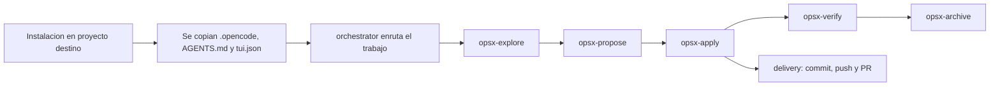
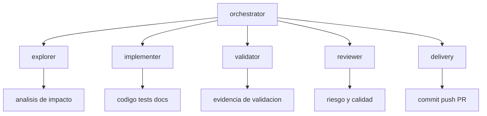
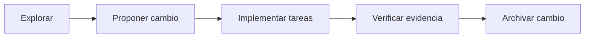
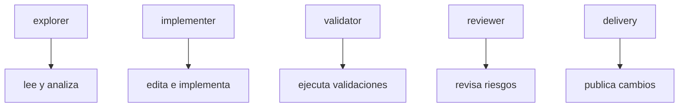
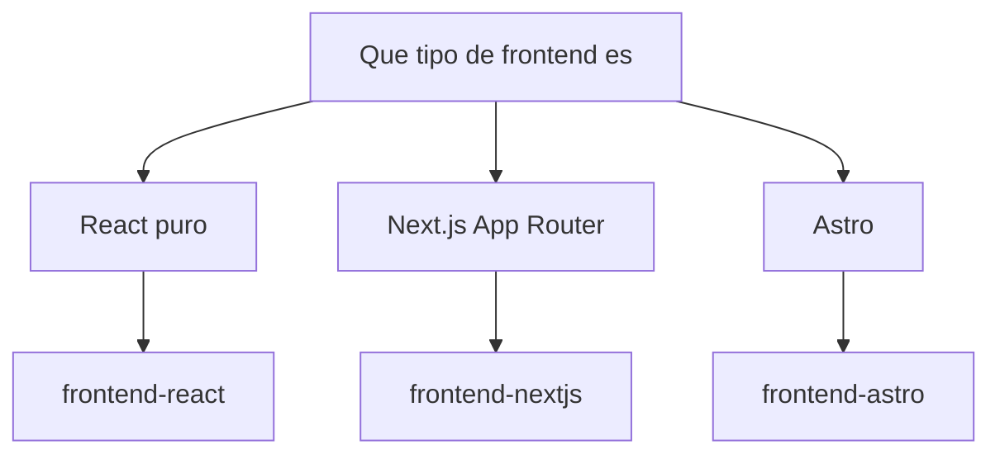
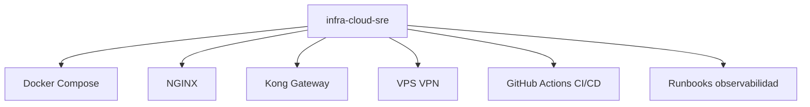

# lufy-ai

Kit de flujo AI-first para proyectos con OpenCode, OpenSpec, agentes especializados, reglas de delivery y observabilidad local.

## Qué entrega realmente este repositorio

Este repositorio no es un framework de aplicación. Es una capa operativa que se instala dentro de otro proyecto y le agrega:

- un agente principal `orchestrator` y subagentes especializados
- un flujo OpenSpec / Spec-Driven Development
- reglas de delivery y trazabilidad
- comandos slash para explorar, proponer, implementar, verificar y archivar
- un panel local de observabilidad de agentes
- una plantilla `AGENTS.md` para convenciones del proyecto

Hoy el repositorio contiene estas piezas:

- `.opencode/agents/`: `orchestrator`, `explorer`, `implementer`, `validator`, `reviewer`, `delivery`
- `.opencode/commands/`: `opsx-explore`, `opsx-propose`, `opsx-apply`, `opsx-verify`, `opsx-archive`
- `.opencode/skills/sdd-workflow/`: skills del ciclo OpenSpec
- `.opencode/policies/delivery.md`: política de delivery y trazabilidad
- `.opencode/plugins/agent-observatory.tsx`: plugin TUI local de observabilidad
- `AGENTS.md.template`: base para convenciones específicas del repositorio
- `scripts/install.sh`: instalador para proyectos destino
- `openspec/`: estructura inicial y configuración del flujo

## Flujo completo

### Vista general



### 1. Instalación en un repositorio destino

El instalador hace lo siguiente:

1. valida dependencias
2. detecta si ya existe `.opencode/` o `AGENTS.md`
3. intenta detectar el stack del proyecto
4. copia los assets locales de OpenCode al proyecto destino
5. crea `AGENTS.md` desde `AGENTS.md.template` si hace falta
6. copia `tui.json`
7. ofrece integración orientada a memoria si Engram ya está instalado

Instalación:

```bash
git clone https://github.com/adrotech/lufy-ai.git /tmp/lufy-ai
cd /ruta/a/tu/proyecto
/tmp/lufy-ai/scripts/install.sh
```

O directamente:

```bash
curl -fsSL https://raw.githubusercontent.com/adrotech/lufy-ai/main/scripts/install.sh | bash
```

### 2. El `orchestrator` reparte el trabajo

Una vez instalado, OpenCode usa los agentes definidos en `.opencode/agents/`.

Topología actual:

| Agente | Responsabilidad |
| --- | --- |
| `orchestrator` | Enrutador principal. Decide qué especialista debe actuar y mantiene la coordinación mínima necesaria. |
| `explorer` | Análisis read-only de impacto, arquitectura y archivos relevantes. |
| `implementer` | Cambios acotados de código, tests, docs y configuración. |
| `validator` | Evidencia de compilación y tests, sin editar archivos. |
| `reviewer` | Revisión read-only de calidad, arquitectura, riesgo y cobertura faltante. |
| `delivery` | Operaciones Git / GitHub, higiene de ramas, push, PR y gates de trazabilidad. |

### Diagrama de agentes



### 3. El ciclo OpenSpec organiza el trabajo

El flujo OpenSpec de este repo gira alrededor de cinco comandos:

- `/opsx-explore`: exploración read-only y clarificación de requisitos
- `/opsx-propose`: crea artefactos del cambio como `proposal.md`, `design.md` y `tasks.md`
- `/opsx-apply`: implementa tareas de un cambio activo
- `/opsx-verify`: verifica completitud, corrección y coherencia contra los artefactos
- `/opsx-archive`: archiva un cambio terminado

A nivel repositorio, el ciclo esperado es:

1. explorar el problema o el código existente
2. proponer un cambio en `openspec/changes/<nombre>/`
3. implementar tareas de forma acotada
4. verificar con evidencia explícita
5. archivar solo cuando el cambio esté completo

### Diagrama del ciclo OpenSpec



### 4. Delivery separado de implementación

`implementer` no es el dueño del delivery. Esa separación es deliberada.

Las reglas de delivery viven en `.opencode/policies/delivery.md` y definen:

- ramas protegidas
- rama base por defecto para PR
- niveles de validación para iteración vs delivery final
- reglas de cierre de tareas OpenSpec
- expectativas de sincronización con GitHub Project
- español como idioma por defecto para artefactos humanos de delivery

Eso evita mezclar edición de código, validación y operaciones Git/GitHub en un solo agente.

### Diagrama de responsabilidades



### 5. Observabilidad local de agentes

El repositorio incluye un plugin local llamado Agent Observatory para la TUI de OpenCode. Se carga desde `tui.json` y su diseño es local, no telemétrico.

Permite ver:

- agentes activos
- actividad de subagentes
- resúmenes de uso de herramientas
- costo opcional

No forma parte del diseño actual enviar telemetría externa.

## Deriva documental corregida

Este README ahora refleja el estado real del repositorio.

La versión anterior tenía drift en varios puntos:

- referenciaba templates de stack que no existen como archivos en este repo
- metía `React`, `Next.js` y `Vue` dentro de un único bucket `frontend-react`
- documentaba `backend-node` como si fuera una dirección principal
- enlazaba a archivos de documentación que hoy no existen en `docs/`

Las secciones siguientes proponen una dirección de evolución para templates y subagentes, pero sin venderlas como ya implementadas.

## Dirección recomendada para templates de stack

Después de revisar el repo actual y la documentación oficial vigente de cada stack, conviene separar mejor los templates.

### Templates frontend que deberían existir

Estos deberían reemplazar la idea demasiado amplia de `frontend-react`:

| Template | Por qué debería ser independiente | Subagentes sugeridos |
| --- | --- | --- |
| `frontend-react` | Un proyecto React puro necesita criterios propios para componentes, hooks, estado, accesibilidad y performance de render. | `react-ui`, `react-state-performance`, `react-testing-a11y` |
| `frontend-nextjs` | Next.js App Router agrega límites server/client, route handlers, caché, streaming y decisiones de runtime que merecen comportamiento específico. | `nextjs-app-router`, `nextjs-server-runtime`, `nextjs-data-cache` |
| `frontend-astro` | Astro tiene un modelo distinto: islands architecture, content collections, integrations, adapters y modos static/hybrid/server. | `astro-islands-content`, `astro-integrations`, `astro-ssr-adapter` |

### Templates que deberían quedarse

- `mobile-expo`
- `backend-spring`

### Template que debería salir

- `backend-node`

Si un repositorio usa Node, eso debería expresarse normalmente a través de un stack más concreto como `frontend-nextjs`, `frontend-react` o un futuro backend explícito mejor definido que "Node.js".

## Por qué conviene separar React, Next.js y Astro

### React

La documentación oficial de React hoy recomienda iniciar apps nuevas con un framework, y `Create React App` ya quedó deprecado. Aun así, sigue teniendo sentido un template `frontend-react` para proyectos que no necesitan Next.js ni el modelo completo de un meta-framework.

Ese template debería orientar a los agentes hacia:

- composición de componentes
- corrección de hooks
- uso de `useEffectEvent` cuando la separación entre efecto y evento importe
- uso de `startTransition` y `useDeferredValue` para actualizaciones no bloqueantes
- accesibilidad y testabilidad de UI interactiva
- evitar supuestos específicos de framework

### Next.js

Next.js necesita template propio porque un proyecto con App Router no es simplemente "React con rutas". La documentación oficial pone el foco en:

- Server Components por defecto
- límites explícitos de Client Components
- Route Handlers en `app/`
- estrategias de caché y rendering dinámico
- streaming y navegación

Eso exige que el agente entienda dónde debe correr cada pieza y cómo separar correctamente datos, render y comportamiento cliente.

### Astro

Astro también necesita template propio porque su arquitectura es distinta:

- islands architecture en lugar de hidratar todo
- content collections como modelo central de contenido
- integrations y adapters como piezas de primer nivel
- modos static, hybrid y server bien diferenciados

Un agente Astro-aware debería tender a minimizar JavaScript cliente, reducir hidratación y decidir bien el adapter o integration apropiado.

### Diagrama de decisión para templates frontend



## Nuevo subagente recomendado: infraestructura / cloud / SRE

Este es el especialista más claramente faltante en la topología actual.

Nombre recomendado:

- `infra-cloud-sre`

Alcance sugerido:

- diseño y hardening de `Dockerfile`
- `docker compose` para dev local, staging y producción single-host
- overlays de producción, health checks y restart policies
- reverse proxy con NGINX
- modelado de Kong Gateway con Services, Routes y Plugins
- bootstrap y topología de despliegue en VPS
- conectividad privada y consideraciones de VPN
- CI/CD con GitHub Actions
- environments, approvals, secretos y rollback
- runbooks operativos, observabilidad y riesgo de release

Límites de ownership sugeridos:

- dueño de archivos de infraestructura, despliegue, proxy, gateway y workflows
- no dueño de lógica de negocio salvo que el cambio sea explícitamente transversal
- debería trabajar junto a `implementer`, `validator` y `delivery`, no reemplazarlos

Archivos típicos bajo su ownership:

- `Dockerfile`
- `docker-compose.yml`, `compose.yaml`, `compose.production.yaml`
- `.github/workflows/*`
- `nginx.conf`, `nginx/*.conf`
- `kong.yaml`, configuración decK y scripts de bootstrap
- scripts de despliegue y runbooks

### Diagrama del subagente SRE



## Mapa sugerido de agentes a futuro

Si el proyecto evoluciona hacia templates con conocimiento explícito del stack, un mapa más sólido sería:

| Capa | Agentes |
| --- | --- |
| Enrutamiento central | `orchestrator` |
| Ejecución transversal | `explorer`, `implementer`, `validator`, `reviewer`, `delivery` |
| Frontend React | `react-ui`, `react-state-performance`, `react-testing-a11y` |
| Frontend Next.js | `nextjs-app-router`, `nextjs-server-runtime`, `nextjs-data-cache` |
| Frontend Astro | `astro-islands-content`, `astro-integrations`, `astro-ssr-adapter` |
| Plataforma | `infra-cloud-sre` |

Eso preserva la topología central actual, pero hace explícito el conocimiento por stack en lugar de recargar un `implementer` genérico.

## Estructura del repositorio

```text
.
├── .opencode/
│   ├── agents/
│   ├── commands/
│   ├── plugins/
│   ├── policies/
│   └── skills/
├── docs/
├── openspec/
├── scripts/
├── AGENTS.md.template
├── README.md
└── tui.json
```

## Documentación local disponible

- [Getting Started](docs/getting-started.md)
- [OpenSpec Overview](openspec/README.md)
- [AGENTS Template](AGENTS.md.template)

## Referencias externas usadas para orientar los templates

- React: [Creating a React App](https://react.dev/learn/start-a-new-react-project), [Installation](https://react.dev/learn/installation), [useEffectEvent](https://react.dev/reference/react/useEffectEvent), [startTransition](https://react.dev/reference/react/startTransition), [useDeferredValue](https://react.dev/reference/react/useDeferredValue)
- Next.js: [App Router](https://nextjs.org/docs/app), [Server and Client Components](https://nextjs.org/docs/app/getting-started/server-and-client-components), [Route Handlers](https://nextjs.org/docs/app/getting-started/route-handlers)
- Astro: [Islands Architecture](https://docs.astro.build/en/concepts/islands/), [Content Collections](https://docs.astro.build/en/guides/content-collections/), [Working with Integrations](https://docs.astro.build/en/guides/integrations/), [On-demand Rendering](https://docs.astro.build/en/guides/on-demand-rendering/)
- Docker Compose: [Quickstart](https://docs.docker.com/compose/gettingstarted/), [Use Compose in production](https://docs.docker.com/compose/how-tos/production/), [Compose Develop Specification](https://docs.docker.com/reference/compose-file/develop/)
- NGINX: [Reverse Proxy](https://docs.nginx.com/nginx/admin-guide/web-server/reverse-proxy)
- Kong Gateway: [Kong Gateway Overview](https://developer.konghq.com/gateway/), [Gateway Services](https://developer.konghq.com/gateway/entities/service/), [Routes](https://developer.konghq.com/gateway/entities/route/), [Plugins](https://developer.konghq.com/gateway/entities/plugin/)
- GitHub Actions: [Deployment environments](https://docs.github.com/en/actions/concepts/workflows-and-actions/deployment-environments)

## Licencia

MIT
