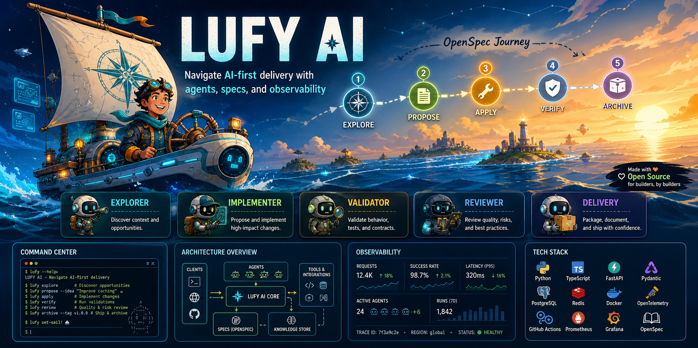
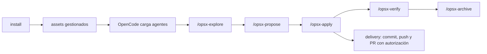

# lufy-ai

<p align="center">
  
</p>

<p align="center">
  Kit AI-first instalable para añadir OpenCode, OpenSpec, subagentes especializados y delivery trazable a un repositorio existente.
</p>

<p align="center">
  <a href="#estado-real-del-repositorio">Estado real</a> •
  <a href="#quickstart">Quickstart</a> •
  <a href="#flujo-instalado">Flujo</a> •
  <a href="#validacion-local">Validación</a> •
  <a href="#documentacion-local">Docs</a> •
  <a href="docs/roadmap.md">Roadmap</a>
</p>

---

## Estado real del repositorio

`lufy-ai` no es un framework de aplicación ni instala templates por stack. Es una capa operativa que se copia en otro proyecto para trabajar con agentes OpenCode y cambios OpenSpec.

Hoy el repo incluye:

- `.opencode/agents/`: `orchestrator`, `explorer`, `implementer`, `validator`, `reviewer` y `delivery`.
- `.opencode/commands/`: comandos slash `/opsx-explore`, `/opsx-propose`, `/opsx-apply`, `/opsx-verify` y `/opsx-archive`.
- `.opencode/skills/sdd-workflow/`: skills que respaldan el ciclo OpenSpec.
- `.opencode/policies/delivery.md`: reglas de validación, branch safety, PR y trazabilidad.
- `.opencode/plugins/agent-observatory.tsx`: plugin TUI local Agent Observatory.
- `AGENTS.md.template`: plantilla base para convenciones del repositorio destino.
- `openspec/`: estructura base y documentación del flujo OpenSpec.
- `tools/lufy-cli-go/`: CLI Go `lufy-ai` con `install`, `verify`, `backup`, `restore` y `sync`.
- `scripts/install.sh`: wrapper Bash estricto que solo delega en `lufy-ai install`; no tiene fallback legacy ni detección de stack.
- `.github/workflows/go-cli-install.yml`: workflow mínimo presente en esta rama para tests/build/smokes de la CLI Go, sanity OpenSpec condicional y `git diff --check`.

El futuro de templates por stack, detección de stack y subagentes adicionales vive en [`docs/roadmap.md`](docs/roadmap.md). No se documenta como capacidad instalable hasta que exista como asset real y validado.

## Quickstart

### 1. Clonar y compilar la CLI local si no está en `PATH`

```bash
git clone https://github.com/adrotech/lufy-ai.git /tmp/lufy-ai
cd /tmp/lufy-ai/tools/lufy-cli-go
mkdir -p bin
go build -o bin/lufy-ai ./cmd/lufy-ai
```

El wrapper `scripts/install.sh` busca primero `tools/lufy-cli-go/bin/lufy-ai` dentro del checkout y después `lufy-ai` en `PATH`. Si no encuentra binario, falla con una instrucción de build local.

### 2. Revisar el plan sin escribir

```bash
/tmp/lufy-ai/scripts/install.sh --target /ruta/a/tu/proyecto --dry-run --yes --no-engram
```

También puedes usar la CLI directamente:

```bash
/tmp/lufy-ai/tools/lufy-cli-go/bin/lufy-ai install --target /ruta/a/tu/proyecto --dry-run --yes --no-engram
```

### 3. Instalar y verificar

```bash
/tmp/lufy-ai/scripts/install.sh --target /ruta/a/tu/proyecto --yes --no-engram
/tmp/lufy-ai/tools/lufy-cli-go/bin/lufy-ai verify --target /ruta/a/tu/proyecto --no-engram
```

Flags relevantes del flujo actual:

- `--target <dir>`: repositorio destino; por defecto suele ser `.` según el comando.
- `--dry-run`: muestra el plan sin mutar archivos.
- `--yes`: requerido para mutaciones reales seguras.
- `--no-engram`: omite resolución/configuración de Engram.
- `--backup <path>`: usado por `restore` para restaurar desde un backup existente.

## Flujo instalado



Los roles instalados mantienen responsabilidades separadas:

| Agente | Responsabilidad |
| --- | --- |
| `orchestrator` | Enruta el trabajo y coordina el mínimo contexto necesario. |
| `explorer` | Investiga en modo read-only y produce handoffs. |
| `implementer` | Aplica cambios acotados de código, tests, docs o configuración. |
| `validator` | Valida y diagnostica sin editar archivos. |
| `reviewer` | Revisa calidad, riesgos y cobertura sin editar. |
| `delivery` | Con autorización explícita, maneja Git/GitHub, PRs y trazabilidad. |

## Assets gestionados e idempotencia

La CLI Go instala y sincroniza assets gestionados desde el catálogo del repo. El estado se registra en `.lufy-ai/install-state.json` con hashes SHA-256 para distinguir archivos sin cambios, actualizaciones gestionadas y drift local.

Capacidades actuales de la CLI:

- `install`: copia assets gestionados, crea estado con hashes y evita sobrescribir drift local.
- `verify`: valida estructura, `install-state.json`, assets clave y hashes registrados.
- `backup`: captura assets gestionados en `.lufy-ai/backups/<timestamp>/manifest.json`.
- `restore`: restaura desde manifest, valida `targetRoot` y crea backup de recovery antes de sobrescribir.
- `sync`: reaplica cambios de assets gestionados cuando el target no tiene drift local; hace backup antes de actualizar.

Para detalles técnicos, ver [`tools/lufy-cli-go/README.md`](tools/lufy-cli-go/README.md).

## Validación local

Desde `tools/lufy-cli-go/`:

```bash
go test ./...
go build ./cmd/lufy-ai
scripts/smoke-install.sh
```

Desde la raíz del repo:

```bash
tools/lufy-cli-go/scripts/smoke-wrapper.sh
git diff --check
```

No hay suite Node/TypeScript en la raíz del repo; no se debe asumir `npm test`, `npm run typecheck` ni `tsc` global para validar este kit.

## Documentación local

- [Getting Started](docs/getting-started.md): instalación paso a paso y uso inicial.
- [Roadmap](docs/roadmap.md): templates, subagentes futuros e iniciativas RM-### no necesariamente instalables hoy.
- [OpenSpec Overview](openspec/README.md): estructura y ciclo OpenSpec.
- [CLI Go README](tools/lufy-cli-go/README.md): comandos y validación de `lufy-ai`.
- [AGENTS Template](AGENTS.md.template): base para convenciones del proyecto destino.

## Licencia

MIT
