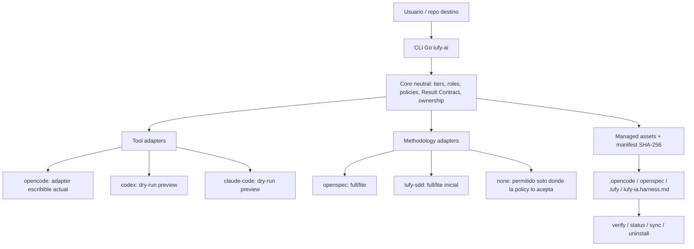
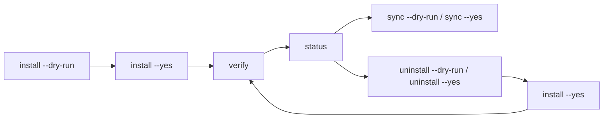

# lufy-ai

<p align="center">
  
</p>

<p align="center">
  Harness operativo para instalar, mantener y gobernar flujos AI-first en repositorios existentes.
</p>

<p align="center">
  <a href="#que-es-lufy-ai">Qué es</a> •
  <a href="#quickstart">Quickstart</a> •
  <a href="#arquitectura">Arquitectura</a> •
  <a href="#cli-y-lifecycle">CLI</a> •
  <a href="#estado-real">Estado</a> •
  <a href="docs/installation.md">Instalación</a> •
  <a href="docs/roadmap.md">Roadmap</a>
</p>

---

## Qué es `lufy-ai`

`lufy-ai` es un harness instalable. No reemplaza tu stack, no genera una app y no fuerza una metodología única. Agrega una capa operativa sobre un repositorio para coordinar agentes, reglas de workflow, specs, validación, delivery y assets gestionados.

La versión actual instala el preset productivo **OpenCode + OpenSpec**. El core ya está orientado a arquitectura hexagonal: tiers, roles, Result Contract, policies, validación y managed assets viven como dominio neutral; OpenCode, OpenSpec y Lufy SDD son adapters seleccionables o modelados alrededor de ese dominio.

El objetivo de producto es que Lufy sea el harness y que la tool sea reemplazable: hoy OpenCode, mañana Codex o Claude Code cuando existan adapters escribibles y validados.

## Qué problema resuelve

En proyectos reales, usar agentes sin una capa de harness suele dejar tres problemas:

- cada agente interpreta distinto el alcance, la evidencia y el estado del trabajo;
- las specs, skills y prompts quedan acoplados a una tool concreta;
- actualizar el kit en repositorios brownfield puede pisar configuración local o bloquearse por drift esperado.

`lufy-ai` resuelve eso con:

- routing proporcional T1/T2/T3;
- contratos de salida compactos para handoffs entre agentes;
- skills y agentes con responsabilidades explícitas;
- metodología por tier: `openspec`, `lufy-sdd` o `none` donde la policy lo permite;
- CLI Go con hashes SHA-256, manifest, backups, restore, sync y uninstall;
- separación entre core neutral, tool adapters y methodology adapters.

## Quickstart

Versión estable actual: `v0.6.8`. La guía completa por OS/shell está en [`docs/installation.md`](docs/installation.md).

### 1. Instalar el binario

```bash
curl -fsSL https://raw.githubusercontent.com/adrotech/lufy-ai/v0.6.8/scripts/bootstrap.sh -o /tmp/lufy-bootstrap.sh
less /tmp/lufy-bootstrap.sh
bash /tmp/lufy-bootstrap.sh --version v0.6.8 --install-dir "$HOME/.local/bin"
```

### 2. Revisar el plan sobre tu repo

```bash
lufy-ai version
lufy-ai scan --target /ruta/a/tu/proyecto --interactive=false
lufy-ai install --target /ruta/a/tu/proyecto --tool opencode --dry-run --yes --no-engram
```

`scan` crea o actualiza `.lufy/project.yaml` con detección de stacks y `project_profile.surfaces`. En una terminal interactiva puedes omitir `--interactive=false` para revisar con Bubble Tea si el proyecto es `frontend`, `backend`, `fullstack`, `mobile`, `cli`, `infra` o `library`.

### 3. Instalar y verificar

```bash
lufy-ai install --target /ruta/a/tu/proyecto --tool opencode --yes --no-engram
lufy-ai verify --target /ruta/a/tu/proyecto --tool opencode --no-engram
lufy-ai status --target /ruta/a/tu/proyecto --verbose
```

Engram es opcional. Si omites `--no-engram` y el binario `engram` está en `PATH`, Lufy mergea un MCP local de Engram en `opencode.json` con `--tools=agent --project <repo>`; los agentes instalados consultan/guardan memoria solo cuando el MCP/tool está disponible y omiten el workflow cuando no lo está.

### 4. Desinstalar o reinstalar si hace falta

```bash
lufy-ai uninstall --target /ruta/a/tu/proyecto --dry-run
lufy-ai uninstall --target /ruta/a/tu/proyecto --yes
lufy-ai install --target /ruta/a/tu/proyecto --tool opencode --yes --no-engram
```

`uninstall` elimina solo assets gestionados sin drift, crea backup previo, preserva `opencode.json` y remueve solo la referencia `@lufy-ia.harness.md` de `AGENTS.md`.

## Lo que instala hoy

| Área | Ruta | Propósito |
| --- | --- | --- |
| Agentes OpenCode | `.opencode/agents/` | `orchestrator`, `sdd-router`, `explorer`, `implementer`, `test-writer`, `validator`, `reviewer` y `delivery`. |
| Comandos OpenSpec | `.opencode/commands/opsx-*.md` | Ciclo OpenSpec: explore, propose, apply, verify, sync, archive y version. |
| Comandos Lufy | `.opencode/commands/lufy.*.md` | Extras propios del kit: `/lufy.close`, `/lufy.pr-review`, `/lufy.timereport` y `/lufy.onboard`. |
| Skills | `.opencode/skills/` | Skills locales para workflow SDD/OpenSpec, PR, onboarding y reportes instalables. |
| Templates | `.opencode/templates/` | `sdd-lite.md` y `result-contract.md` para T2 y handoffs recuperables. |
| Policies | `.opencode/policies/` | Delivery, branch safety, validación, gates y permisos. |
| Observatory | `.opencode/plugins/agent-observatory.tsx` | Plugin TUI local de observabilidad de agentes. |
| OpenSpec | `openspec/` | Configuración, specs base, deltas y workflow action-based. |
| Lufy SDD | `.lufy/sdd/` | Superficie inicial opcional cuando se selecciona `lufy-sdd`. |
| Harness doc | `lufy-ia.harness.md` | Instrucciones compartidas que se referencian desde `AGENTS.md`. |
| Estado local | `.lufy-ai/install-state.json` | Manifest schema v2 con tool, methodology por tier, ownership y hashes. |

`AGENTS.md` es user-owned: la CLI solo crea o mantiene la referencia `@lufy-ia.harness.md`. `opencode.json` también es user-owned/merge-managed: se mergea de forma conservadora y no se registra como asset completo por hash.

## Arquitectura



El dominio no debería saber de paths específicos de OpenCode, `CLAUDE.md` o `AGENTS.md`. Ese conocimiento pertenece a adapters. Esta separación evita duplicar tiers, agentes, contracts y policies cuando se agreguen tools nuevas.

Más detalle técnico: [`docs/architecture.md`](docs/architecture.md).

## Routing T1/T2/T3

| Tier | Cuándo aplica | Metodología típica | Resultado |
| --- | --- | --- | --- |
| T1 Full SDD | Arquitectura, contratos públicos, seguridad, cambios transversales o alta incertidumbre. | `openspec/full` o futuro `lufy-sdd/full`. | Proposal, design, specs, tasks, validación agrupada, optional overview/render y archive. |
| T2 SDD Lite | Cambio funcional acotado, bug relevante, agente/skill o refactor controlado. | `openspec/lite`, `lufy-sdd/lite` o mini-spec. | Criterios `WHEN`/`THEN`, handoff recuperable, optional overview/render y review enfocada. |
| T3 Express | Cambio trivial, mecánico, local o documental. | `none` permitido. | Implementación directa y validación proporcional. |

La metodología es elegible por tier, no global. Eso permite que un proyecto use OpenSpec completo para T1, Lufy SDD Lite para T2 y ningún spec para T3. La mentalidad de los agentes se ajusta con `project_profile.surfaces` en `.lufy/project.yaml`, separando stack técnico (`go`, `typescript`) de superficie de producto (`frontend`, `backend`, `fullstack`, `mobile`, `cli`, `infra`, `library`).

Cuando `init` o `scan` detecta o el usuario selecciona `frontend` o `fullstack`, el `agent_lens` generado favorece estructura feature-driven: código de cada funcionalidad colocado en `src/features/<feature>/` con `components/`, `hooks/`, `services/`, `types.ts` y un barril público `index.ts`; `src/pages/` queda para routing/layouts, y `src/components`, `src/hooks`, `src/services` y `src/utils` se reservan para piezas globales compartidas.

Ejemplos:

```bash
lufy-ai install --target <repo> --methodology-tier T3:none --yes --no-engram
lufy-ai install --target <repo> --methodology-tier T2:lufy-sdd/lite --yes --no-engram
lufy-ai install --target <repo> --methodology-tier T2:openspec/lite --methodology-tier T3:none --yes --no-engram
```

Por seguridad, los comandos mutantes bloquean `T1:none`, `T2:none`, `--tool codex` y `--tool claude-code` hasta que existan adapters escribibles con validación.

## CLI y lifecycle

| Comando | Propósito |
| --- | --- |
| `lufy-ai init` | Genera `.lufy/project.yaml` stack-aware/surface-aware y editable; puede abrir selector Bubble Tea con `--interactive`. |
| `lufy-ai scan` | Reescanea stacks y superficies de producto, preserva overrides y puede abrir selector Bubble Tea. |
| `lufy-ai install` | Instala assets gestionados, mergea configs user-owned y escribe manifest con SHA-256. |
| `lufy-ai uninstall` | Remueve assets gestionados sin drift, con backup, preservando configs user-owned. |
| `lufy-ai verify` | Valida manifest, estructura, JSON, hashes y referencias críticas. |
| `lufy-ai status` | Resume estado instalado, drift, faltantes y detalles por asset. |
| `lufy-ai sync` | Reaplica assets gestionados cuando el source cambió y el target no tiene drift local. |
| `lufy-ai merge` | Reconcilia `.lufy-new` con edits locales cuando existe ancestor seguro. |
| `lufy-ai backup` | Crea backup multiasset bajo `.lufy-ai/backups/<timestamp>/`. |
| `lufy-ai restore` | Restaura backups validando target, paths seguros y hashes. |
| `lufy-ai opsx render` | Genera un HTML offline/autocontenido para revisar artifacts OpenSpec. |
| `lufy-ai upgrade` | Actualiza el binario a una versión fija con checksum. |
| `lufy-ai version` | Muestra versión, commit, build date y plataforma. |

### Overview/render de propuestas

El contrato del harness exige que una propuesta o especificación lista preserve el outcome opcional de overview/render como `generated`, `offered_pending`, `skipped_by_user` o `not_available`. Para OpenSpec propose, la respuesta exitosa debe mostrar el comando exacto `lufy-ai opsx render --change <change> --format html --theme notion-dark` y preguntar explícitamente: `¿Quieres que genere ahora el reporte HTML offline de los artifacts con tema Notion dark?`

`offered_pending` significa que el reporte fue ofrecido y el usuario todavía no respondió. `skipped_by_user` solo es válido cuando el usuario lo rechazó explícitamente. Esto aplica a Full SDD y SDD Lite; si la metodología o el tool adapter seleccionado no tiene una superficie de render, el resultado debe decir `not_available` en vez de omitir el paso.

### Preview HTML de changes OpenSpec

`lufy-ai opsx render` es la superficie concreta actual para OpenSpec: crea una vista HTML local para revisión humana de un change OpenSpec.

```bash
lufy-ai opsx render --target <repo> --change <name> --format html --theme notion-dark --output /tmp/lufy-opsx-overview.html
```

El render incluye solo Markdown directo de `openspec/changes/<name>/`: `proposal.md`, `design.md`, `plan.md`, `tasks.md` y otros `.md` top-level. Excluye `specs/**`. El HTML es autocontenido, usa diseño dark con tabs y no carga recursos remotos.

El parser local soporta headings, listas, checkboxes deshabilitados, fenced code, inline code y links seguros (`http://`, `https://`, `mailto:`). HTML crudo y links inseguros como `javascript:` quedan escapados. Si un artefacto falta o está vacío, la UI muestra `No disponible` y `Este artefacto no existe o está vacío.`

### Reportes HTML instalables

La versión actual instala tres superficies de reporte offline/autocontenido con estética unificada basada en Notion:

| Reporte | Cómo se genera | Uso |
| --- | --- | --- |
| Proposal overview | `lufy-ai opsx render --change <change> --format html --theme notion-dark` | Revisar artifacts OpenSpec generados antes de aplicar. |
| PR review | `/lufy.pr-review` | Generar un review HTML en español para un PR existente. |
| Time report | `/lufy.timereport` | Resumir tiempo, actividad, fases, herramientas, subagentes, skills, ROI y limitaciones desde fuentes locales. |

Los reportes no cargan recursos remotos y deben marcar faltantes o limitaciones en vez de inventar evidencia.

Lifecycle recomendado:



## Desarrollo local

```bash
git clone https://github.com/adrotech/lufy-ai.git /tmp/lufy-ai
cd /tmp/lufy-ai/tools/lufy-cli-go
mkdir -p bin
go build -o bin/lufy-ai ./cmd/lufy-ai
```

Probar contra un target:

```bash
/tmp/lufy-ai/tools/lufy-cli-go/bin/lufy-ai install --target /ruta/a/tu/proyecto --dry-run --yes --no-engram
/tmp/lufy-ai/tools/lufy-cli-go/bin/lufy-ai install --target /ruta/a/tu/proyecto --yes --no-engram
/tmp/lufy-ai/tools/lufy-cli-go/bin/lufy-ai verify --target /ruta/a/tu/proyecto --no-engram
```

`scripts/install.sh` es solo un wrapper estricto hacia `lufy-ai install`; no tiene fallback legacy.

## Validación

Desde la raíz del repo:

```bash
scripts/validate.sh
git diff --check origin/develop...HEAD
git diff --check
```

`scripts/validate.sh` ejecuta gates reales del producto: whitespace PR-aware, pinning de Actions, YAML con helper Go, shell lint cuando está disponible, tests Go con coverage, `go vet` y build del CLI. No hay suite Node/TypeScript global en la raíz.

## Delivery y release

- `develop` es la rama normal de integración.
- `main` es estable/productiva.
- Las releases públicas se publican desde tags `v*` alcanzables desde `origin/main`.
- Al mergear un PR hacia `main`, el pipeline crea el tag de release, construye y publica artifacts, checksums, SBOM, provenance, firmas y valida el artifact publicado con instalación/verificación real.
- Delivery, commit, push, PR y promoción requieren autorización explícita.

Ver [`docs/github-branch-settings.md`](docs/github-branch-settings.md) y [`docs/release-security.md`](docs/release-security.md).

## Estado real

Disponible e instalable:

- OpenCode como tool adapter escribible.
- OpenSpec como metodología principal.
- Lufy SDD como metodología inicial seleccionable.
- `none` para tiers permitidos por policy, especialmente T3.
- CLI Go con install, uninstall, verify, status, sync, merge, backup, restore, upgrade y version.
- `init` y `scan` con `.lufy/project.yaml`, detección stack-aware/surface-aware y selector Bubble Tea para `project_profile.surfaces`.
- Managed assets con manifest schema v2, ownership, SHA-256, backups e idempotencia.
- Reportes HTML offline: overview OpenSpec, PR review y time report.
- `codex` y `claude-code` solo como adapters dry-run/preview, no como instalación real.

No disponible como feature escribible todavía:

- instalación real en Codex o Claude Code;
- templates por stack;
- subagentes de dominio adicionales;
- Lufy SDD full como reemplazo completo de OpenSpec;
- instalación automática de skills externas.

## Documentación

| Documento | Contenido |
| --- | --- |
| [`docs/installation.md`](docs/installation.md) | Instalación del binario, PATH, install/uninstall/reinstall y troubleshooting. |
| [`docs/getting-started.md`](docs/getting-started.md) | Walkthrough de uso diario y flujo de repo destino. |
| [`docs/architecture.md`](docs/architecture.md) | Arquitectura hexagonal, adapters, ownership y lifecycle. |
| [`docs/status.md`](docs/status.md) | Estado implementado vs pendiente. |
| [`docs/backlog.md`](docs/backlog.md) | Backlog estratégico y prioridades. |
| [`docs/roadmap.md`](docs/roadmap.md) | Evolución futura y límites de roadmap. |
| [`tools/lufy-cli-go/README.md`](tools/lufy-cli-go/README.md) | Detalle técnico de la CLI Go. |
| [`openspec/README.md`](openspec/README.md) | Workflow OpenSpec instalado. |

## Licencia

MIT
