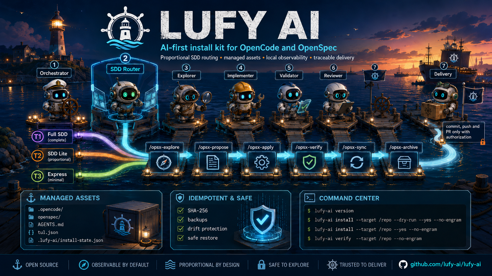
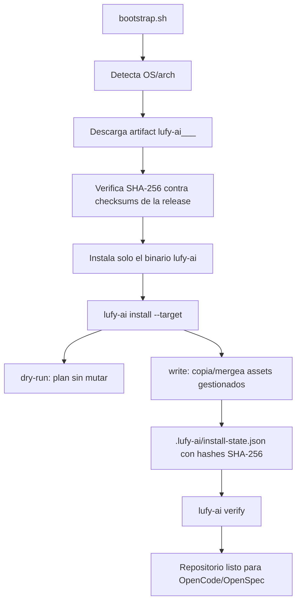
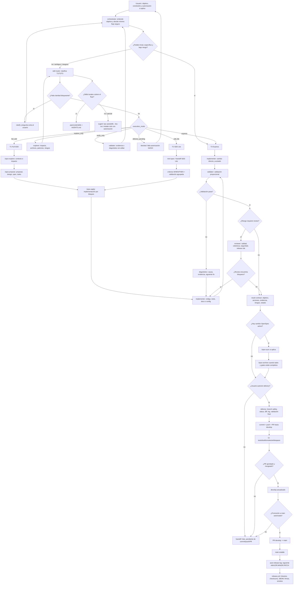
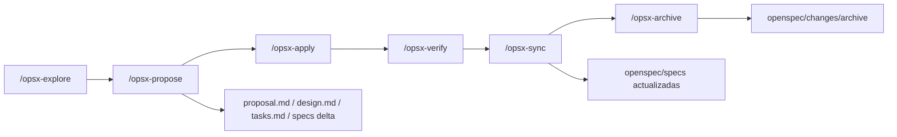
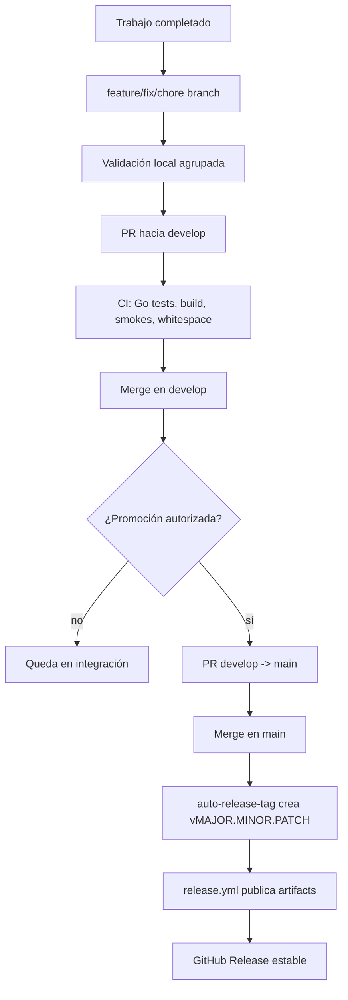

# lufy-ai

<p align="center">
  
</p>

<p align="center">
  Harness operativo instalable para trabajar con OpenCode y OpenSpec usando routing SDD proporcional, agentes especializados, assets gestionados y delivery trazable.
</p>

<p align="center">
  <a href="#que-es-lufy-ai">Qué es</a> •
  <a href="#quickstart">Quickstart</a> •
  <a href="#como-funciona">Cómo funciona</a> •
  <a href="#cli-go">CLI Go</a> •
  <a href="#delivery-y-release">Delivery</a> •
  <a href="#validacion">Validación</a> •
  <a href="docs/roadmap.md">Roadmap</a>
</p>

---

## Qué es `lufy-ai`

`lufy-ai` es un harness operativo AI-first que se instala sobre un repositorio existente para ordenar cómo se exploran, proponen, implementan, verifican y entregan cambios asistidos por agentes.

No reemplaza tu stack de aplicación. Agrega una capa de operación alrededor del repo con OpenCode, OpenSpec, routing SDD proporcional, contratos de resultado, políticas de delivery y una CLI Go que mantiene los assets instalados bajo control.

El objetivo es simple: cada pedido debe usar el flujo más pequeño que lo resuelva con seguridad.

| Si el pedido es... | `lufy-ai` usa... | Resultado esperado |
| --- | --- | --- |
| Trivial, local o documental | T3 Express | Cambio directo y validación proporcional. |
| Funcional acotado o con riesgo medio | T2 SDD Lite | Mini-spec, criterios `WHEN`/`THEN`, handoff recuperable y review enfocada. |
| Sistémico, arquitectónico o incierto | T1 Full SDD | OpenSpec completo con propuesta, diseño, specs, tasks, verificación y archivo. |

`lufy-ai` también define límites claros: subagentes aislados, contexto mínimo, validación con evidencia real, delivery solo con autorización explícita y releases estables desde `main`.

## Lo que instala hoy

| Área | Asset / ruta | Propósito |
| --- | --- | --- |
| Agentes OpenCode | `.opencode/agents/` | `orchestrator`, `sdd-router`, `explorer`, `implementer`, `validator`, `reviewer` y `delivery`. |
| Comandos slash | `.opencode/commands/` | `/opsx-explore`, `/opsx-propose`, `/opsx-apply`, `/opsx-verify`, `/opsx-sync`, `/opsx-archive` y `opsx-version`. |
| Skills OpenSpec | `.opencode/skills/sdd-workflow/` | Ciclo completo para explorar, proponer, aplicar, verificar, sincronizar y archivar cambios. |
| Templates operativos | `.opencode/templates/` | `sdd-lite.md` y `result-contract.md` para T2 y handoffs recuperables. |
| Delivery policy | `.opencode/policies/delivery.md` | Reglas compartidas para branch safety, validación, PRs, releases y estados bloqueados. |
| Observatory TUI | `.opencode/plugins/agent-observatory.tsx` | TUI local con comandos `/observatory*`. |
| OpenSpec core v2 | `openspec/` | Configuración action-based, specs delta, `UPSTREAM.json` y stay-updated. |
| Guía de agentes | `AGENTS.md.template` | Plantilla base para convenciones del repositorio destino. |
| CLI Go | `tools/lufy-cli-go/` | Instalador/verificador canónico con hashes SHA-256, manifest y backups. |
| Wrapper Bash | `scripts/install.sh` | Delegación estricta a `lufy-ai install`, sin fallback legacy. |

No son capacidades instalables actuales:

- Templates por stack como React, Next.js, Astro, Expo o Spring.
- Detección automática de stack integrada en la CLI.
- Subagentes de dominio adicionales fuera de `.opencode/agents/`.
- Instalación automática de skills externas.

AutoSkills puede sugerirse solo como bootstrap opcional con `npx autoskills --dry-run`; cualquier mutación externa requiere autorización explícita.

## Quickstart

Versión estable actual: `v0.3.1`.

Para la guía completa por sistema operativo y shell, usa [`docs/installation.md`](docs/installation.md). Este resumen instala primero el binario y después aplica assets sobre un repositorio destino.

### 1. Descargar y revisar el bootstrap

```bash
curl -fsSL https://raw.githubusercontent.com/adrotech/lufy-ai/v0.3.1/scripts/bootstrap.sh -o /tmp/lufy-bootstrap.sh
less /tmp/lufy-bootstrap.sh
```

### 2. Instalar el binario

```bash
bash /tmp/lufy-bootstrap.sh --version v0.3.1 --install-dir "$HOME/.local/bin"
```

Si el bootstrap indica que `install-dir` no está en `PATH`, aplica la instrucción sugerida para tu shell y abre una terminal nueva.

### 3. Revisar el plan de instalación en tu repo

```bash
lufy-ai version
lufy-ai install --target /ruta/a/tu/proyecto --dry-run --yes --no-engram
```

### 4. Instalar y verificar

```bash
lufy-ai install --target /ruta/a/tu/proyecto --yes --no-engram
lufy-ai verify --target /ruta/a/tu/proyecto --no-engram
```

Atajo directo, solo si aceptas ejecutar el script remoto tras revisar la versión fijada:

```bash
curl -fsSL https://raw.githubusercontent.com/adrotech/lufy-ai/v0.3.1/scripts/bootstrap.sh \
  | bash -s -- --version v0.3.1 --install-dir "$HOME/.local/bin"
```

`latest` existe como conveniencia explícita (`--version latest`), pero no es reproducible. Prefiere `vX.Y.Z` en documentación, CI y onboarding automatizado.

## Instalación y gestión de assets



| Concepto | Comportamiento |
| --- | --- |
| Assets gestionados | Archivos instalados desde el catálogo de la CLI Go. |
| Hashes SHA-256 | Distinguen `skip`, `create`, `update-managed` y `conflict`. |
| Manifest local | `.lufy-ai/install-state.json` registra versión, assets y hashes. |
| JSON gestionado | `opencode.json` usa `merge-json` para preservar configuración local. |
| Backups | `lufy-ai backup` crea snapshots multiasset restaurables. |
| Drift local | `status`, `verify`, `sync` y `merge` ayudan a resolver cambios locales vs managed. |

## Cómo funciona

El sistema separa coordinación, análisis, implementación, validación, review y delivery. Ningún agente debería hacer más de su rol, y Git/GitHub solo se usan con autorización explícita.



## Tiers y agentes

| Tier | Cuándo aplica | Artefactos | Validación | Review |
| --- | --- | --- | --- | --- |
| T1 Full SDD | Nueva capability, arquitectura, contratos públicos, seguridad, delivery policy o alta incertidumbre. | OpenSpec completo: proposal, design, spec, tasks. | Agrupada al final del bloque y contra criterios OpenSpec. | Full o por `review_slices`. |
| T2 SDD Lite | Cambio funcional acotado, bug relevante, agente/skill o refactor controlado. | Mini-spec o handoff con `WHEN`/`THEN`. | Proporcional, agrupada y observable. | Focused si hay riesgo medio. |
| T3 Express | Cambio trivial, mecánico, documental o local. | Result contract cuando basta. | Proporcional al cambio. | Normalmente no requerido. |

| Agente | Rol | Puede editar | Puede hacer delivery |
| --- | --- | --- | --- |
| `orchestrator` | Coordina y enruta al mínimo flujo seguro. | No | No |
| `sdd-router` | Clasifica T1/T2/T3, `execution_mode`, skills, contexto y review workload. | No | No |
| `explorer` | Investiga impacto, archivos, dependencias y riesgos. | No | No |
| `implementer` | Aplica cambios acotados en código, tests, docs o configuración. | Sí | No |
| `validator` | Ejecuta o diagnostica validación sin mutar código. | No | No |
| `reviewer` | Revisa calidad, cobertura, seguridad y riesgo de release. | No | No |
| `delivery` | Empaqueta cambios con branch safety, commit, push, PR y trazabilidad. | No | Solo con autorización explícita |

## OpenSpec core v2

El workflow OpenSpec instalado usa acciones explícitas en `openspec/config.yaml`, registra baseline en `openspec/UPSTREAM.json` y trabaja con specs delta antes de sincronizarlas a `openspec/specs/`.



| Regla | Detalle |
| --- | --- |
| Specs delta | Usan markers `ADDED`, `MODIFIED` o `REMOVED`. |
| Escenarios | Cada requisito añadido o modificado debe tener `WHEN` y `THEN`; `GIVEN` es opcional. |
| Sync | `/opsx-sync` aplica deltas validados a `openspec/specs/` sin archivar el cambio. |
| Archive | `/opsx-archive` solo corresponde cuando tasks y gates están completos. |
| Version | `opsx-version` resuelve OpenSpec desde `PATH`, cache local o baseline embebida offline. |

## CLI Go

La CLI actual vive en [`tools/lufy-cli-go/`](tools/lufy-cli-go/) y es la implementación canónica del instalador. `scripts/install.sh` solo delega en ella.

| Comando | Propósito |
| --- | --- |
| `lufy-ai install` | Copia assets gestionados, crea/mergea configuración mínima y registra estado con hashes SHA-256. |
| `lufy-ai verify` | Valida estructura, `.lufy-ai/install-state.json`, assets críticos, hashes registrados y JSON gestionado. |
| `lufy-ai backup` | Crea backup multiasset bajo `.lufy-ai/backups/<timestamp>/manifest.json`. |
| `lufy-ai restore` | Restaura desde backup validando `targetRoot`, paths seguros y hashes. |
| `lufy-ai sync` | Reaplica assets gestionados cuando el source cambió y el target no tiene drift local. |
| `lufy-ai status` | Resume estado instalado, drift local, faltantes y errores; soporta `--json` y `--verbose`. |
| `lufy-ai merge` | Reconcilia `.lufy-new` con edits locales cuando existe ancestor seguro. |
| `lufy-ai upgrade` | Actualiza el binario a una versión fija verificando checksum antes de reemplazarlo. |
| `lufy-ai version` | Muestra versión semántica, commit, build date, GOOS y GOARCH. |

Flags frecuentes:

| Flag | Uso |
| --- | --- |
| `--target <dir>` | Repositorio destino. |
| `--dry-run` | Construye y muestra el plan sin mutar archivos. |
| `--yes` | Autoriza mutaciones reales cuando no hay conflictos bloqueantes. |
| `--no-engram` | Omite resolución/configuración de Engram. |
| `--backup <path>` | Ruta usada por `restore` para restaurar un backup existente. |

## Desarrollo con clone local

```bash
git clone https://github.com/adrotech/lufy-ai.git /tmp/lufy-ai
cd /tmp/lufy-ai/tools/lufy-cli-go
mkdir -p bin
go build -o bin/lufy-ai ./cmd/lufy-ai
```

Revisar el plan sin escribir:

```bash
/tmp/lufy-ai/scripts/install.sh --target /ruta/a/tu/proyecto --dry-run --yes --no-engram
```

Instalar y verificar con el wrapper local:

```bash
/tmp/lufy-ai/scripts/install.sh --target /ruta/a/tu/proyecto --yes --no-engram
/tmp/lufy-ai/tools/lufy-cli-go/bin/lufy-ai verify --target /ruta/a/tu/proyecto --no-engram
```

`scripts/install.sh` busca primero `tools/lufy-cli-go/bin/lufy-ai` dentro del checkout y después `lufy-ai` en `PATH`. Si no encuentra binario, falla con una instrucción explícita de build local. No descarga releases ni reintroduce fallback legacy.

## Delivery y release

`develop` es la rama normal de integración. `main` es la rama estable/productiva. El delivery normal abre PRs hacia `develop`; la promoción `develop` → `main` requiere autorización explícita.



| Gate | Evidencia esperada |
| --- | --- |
| Branch safety | `git status`, `git diff`, `git log` antes de staging. |
| Whitespace PR-aware | `git diff --check origin/develop...HEAD` o rango equivalente de promoción. |
| Validación local | `scripts/validate.sh` para cambios de CLI/assets cuando aplica. |
| CI | `.github/workflows/go-cli-install.yml` en PRs/pushes a `develop` y `main`. |
| Release | Tag `v*` sobre commit alcanzable desde `origin/main`. |
| Supply chain | Checksums, SBOM, provenance, firmas y smokes en `release.yml`. |

## Validación

Validación agrupada desde la raíz para cambios de CLI/instalador:

```bash
scripts/validate.sh
```

Validación manual de bajo nivel:

```bash
cd tools/lufy-cli-go
go test ./...
go build ./cmd/lufy-ai
scripts/smoke-install.sh
```

Smokes útiles desde la raíz:

```bash
tools/lufy-cli-go/scripts/smoke-wrapper.sh
tools/lufy-cli-go/scripts/smoke-release-artifacts.sh
tools/lufy-cli-go/scripts/smoke-bootstrap.sh
git diff --check
```

El workflow `.github/workflows/go-cli-install.yml` cubre tests Go, build Go, smokes de CLI/wrapper, sanity OpenSpec condicional cuando existe la CLI `openspec`, y `git diff --check`.

No hay suite Node/TypeScript de producto en la raíz del repo; no se debe asumir `npm test`, `npm run typecheck` ni `tsc` global para validar este kit.

## Estado y límites actuales

| Tema | Estado |
| --- | --- |
| Harness SDD proporcional | Disponible e instalable. |
| CLI Go | Implementación canónica del instalador. |
| Installer Bash | Wrapper estricto de la CLI Go. |
| Assets embebidos | Sincronizados desde el repo raíz hacia `tools/lufy-cli-go/internal/assets/embedded/**`. |
| Releases | Publicados desde tags `v*` alcanzables desde `main`. |
| Templates por stack | Roadmap, no instalable hoy. |
| Domain agents adicionales | Roadmap, no instalable hoy. |
| AutoSkills | Opcional como dry-run; no dependencia dura. |

El cambio `route-orchestrator-to-domain-agents` sigue siendo trabajo activo/futuro; no debe tratarse como capacidad completada hasta que sus assets y validación estén disponibles.

## Enlaces

| Documento | Contenido |
| --- | --- |
| [`docs/installation.md`](docs/installation.md) | Instalación paso a paso, PATH por OS/shell y troubleshooting. |
| [`docs/getting-started.md`](docs/getting-started.md) | Quickstart, uso posterior y flujo de contribución. |
| [`docs/github-branch-settings.md`](docs/github-branch-settings.md) | Settings esperados de ramas GitHub para `develop`/`main`. |
| [`docs/roadmap.md`](docs/roadmap.md) | Hardening, templates futuros, detección de stack y subagentes no instalables hoy. |
| [`openspec/README.md`](openspec/README.md) | Estructura y ciclo OpenSpec. |
| [`.opencode/README.md`](.opencode/README.md) | Agentes, templates y harness routing instalado. |
| [`tools/lufy-cli-go/README.md`](tools/lufy-cli-go/README.md) | Detalles técnicos, comandos y validación de la CLI Go. |
| [`AGENTS.md.template`](AGENTS.md.template) | Plantilla base para convenciones del repositorio destino. |

## Licencia

MIT
