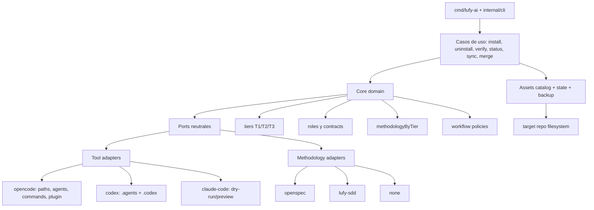
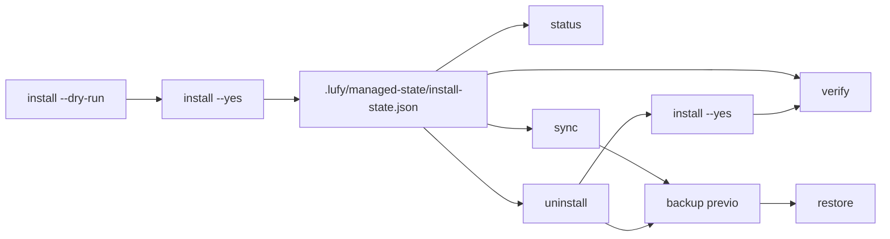

# Arquitectura

`lufy-ai` está evolucionando de un kit OpenCode/OpenSpec a un harness neutral con adapters. La implementación productiva actual instala OpenCode como default y Codex como adapter escribible core project-local; el dominio separa lo que pertenece a Lufy de lo que pertenece a una tool o metodología concreta.

## Objetivo arquitectónico

Lufy debe ser el harness:

- decide tier, workflow, permisos, validación y contrato de salida;
- mantiene roles, skills, policies y Result Contract;
- administra assets instalados con manifest, hashes, backups y rollback;
- permite elegir metodología por tier;
- evita que los agentes principales y secundarios queden hardcodeados a OpenCode/OpenSpec.

La tool debe ser un adapter:

- hoy `opencode` es el adapter escribible default;
- `codex` existe como adapter escribible core para superficie project-local;
- `claude-code` existe como dry-run/preview para perfilar capabilities y contratos futuros;
- ningún adapter futuro debe duplicar el dominio de tiers, roles o delivery.

La metodología también debe ser un adapter:

- `openspec` es la metodología principal actual;
- `lufy-sdd` existe como superficie inicial seleccionable;
- `none` es válido solo donde la policy lo permite, típicamente T3.

## Capas

## Paquetes principales

| Paquete | Responsabilidad |
| --- | --- |
| `internal/core/domain` | Modelos neutrales: harness, tiers, roles, methodology por tier y routing policy. |
| `internal/adapters/tool/opencode` | Adapter escribible actual para OpenCode. |
| `internal/adapters/tool/codex` | Adapter escribible core para Codex con `.agents/skills`, custom agents en `.codex/agents`, `.codex/lufy-agent-mapping.md`, hooks/rules/config y `AGENTS.md` gestionado. |
| `internal/adapters/tool/claudecode` | Adapter dry-run para capabilities y preview conceptual de Claude Code. |
| `internal/adapters/methodology/openspec` | Adapter OpenSpec para superficie full/lite. |
| `internal/adapters/methodology/lufysdd` | Adapter inicial para `.lufy/workflows/sdd`. |
| `internal/adapters/methodology/none` | Adapter explícito para tiers sin metodología. |
| `internal/instructions/registry` | Contratos neutrales de roles, skills y bindings. |
| `internal/instructions/render` | Render de superficies de instrucción sin paths hardcodeados al dominio. |
| `internal/assets` | Catálogo, policies, assets embebidos y hashing SHA-256. |
| `internal/state` | `.lufy/managed-state/install-state.json` versionado. |
| `internal/installer` | Plan/apply de instalación idempotente. |
| `internal/uninstaller` | Plan/apply de desinstalación gestionada con backup y protección por drift. |
| `internal/syncer` | Sincronización conservadora de assets ya gestionados. |
| `internal/verify` | Verificación estructural, manifest, hashes, JSON y referencias críticas. |
| `internal/status` | Estado humano/JSON de instalación y drift. |
| `internal/backup` | Backup/restore multiasset con manifest. |
| `internal/config` | Merge conservador de `opencode.json`. |
| `internal/projectconfig` | Scanner stack-aware para `.lufy/config/project.yaml`. |
| `internal/opsx` | Resolución stay-updated de OpenSpec: PATH, cache local y baseline embebida. |
| `internal/platform` | Path safety, locks y resolución portable de targets. |

## Lifecycle de assets

`install-state.json` usa schema v2 y registra:

- `tool`, actualmente `opencode` o `codex` en instalaciones reales;
- `methodologyByTier`;
- ownership por asset: `tool`, `methodology`, `component`, `policy` y `scope`;
- hashes SHA-256 de source/target;
- ancestors cuando la policy requiere merge o recovery.

Estados legacy schema v1 siguen siendo legibles y se normalizan con defaults compatibles durante `verify`, `status` y `sync`.

## Ownership de archivos

| Archivo/ruta | Ownership | Comportamiento |
| --- | --- | --- |
| `.opencode/agents`, `.opencode/commands`, `.opencode/skills`, `.opencode/templates`, `.opencode/policies`, `.opencode/plugins` | Managed | Se copian/sincronizan por catálogo y SHA-256. |
| `openspec/` | Managed por metodología `openspec` | Se instala cuando la metodología lo requiere. |
| `.lufy/workflows/sdd/` | Managed por metodología `lufy-sdd` | Se instala según mode full/lite. |
| `lufy-ia.harness.md` | Managed | Se actualiza por manifest y hash. |
| `tui.json` | Managed/no-replace según policy | Se preserva ante drift y puede generar `.lufy-new`. |
| `AGENTS.md` | User-owned con bloque gestionado | `install` agrega el bloque LUFY gestionado y reconoce la referencia legacy `@lufy-ia.harness.md`; `uninstall` remueve solo esa integración. |
| `opencode.json` | User-owned/merge-managed | Se mergea conservadoramente; no se registra como asset completo por hash. |
| `.lufy/config/project.yaml` | User-managed | Lo crea `init`; no entra en sync por hash. |

## Contrato de adapters

Un tool adapter debe responder:

- capabilities disponibles;
- superficie de instrucciones que puede renderizar;
- paths y archivos que controla;
- restricciones de escritura;
- contrato esperado para agentes y subagentes;
- mapping de skills disponibles o requeridas.

Un methodology adapter debe responder:

- modes soportados: `full`, `lite` o `none`;
- assets requeridos por mode;
- comandos/skills que habilita;
- criterios de validación;
- compatibilidad por tier.

Esta separación es clave para no duplicar texto de agentes y skills cuando agreguemos Codex o Claude Code. Los textos de agentes deben depender de roles, contracts y skills neutrales; los adapters solo renderizan la superficie específica de cada tool.

## Harness instalado

Los presets OpenCode y Codex instalan el mismo núcleo de roles:

- `orchestrator`: coordinación y routing general;
- `sdd-router`: clasificación T1/T2/T3 en modo read-only/no-shell;
- `explorer`: investigación read-only;
- `implementer`: cambios acotados sin delivery;
- `test-writer`: soporte TDD stack-aware para T1/T2 sustantivos;
- `validator`: validación y diagnóstico read-only;
- `reviewer`: revisión stack-aware con severidades y scoring;
- `delivery`: Git/GitHub solo con autorización explícita.

También instala:

- templates `sdd-lite.md` y `result-contract.md`;
- policy de delivery;
- skills `sdd-workflow`;
- comandos `/opsx-*`;
- comandos `/lufy.*`;
- plugin Agent Observatory.

OpenCode renderiza ese núcleo bajo `.opencode`. Codex renderiza la paridad core bajo `.agents/skills` y `.codex`, sin comandos slash ni plugin Observatory todavía.

## Decisiones vigentes

- El wrapper `scripts/install.sh` delega estrictamente en la CLI Go.
- No se reintroduce fallback legacy.
- No se asume tooling Node/TS en la raíz.
- Releases estables se publican desde tags `v*` alcanzables desde `main`.
- Delivery requiere autorización explícita.
- `codex` es escribible core project-local; `claude-code` sigue dry-run/preview.

## ADRs relacionados

- [`docs/adr/0001-managed-asset-source-of-truth.md`](adr/0001-managed-asset-source-of-truth.md)
- [`docs/adr/0002-managed-directories-extra-files.md`](adr/0002-managed-directories-extra-files.md)
- [`docs/adr/0003-opencode-json-ownership.md`](adr/0003-opencode-json-ownership.md)
- [`docs/adr/0004-sync-new-catalog-assets.md`](adr/0004-sync-new-catalog-assets.md)
- [`docs/adr/0005-recovery-and-rollback.md`](adr/0005-recovery-and-rollback.md)
