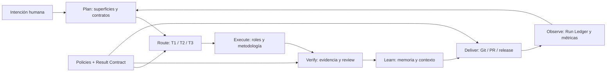

# Flujo sistémico del harness

`lufy-ai` convierte una intención humana en software verificable mediante un ciclo gobernado. Cada componente aporta una señal concreta; ninguno reemplaza por sí solo la decisión humana, el código actual o la evidencia de validación.

## Ciclo principal



## Componentes y responsabilidades

| Componente | Pregunta que responde | Fuente/CLI |
| --- | --- | --- |
| Project profile | ¿Qué stacks, superficies, arquitectura y comandos existen? | `.lufy/config/project.yaml`, `init`, `scan` |
| Surface Execution Plan | ¿Qué parte del sistema está activa y cómo se valida? | `lufy-ai plan` |
| SDD router | ¿Cuál es el menor flujo seguro? | T1 Full, T2 Lite, T3 Express |
| Methodology adapter | ¿Qué artifacts y gates organizan el cambio? | OpenSpec o Lufy SDD Full/Lite |
| Roles | ¿Quién explora, implementa, prueba, valida, revisa y entrega? | ocho roles estables del harness |
| Result Contract | ¿Qué estado, evidencia, riesgo y siguiente acción deja un actor? | `lufy-ai result` |
| Run Ledger | ¿Qué ocurrió, en qué orden causal y con qué checkpoint? | `lufy-ai run` |
| Context Graph | ¿Dónde buscar y qué relaciones/coverage revisar? | `lufy-ai context` |
| Memoria Obsidian | ¿Qué decisión o aprendizaje durable debe sobrevivir sesiones? | `lufy-ai memory` |
| Adaptive routing | ¿Hay una capacidad temporal útil dentro de límites seguros? | `lufy-ai adaptive` |
| Delivery policy | ¿Puede pasar a Git/PR/release? | `.lufy/contracts/delivery.md`, rol `delivery` |

## Secuencia recomendada

### 1. Preparar el repositorio

```bash
lufy-ai setup --target <repo> --dry-run
lufy-ai setup --target <repo> --yes
lufy-ai verify --target <repo> --deep
```

Para seleccionar explícitamente tool o metodología:

```bash
lufy-ai install --target <repo> --tool codex --methodology-tier T1:lufy-sdd/full --yes
```

### 2. Entender el alcance

```bash
lufy-ai context status --target <repo> --json
lufy-ai context query --target <repo> --json "<concepto>"
lufy-ai plan --target <repo> --base origin/develop --json
```

El grafo orienta; `plan` produce el contrato de superficie. Si el grafo falta o está stale, se reporta y se continúa con archivos, Git diff y configuración actual.

### 3. Elegir profundidad

| Tier | Uso | Salida mínima |
| --- | --- | --- |
| T1 Full SDD | arquitectura, seguridad, contratos o alta incertidumbre | proposal, design, specs, tasks, validación, sync y archive |
| T2 SDD Lite | comportamiento acotado o refactor controlado | mini-spec/proposal, criterios WHEN/THEN y validación agrupada |
| T3 Express | cambio trivial, local o documental | edición acotada y evidencia proporcional |

T1/T2 con varios riesgos se dividen en `review_slices` cuando eso reduce la carga humana. El paralelismo sólo aplica a slices con archivos independientes, plan de join y validación agrupada.

### 4. Ejecutar y verificar

Los roles mantienen ownership separado. Implementar no autoriza delivery; validar no autoriza editar; review no sustituye tests. Cada handoff sustantivo usa Result Contract v1 y puede validarse con:

```bash
lufy-ai result validate --file result.yaml --role implementer --json
lufy-ai result transition --file transition.yaml --target <repo> --record --json
```

Las transiciones se deciden por schema, estado, policy y evidencia. Un substring o una afirmación en lenguaje natural nunca avanza un gate.

### 5. Aprender sin acumular ruido

- Context Graph guarda estado derivado y regenerable bajo `.lufy/context/`.
- Run Ledger guarda eventos causales content-free bajo `.lufy/runtime/`.
- Obsidian guarda sólo decisiones, reglas, flows, lessons y conceptos durables bajo `.lufy/memory/`.
- Los artifacts SDD/specs versionados conservan el contrato del producto.

### 6. Entregar

Delivery requiere autorización explícita, branch safety, validación proporcional, `pr guard`, checks remotos y trazabilidad. El flujo normal integra en `develop`; `main` se reserva para promoción estable y releases desde tags `v*` alcanzables.

## Adaptive routing sin pérdida de control

`adaptive_routing` está `disabled` por default:

- `shadow` calcula y puede registrar recomendaciones, pero no asigna recursos;
- `advisory` permite `assign` y `yield` explícitos con idempotencia, capacity/budget y lease fenced;
- `role_hint` es una sugerencia temporal, no una identidad ni permiso;
- un yield libera recursos sólo después de un checkpoint durable;
- delivery, seguridad, contratos públicos, schema y migraciones destructivas escalan al humano antes del scoring.

Si adaptive, ledger o configuración no están disponibles, el routing T1/T2/T3 determinístico continúa siendo autoritativo.

## Estados locales

| Ruta | Naturaleza | Política |
| --- | --- | --- |
| `.lufy/config/project.yaml` | configuración canónica del proyecto | user-managed |
| `.lufy/managed-state/` | manifest, ancestors y backups | gestionado por CLI |
| `.lufy/workflows/sdd/` | metodología y changes Lufy SDD | bootstrap managed; changes user-owned |
| `.lufy/context/` | grafo y cache derivados | regenerable |
| `.lufy/runtime/` | ledger causal local | privado, content-free, ignorado por Git |
| `.lufy/memory/` | memoria Obsidian | privada y user-owned |
| `.lufy/skill-registry.json` | índice local de skills | derivado y regenerable |

## Invariantes

1. La intención humana y el alcance explícito tienen precedencia.
2. Los roles no ganan permisos por necesidad operativa.
3. Los estados derivados no sustituyen evidencia primaria.
4. Ningún mecanismo adaptativo avanza gates.
5. La privacidad usa allow-lists y referencias por digest.
6. Los cambios grandes se diseñan para revisión humana, no sólo para throughput de agentes.
7. El sistema degrada explícitamente a `not_available`, `stale`, `blocked` o flujo determinístico; no inventa continuidad.

## Lecturas relacionadas

- [`architecture.md`](architecture.md): capas, paquetes y ownership.
- [`run-ledger.md`](run-ledger.md): causalidad, privacidad, retención y recovery.
- [`status.md`](status.md): matriz de capacidades publicadas.
- [`roadmap.md`](roadmap.md): hipótesis futuras separadas del estado actual.
