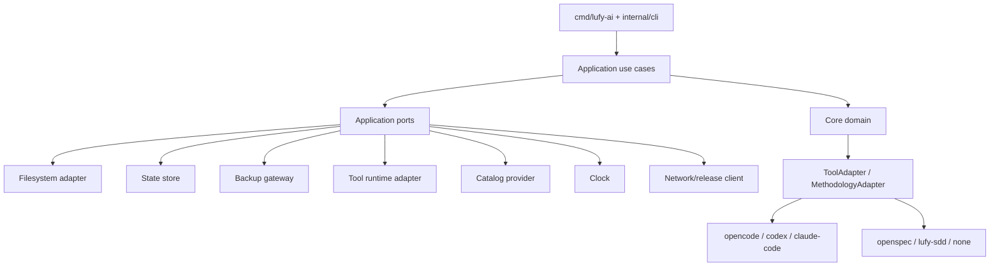

## Contexto

La arquitectura actual ya expresa una direccion hexagonal:

- `internal/core/domain` contiene modelos de harness, tiers, metodologia por tier y routing policy.
- `internal/ports` define adapters de tool/metodologia.
- `internal/adapters/*` implementa estrategias concretas.
- `internal/harnesscatalog` calcula catalogo efectivo a partir de adapters.

El problema no esta en esa direccion, sino en que la capa de casos de uso todavia conserva detalles externos. La frontera hexagonal existe para adapters de harness, pero no para todas las operaciones de instalacion/verificacion/sync.

## Target Architecture



## Boundary Rules

- El dominio no debe importar `os`, `filepath`, `platform`, `state`, `backup`, `toolruntime`, `assets` concretos ni adapters.
- Los use cases pueden coordinar, validar decisiones y transformar modelos, pero no deberian conocer todos los detalles de IO.
- Los adapters externos encapsulan filesystem, manifest, backups, runtime de tool, config global/project y red.
- La CLI solo parsea flags, decide exit code y delega.
- Los reports humanos/JSON deben construirse desde modelos de resultado, no desde chequeos dispersos con `fmt.Fprintf` en medio de reglas.

## Componentes Propuestos

### Application ports

Puertos iniciales recomendados, solo cuando el primer slice los necesite:

- `FileSystem`: stat seguro, read, write atomic, mkdir, walk, remove.
- `StateStore`: load/write de install-state.
- `BackupGateway`: backup/restore de archivos gestionados.
- `ToolRuntime`: project/global config, plugin config files, write capability.
- `CatalogProvider`: catalogo source/embedded y catalogo efectivo por harness.
- `Clock`: timestamps deterministicos.
- `ReleaseClient`: descarga/checksum/extraccion para `upgrade` si entra en alcance posterior.

### Planner / Executor / Reporter

Para `install` y `sync`:

- `PlanBuilder`: calcula acciones/conflictos, sin mutar.
- `ActionExecutor`: aplica acciones, maneja recovery y rollback.
- `PlanReporter`: imprime salida humana o genera estructura serializable.
- `ConfirmationPolicy`: decide si `--yes` es requerido.

Para `verify`:

- `CheckBuilder`: arma checks desde state/catalog/filesystem.
- `CheckRunner`: ejecuta validaciones estructurales y profundas.
- `ReportPresenter`: salida humana/JSON.

### Acciones tipadas

Reemplazar strings sueltos por:

```go
type ActionKind string

const (
    ActionMkdir ActionKind = "mkdir"
    ActionCopy ActionKind = "copy"
)
```

El siguiente paso, solo si el switch sigue creciendo, es un registry de executors:

```go
type ActionExecutor interface {
    Supports(ActionKind) bool
    Execute(context.Context, Action) error
}
```

No introducir esta segunda abstraccion antes de separar tipos y responsabilidades.

## SOLID Gates

- SRP: cada componente debe tener una razon principal para cambiar.
- OCP: agregar una accion o adapter no debe requerir tocar multiples switches no relacionados.
- LSP: adapters deben cumplir los puertos sin precondiciones ocultas.
- ISP: puertos chicos, no interfaces omnibus.
- DIP: use cases dependen de abstracciones; detalles concretos se ensamblan en constructors/factories.

## Clean Code Gates

- Nombres especificos al dominio del instalador.
- Errores accionables y sin esconder contexto.
- Early returns para guard clauses.
- Funciones largas solo cuando sean secuencias simples; extraer cuando mezclen decision, IO y reporting.
- Evitar strings magicos para estados/acciones/policies cuando afecten comportamiento.
- No agregar abstracciones que no reduzcan complejidad real o duplicacion significativa.

## TDD / AAA

La propuesta no puede demostrar TDD historico, pero cada slice debe producir evidencia proporcional:

- RED: test nuevo falla o razon de no aplicabilidad.
- GREEN: test pasa tras implementacion.
- TRIANGULATE: al menos un edge/caso alternativo cuando el comportamiento lo amerite.
- REFACTOR: limpieza posterior con tests verdes.

AAA puede ser explicito con comentarios o implicito mediante estructura clara:

- Arrange: fixtures, temp dirs, fakes, estado inicial.
- Act: una llamada principal al use case o funcion bajo prueba.
- Assert: verificaciones de estado, salida, errores y no-mutacion.

En tests Go, no se requiere ceremonia si el orden es obvio y el nombre del test describe el comportamiento.

## Backward Compatibility

El preset `opencode` + `openspec` debe quedar estable:

- mismos comandos y flags publicos;
- mismo layout instalado;
- misma semantica de manifest compatible;
- misma validacion agrupada;
- ningun fallback legacy en `scripts/install.sh`.

## Review Workload

Esta propuesta no debe implementarse como una unica PR grande. Los slices deben mantener diffs revisables y poder validarse de forma independiente. Si un slice descubre impacto transversal mayor, escalar a T1 y dividir antes de continuar.
